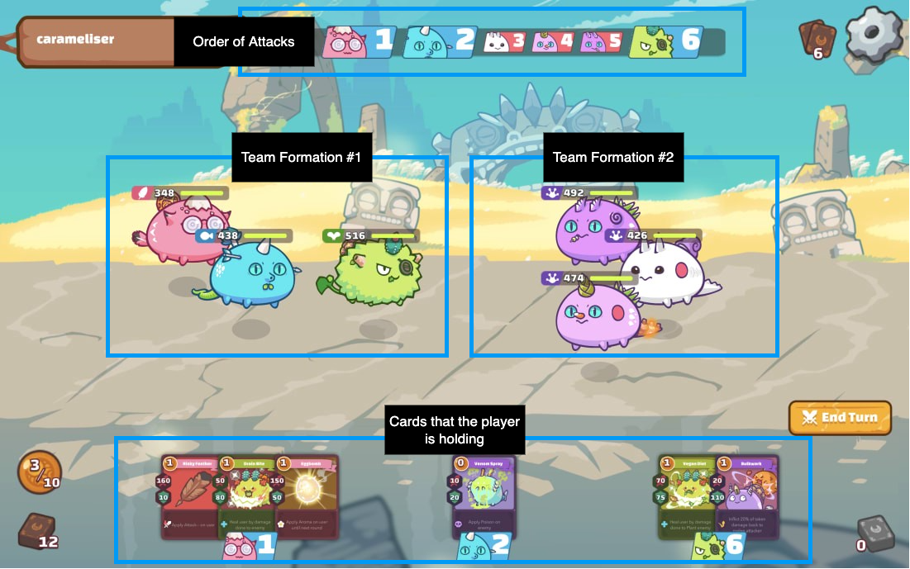
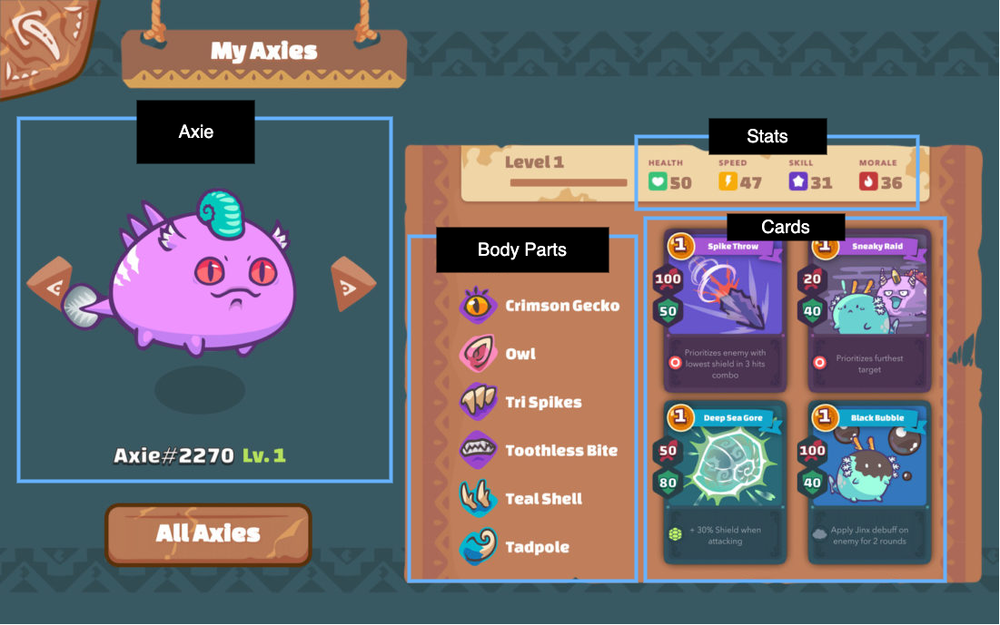

# Executive Summary

Blockchain games, also called Gaming DAPPs, are an emerging area in the
Web3 space. With their gameplay, Gaming DAPPs currently cannot compete
with the 3D AAA games and they mostly resemble 2D Hyper Casual Mobile
games. Developers often need to make compromises in separating on-chain
activity from the actions that are taken off-chain and so the line is
blurred between what is truly a blockchain game and what is not.
However, strong advantage of these games is that they almost always
offer some form of an economic incentive to the players with an
opportunity to “own” part of the game in order to influence the game’s
further development.

The most widespread model in such games is the “Play to Earn” (P2E)
model. In a P2E model, players compete against each other in earning
either ERC721 or ERC20 tokens. The mechanism of token distribution
varies from game to game but in general it favors those that invest more
into the game and so the “Pay to Win” element is introduced. This is
currently the most popular model but it has negative connotations of
lacking the play aspect and focusing on just the earning potential.
Games now try to pivot to what they call “Play and Earn” model with the
intention of promoting the community first but also keeping the earning
part going. In either way, the economy of such games seems unsustainable
as it relies on the never ending stream of new players.

Onboarding process is also almost always a bit complex and pricy. In
order to start playing, the player initially needs to bare some cost
that is not constant and is decided by the market (i.e. buying ERC721
tokens used in the game).

For the gamers to accept those low quality games, those tradeoffs and a
pricy onboarding process there would need to be an economic incentive
and whatever the future models will be called the earning aspect needs
to be present.

# Introduction

Gamers expect interactivity from the games they play. Once an action is
taken in the off-chain games, the feedback signal is quick and the gamer
knows nearly instantly the consequences of that action. Translating this
experience to on-chain games is extremely difficult as every interaction
that alters the state involves a transaction. Those transactions cost
some amount of tokens native to the chain but they also take some time
to process. This affects the whole game design process as the number of
transactions that are required to advance the state in the game should
be kept to a reasonable number. Having the player’s balance getting
continuously decreased while playing the game and breaking the flow of
it with the popup needed to sign each transaction will result in that
player questioning the whole utility of that game. If the game doesn’t
take this seriously into account it will lead to a bad user experience.

Due to current blockchain limitations, games try to cheat their way out
of this by having the game logic on the server with players just signing
the messages or transactions associated with their in-game actions.
Splinterlands[^1] is a popular game and an example of such practice. It
is developed on the Hive blockchain[^2] that does not support smart
contracts and so the rules of the game need to be kept on the server.

Another successful game, Axie Infinity[^3] takes the approach of having
the players register an user account that will be linked to their
wallet’s address. Almost every action inside the game is done via the PC
or a Mobile client where the player has logged in with their user
account. The server is in control of this game’s logic as well, which
poses a huge problem because the rules of the game can be altered by the
developers.

One important part of the Axie Infinity’s economy relies on ERC721
tokens (called “Axies”) that are used inside the game. Axies can be
traded on the Axie Marketplace and are needed when minting new tokens so
some players focus purely on this aspect of the game. The main game’s
mechanic are “Player vs Player” (PvP) matches. The winner of the match
gets some amount of game’s ERC20 tokens that depends on the player’s
rank. The higher the rank the bigger the rewards. To increase their
rank, players need stronger and better Axies which leads them back to
the marketplace. The similar model is used across the industry, like in
Pegaxy[^4] which is a competitor game on Polygon that is currently
gaining traction.

Because Axie Infinity was one of the first P2E games, is still relevant
today and its solutions are being used in other games, this paper takes
it as a study case, doing a deep dive into its inner workings.

# Goals & Methodology

Being a pioneer in the space, Axie Infinity had to make some
compromises. This resulted in combining the actions that are taken
on-chain that include trading, minting and paying out the winnings with
the off-chain actions like playing a match.

Having a hybrid or completely centralized approach defeats the purpose
of a blockchain. The goal of this research is to understand the game’s
mechanics and to try to answer the question if this and similar games
can be built purely on-chain. It does this by breaking down the rules of
the game and then proposing on-chain solutions.

In this research, there are sections dedicated to the basics of the
economic model of the game. However, it is not the goal of this paper to
delve deep into its problems and possible approaches to solving them.
This model and its variations would require a separate research and the
intention of those sections is just meant to provide context to the
reader.

# Results & Discussion

## Ronin sidechain

The game was developed on Ethereum in 2018 by the Sky Mavis company
located in Vietnam. Due to high Ethereum fees, the game’s creators moved
to their own EVM compatible sidechain called Ronin which uses Proof of
Authority with validators being chosen by the company[^5] .

To start playing a player needs to :

-   create their own Ronin wallet
-   create their user account on the Axie Marketplace and connect their
    wallet to it
-   transfer some amount of ETH and buy at least 3 Axies with a floor
    price of \~42 dollars per Axie
-   install a PC or Mobile app and **login with their user account**

Disregarding the difficulty of the onboarding process, the whole point
of a blockchain game is to have the players take actions on the
blockchain. Some arguments could be made that at the time the game was
developed this was needed but with the introduction of Ronin it is
unclear why the whole game was not ported to it.

The only actions that are taken on the Ronin sidechain are dedicated to
trading - buying, minting and gifting of Axies. There are no fees on
Ronin, but the number of transactions per wallet address per day is
limited. Deploying on Ronin, also, requires company’s permission so the
development of new games and the whole Ronin ecosystem is slowed down.

## Scholarships

Market decides on the price of Axies and with a high entry cost of
starting with the game, a new model of onboarding has emerged. Newcomers
(scholars) can “rent out” the Axies for a certain period of time and
negotiate with the owners (managers) the terms of the profit
distribution. This is not a official in-game feature and is enabled by
having the managers controlling the Ronin wallet and scholars
controlling the user account associated with it. This leads to a bad
position for the scholar as the profits are claimed by the manager and
then the scholar’s share is sent to the their wallet’s address. Scholars
are essentially at the mercy of the managers as their earnings and the
scholarship itself can be revoked at any time.

More fairer way of enabling Scholarships, would be to have a smart
contract that would have complete control of the Axies and through which
the scholars would make in-game actions. The profits would go to the
contract’s address that would perform a fair split. The terms of the
agreement (the minimum amount of profits to be earned by the scholar)
and the scholarship’s time period would be embedded in the contract. If
both parties agree, the terms could be changed later on.

## Game Breakdown

The game itself is organized in 1v1 matches where players do not have
any influence against who they will get matched. Matching is done by the
server based on players’ Match Making Rankings (MMR) which is determined
by the win/lose ratio of those players. All of this could be implemented
in a smart contract which would keep track of all of the players’ MMRs
and update them after each match. Players could start a new match or
join an existing one if the absolute difference in their MMRs is under a
certain threshold. The benefits of this approach is that they could also
choose what match they will join or challenge a specific player.

Winner of each match gets some amount of game’s “Smooth Love Potion”
(SLP) tokens. That amount is dependent on the MMR of that player (the
higher the MMR the more SLP tokens they will win). SLP is an
inflationary ERC20 token that gets minted after each match. Even though
there are SLP burning mechanisms through some in-game actions, most
players opt to cash out their winnings so this might not be a viable
economic model. One alternative would be to have both players stake some
amount of tokens in a match with the winner taking the sum of those
stakes. The problem is that it introduces betting connotations and games
go to extreme lengths in order to not be considered a betting game as it
potentially introduces regulation.

Inside the game, there is also “Axie Infinity Shard” (AXS) token. AXS is
an ERC20 token which has a fixed total supply. The company behind the
game has roughly 20% of the total AXS supply and small amounts of AXS is
distributed to the top players of the month.

The game makes heavy use of Axies which have certain characteristics.
Players do not completely own Axies as it was discovered that the
company can freeze them, making them useless. Once an Axie is frozen, it
cannot be used in the game nor it can be traded on the Axie Marketplace.
This possess a major concern as the players’ assets are constantly under
a threat of those players being banned from the game by the Sky Mavis
company. Full list of violations that will result in a ban can be seen
here[^6] .

Each Axie has one of the 9 classes, 4 statistics and 4 cards associated
with it. Classes are grouped into three groups that form a “rock paper
scissor” relationship. Meaning that, group G1 does 15% extra damage to
group G2 but takes 15% extra damage when attacked by group G3.
Statistics determine the Health, Skill, Speed and Morale of an Axie.
This statistics affect the matches and their state transitions as the
Speed for example determines the order of attacks. Cards can have
positive or negative effects on an Axie as well additional effects that
affect the players. Four cards associated with an Axie are added to the
player’s deck when that Axie is used inside a match. More information
about Axies is provided in [Appendix A](#appendix-a) and the way new
Axies are created is provided in the Breeding section of the
Whitepaper[^7] .

## Matches

One match consists out of:

1.  Both players choosing a team of 3 Axies and deciding on their
    positions on the field (creating team formations)
2.  Rounds being played out until one of the players doesn’t have a
    standing Axie

*Picture 1 : Axie Infinity Match View*

### Team formations

The positioning of an Axie matters because it determines what Axie will
take the damage from the enemy. Each player has 5 rows where an Axie can
be positioned. The closest row to the enemy lines will be attacked
first. The Axies cannot change their position and they stay where they
initially were until they get knocked out. Choosing of a team formation
would require two transactions per player. Those transactions would be
organized in the commit-reveal scheme so that the players wouldn’t have
an advantage against the opponent that naively sent the transaction
revealing their team and their positions.

### Rounds

Each Round is carried out in the following order:

1.  Players randomly draw 3 cards\* from their own decks (consisting of
    24 Cards\*\*) and decide on what cards they will play
2.  Cards are revealed and their affects are applied to Axies
3.  Battle of the Round takes place
4.  If one of the players doesn’t have a standing Axie then the match is
    over

\* Exception is that in the first Round, players draw 6 cards.

\*\* There are 3 Axies per team, each Axie adds two copies for each of
the 4 cards. So in total there are 3\*2\*4 = 24 cards in one player’s
deck.

### Drawing of Cards

Once the teams have been revealed both players know each other decks.
However, they should not know what cards the opponent has in their hands
and so they should not know what cards they have yet to draw.

One scheme that could be applied is the following:

1.  Have both players choose their secret “random” number and commit to
    it with a hash
2.  Have the game’s contract ask for a random number from Chainlink’s
    VRF[^8]
3.  Once the randomness has been fulfilled, both players know what is
    the order of cards they will be drawing as the seed for shuffling
    their decks will be some function of their own number and the
    received number from Chainlink’s VRF

The drawing order of cards in the deck is now known only to the players.
During the match, each player can play any card inside their deck and
until a match ends, players trust each other that the played card was in
the opponent’s hand. However, when the match ends both players would
need to reveal their secret numbers as the contract needs to verify if
they honored the drawing order and if the card they played at a certain
moment was one of the cards they were holding. The first discrepancy
would end the verification process and the cheater would be penalized.

One additional subproblem is that after each round the remaining cards
inside the deck should be reshuffled. This could be done with requesting
another random number which would help form a seed for random shuffling
of the remaining cards. The verification process would need to be
modified to support this.

Note: after all of the cards have been drawn, the deck resets.

### Reveal of the Cards

The reveal of the cards would also need two transactions per player so
that one player wouldn’t just wait for the opponent to reveal their
cards and then change their strategy accordingly.

Once cards have been revealed, before the battle takes place, the
effects of the played Cards are applied. In total there are 3 constant
effects (Attack damage, Defensive points and the cost of playing that
Card) and 19 additional effects that a Card may have. For example, one
of those additional effects are an increase/decrease in one of the Axie
statistics. When multiple Cards that affect the same Axie are played,
their effects are accumulated. More information about cards is provided
in [Appendix A](#appendix-a) .

### Battle of the Round

Battle rules:

-   the order of attacks is determined by the highest Speed statistic
    (if there is a draw then it is decided by the lowest Health and then
    by lowest ID of an Axie)
-   closest row with a standing Axie to the enemy lines will take the
    damage
-   if two Axies are inside the row taking the damage there’s a 50/50
    chance which Axie will absorb the damage

All of this logic could be kept inside a contract. One of that things
that would need to be taken into account is that Axies attack in the
pre-defined order. So during a Round, an Axie that has not yet attacked
could be knocked out of the game and so the Cards associated with it,
that were played in the Round, should lose their effects. Also, when an
Axie gets knocked out, all of their cards should be removed from the
deck.

## Summary of proposed matched progression

### Inital proposal

| Step |     Phase     |                          Description                          | Number of transactions |        Done by        |
|:----:|:-------------:|:-------------------------------------------------------------:|:----------------------:|:---------------------:|
|  1   | Match Set Up  |                      Starting of a Match                      |           1            |       Player 1        |
|  2   | Match Set Up  |                        Joining a Match                        |           1            |       Player 2        |
|  3   | Match Set Up  | Committing to a team formation and setting of a secret number |          2\*1          | Player 1 and Player 2 |
|  4   | Match Set Up  |                   Revealing team formations                   |          2\*1          | Player 1 and Player 2 |
|  5   |     Round     |     Committing to Cards that will be played in this Round     |          2\*1          | Player 1 and Player 2 |
|  6   |     Round     |                 Revealing Cards of the Round                  |          2\*1          | Player 1 and Player 2 |
|  7   | Match Wrap Up |      Revealing secret numbers after the match has ended       |          2\*1          | Player 1 and Player 2 |

**Total** = (1+1+2+2) + N\*(2+2) + (2) = 8 + 4\*N ; where N is the
number of rounds in the match

Even with just 3 rounds the number of transactions per player would be
16, so this is a problem.

### Improved Match Progression

Something that could be done is the introduction of “fair play” where
for one round’s commit stage, one player would transmit both of the
commit messages to the chain after which the other player would transmit
both reveal messages.

If the player transmitting commitment messages decides to not transmit
them, then the match is stuck. However, the game can be structured in a
way such that it is in the interest of both players to resolve the match
regardless of the outcome. This could be done by staking some amount of
tokens that the players will receive at the end of the match.

If the player transmitting the reveal messages realizes he will lose and
decides to not transmit them, then the first player could transmit just
their own reveal message that would start a countdown for the other
player to transmit their reveal message. If the countdown is reached
then the player that didn’t act in the spirit of fair play is penalized
in some way.

| Step |     Phase     |                                  Description                                   | Number of transactions | Done by  |
|:----:|:-------------:|:------------------------------------------------------------------------------:|:----------------------:|:--------:|
|  1   | Match Set Up  |                              Starting of a Match                               |           1            | Player 1 |
|  2   | Match Set Up  |                                Joining a Match                                 |           1            | Player 2 |
|  3   | Match Set Up  | Transmitting commitments to the team formations and setting of a secret number |           1            | Player 1 |
|  4   | Match Set Up  |                   Transmitting the Reveal of team formations                   |           1            | Player 2 |
|  5   |     Round     |                        Transmitting Commitment Messages                        |           1            | Player 1 |
|  6   |     Round     |                          Transmitting Reveal Messages                          |           1            | Player 2 |
|  7   | Match Wrap Up |               Revealing secret numbers after the match has ended               |           1            | Player 1 |

This scheme would give the total number of transactions of:

**Total** = (1+1+2) + N\*(2) + (1) = 5 + 2\*N ; where N is still the
number of rounds in the match

With the number of rounds equal to 3, the number of transactions per
player is less or equal to 6.

This is an improvement but maybe it could be brought down further. Also,
signing 6 transactions per match would still break the flow of the game,
so the players would have to have a substantial financial interest in
continuing to play the current match and the game itself.

# Conclusion

Developers should keep realistic expectations on what games can be built
purely on the blockchain and they should convey those expectations
transparently to the end users. Proposed on-chain solutions from this
research can be improved and adjusted to fit similar games. The current
bottleneck of all Gaming DAPPS is the number and speed of transactions
needed, so the choice of a blockchain on which the games will be built,
is extremely important. Hybrid approaches, in my opinion, should not be
considered, but at the end of the day, the players will decide what
games will be played. The most important thing is that the rules of the
game cannot change by the will of the developers. The game’s logic
should be kept in the smart contracts with the source code being public.
This will keep everyone honest and the players would not be at the mercy
of the developers.

Games are meant at meant to be fun but players ought to have an
additional financial benefit from blockchain games because at this
moment their user experience is hindered by the current blockchain
limits as well as the lower quality graphics and player involvement.
Everyone involved in the P2E model should view it as an investment
first. Investments can be either good or bad and they depend on every
party involved contributing to the end result. Once the investment has
turned bad, investors should cut their losses if there is no indication
that the situation will change. In this context that would result with
the players quitting the game and moving to other games which leads to a
bad word of mouth and it damages the whole ecosystem. A sustainable
economic model needs to be embedded in the game itself so there should
not be unbound minting of new tokens. However, how exactly should that
future model look like would require serious thought and it should be a
topic of a separate research.

# Appendices

## Appendix A

Each Axie has a fixed set of attributes - a class, 4 stats and 4 cards.

Picture 2: Axie characteristics

### Axie Classes

-   9 of them **(Plant, Reptile, Dusk, Beast, Bug, Mech, Aqua, Bird,
    Dawn)**
-   6 main classes (Plant, Beast, Bug, Reptile, Aqua, Bird, Dawn)
-   3 remaining are “secret” (and generally weaker in the game)
-   to make the strengths of classes balanced, they are grouped in 3
    groups, forming a “rock paper scissor” relationship

### Axie Stats

-   can be divided into “base” and “additional” Stats

-   total of 140 points is distributed between 4 of the base Stats (with
    each class having its own base distribution)

    -   **Health** — amount of damage Axie can take before getting
        knocked out
    -   **Speed** — affects the order in which Axies attack in a match
        (higher Speeds attack first)
    -   **Skill** — increases damage dealt when the Axie performs
        multiple cards/moves (a.k.a. combo)
    -   **Morale** — increases chance to land a critical hit, as well as
        entering “last stand” which allows them to attack a few more
        times before getting knocked out

**Base Stats Distribution**

|  Class  | Health | Speed | Skill | Morale |
|:-------:|:------:|:-----:|:-----:|:------:|
|  Aqua   |   39   |  39   |  35   |   27   |
|  Beast  |   31   |  35   |  31   |   43   |
|  Birds  |   27   |  43   |  35   |   35   |
|   Bug   |   35   |  31   |  35   |   39   |
|  Plant  |   61   |  31   |  31   |   41   |
| Reptile |   39   |  35   |  31   |   35   |

-   additional Stats depend on Axie’s Body Parts

### Axie Body Parts

-   there are 6 of them **(Eyes, Ears, Horns, Mouth, Back, Tail)**
-   only Horns, Mouth, Back, Tail have an associated card with it (one
    card per body part)
-   In total, there are:
    -   4\*6 types of Mouth
    -   6\*6 types of Horns
    -   6\*6 types of Back
    -   6\*6 types of Tail
-   inside groups of those types each of the 6 main classes is equally
    represented
-   if the class of an Axie matches with the type of a body part, Axie’s
    stats will increase

**Additional Stats Increase**

| Class/Type | Health | Speed | Skill | Morale |
|:----------:|:------:|:-----:|:-----:|:------:|
|    Aqua    |   +1   |  +3   |   0   |   +0   |
|   Beast    |   0    |  +1   |   0   |   +3   |
|   Birds    |   0    |  +3   |   0   |   +1   |
|    Bug     |   +1   |   0   |   0   |   +3   |
|   Plant    |   +3   |   0   |   0   |   +1   |
|  Reptile   |   +3   |  +1   |   0   |   0    |

-   An Axie is a ‘pure breed’ when its class and all of its body parts
    are of the same type.

### Axie Abilities (Cards)

-   there are 132 cards in total (first divided by 6 main classes and
    then by the body parts)
-   each Axie has 4 cards associated with it
-   each Card has
    -   an amount of Energy it costs to play it
    -   attack points - damage it does to the enemy Axie
    -   defensive points - forms a shield that takes the damage instead
        of Axie’s Health
    -   potentially buffs/debuffs
    -   additional effects (draw another card, steal some Energy from
        the opponent,…)
-   cards realize a “combo” when 2 or more of them are played (for the
    same Axie)
-   cards realize a “chain” when 2 or more Axies use 2 or more cards
    that are from the same class

### Axie Card Buffs/Debuffs (Card Effects)

-   there are 3 buffs (positive effects on the Axie) and 16 debuffs
    (negative effects on the enemy Axie)
-   they affect the Axie for one or more turns
-   they are “stackable” - their effects are accumulated

**List of Buffs**

|  Name   |                  Description                   |
|:-------:|:----------------------------------------------:|
| Attack+ |          Increase next attack by 20%           |
| Morale+ | Increase Moral by 20% for the following round  |
| Speed+  | Increase Speed by 20% for the following round. |

**List of Debuffs**

|       Name       |                                   Description                                   |
|:----------------:|:-------------------------------------------------------------------------------:|
|      Aroma       |           Target priority changes to this Axie until the next round.            |
|     Attack-      |                          Decrease next attack by 20%.                           |
|      Chill       |                      Affected Axie cannot enter Last Stand                      |
|       Fear       |                    Affected Axie will miss their next attack                    |
|     Fragile      |  Affected Axie’s shield will take double damage from the next incoming attack   |
|       Jinx       |                     Affected Axie cannot land critical hits                     |
|      Lethal      |              Next incoming attack is a guaranteed critical strike               |
|     Morale-      |                 Decrease Morale by 20% for the following round                  |
|      Poison      |                Affected Axie will lose 2 HP for every card used                 |
|      Sleep       |                    Next incoming attack will ignore shields                     |
|      Speed-      |                  Decrease Speed by 20% for the following round                  |
|      Stench      |         Affected Axie will lose target priority for the following round         |
|       Stun       | Affected Axie’s first attack will miss.Next incoming attack will ignore shields |
| Cannot Be Healed |   This Axie cannot be healed or recover health. This Debuff cannot be removed   |

# Bibliography

‘Axie Infinity’, *Axie Infinity* \<<https://axieinfinity.com/>\>
\[accessed 24 February 2022\]

‘Breeding and \$SLP’
\<<https://whitepaper.axieinfinity.com/gameplay/breeding>\> \[accessed
13 February 2022\]

‘Introduction to Chainlink VRF \| Chainlink Documentation’
\<<https://docs.chain.link/docs/chainlink-vrf/>\> \[accessed 13 February
2022\]

‘Pegaxy Summary’ \<<https://whitepaper.pegaxy.io/>\> \[accessed 24
February 2022\]

‘Ronin Ethereum Sidechain’
\<<https://whitepaper.axieinfinity.com/technology/ronin-ethereum-sidechain>\>
\[accessed 14 February 2022\]

‘Terms’, *Axie Infinity* \<<https://axieinfinity.com/terms/>\>
\[accessed 10 February 2022\]

‘The Splintershards (SPS) Token’ \<<https://sps.splinterlands.com/>\>
\[accessed 24 February 2022\]

Web3, Hive-The Blockchain & Cryptocurrency for, ‘Hive - The Blockchain &
Cryptocurrency for Web3’, *Hive - The Blockchain & Cryptocurrency for
Web3* \<<https://hive.io>\> \[accessed 24 February 2022\]

[^1]: [‘The Splintershards (SPS) Token’
    \<<https://sps.splinterlands.com/>\> \[accessed 24 February
    2022\]](#ref-SplintershardsSPSToken).

[^2]: [Hive-The Blockchain & Cryptocurrency for Web3, ‘Hive - The
    Blockchain & Cryptocurrency for Web3’, *Hive - The Blockchain &
    Cryptocurrency for Web3* \<<https://hive.io>\> \[accessed 24
    February 2022\]](#ref-web3HiveBlockchainCryptocurrency).

[^3]: [‘Axie Infinity’, *Axie Infinity* \<<https://axieinfinity.com/>\>
    \[accessed 24 February 2022\]](#ref-AxieInfinity).

[^4]: [‘Pegaxy Summary’ \<<https://whitepaper.pegaxy.io/>\> \[accessed
    24 February 2022\]](#ref-PegaxySummary).

[^5]: [‘Ronin Ethereum Sidechain’
    \<<https://whitepaper.axieinfinity.com/technology/ronin-ethereum-sidechain>\>
    \[accessed 14 February 2022\]](#ref-RoninEthereumSidechain).

[^6]: [‘Terms’, *Axie Infinity* \<<https://axieinfinity.com/terms/>\>
    \[accessed 10 February 2022\]](#ref-Terms).

[^7]: [‘Breeding and \$SLP’
    \<<https://whitepaper.axieinfinity.com/gameplay/breeding>\>
    \[accessed 13 February 2022\]](#ref-BreedingSLP).

[^8]: [‘Introduction to Chainlink VRF \| Chainlink Documentation’
    \<<https://docs.chain.link/docs/chainlink-vrf/>\> \[accessed 13
    February 2022\]](#ref-IntroductionChainlinkVRF).
