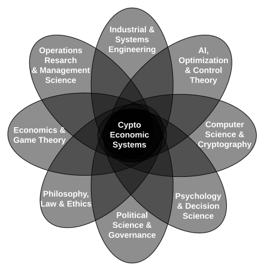
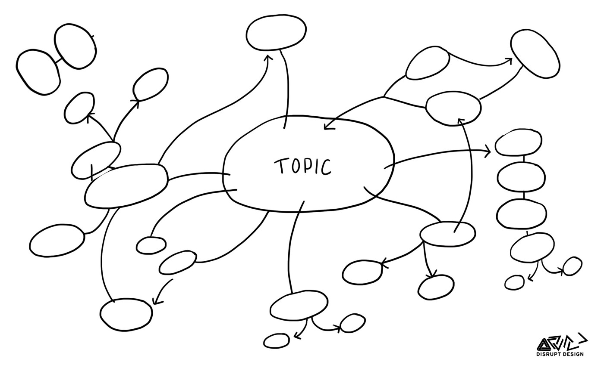
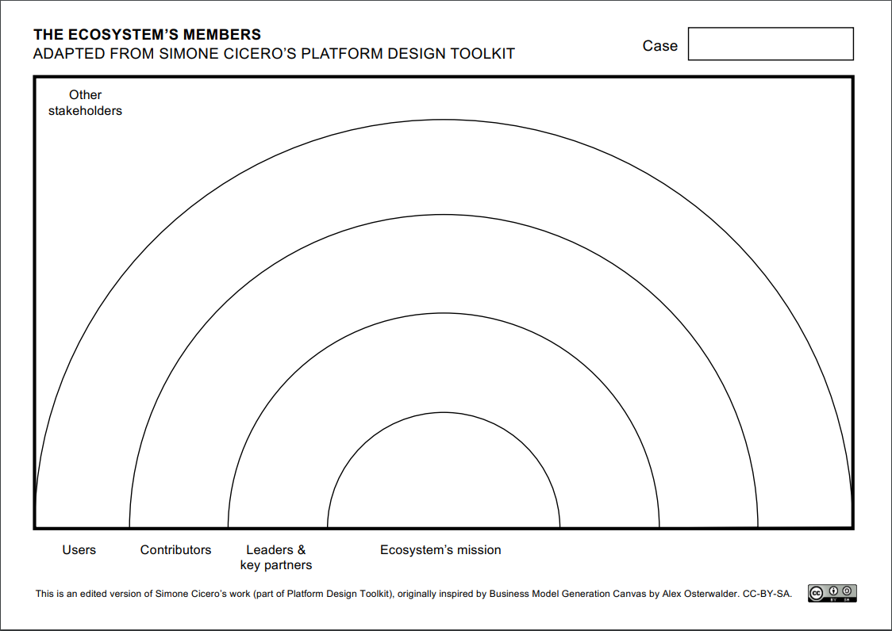
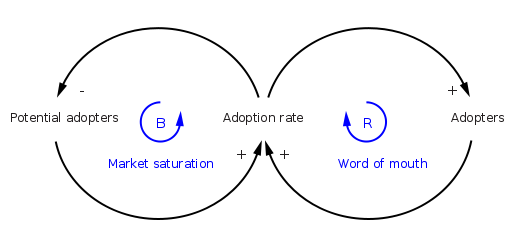
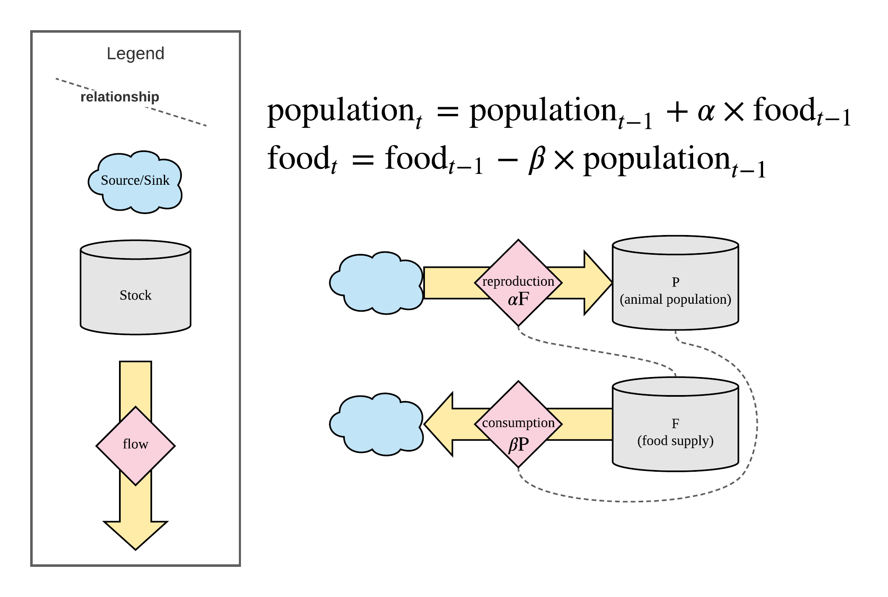
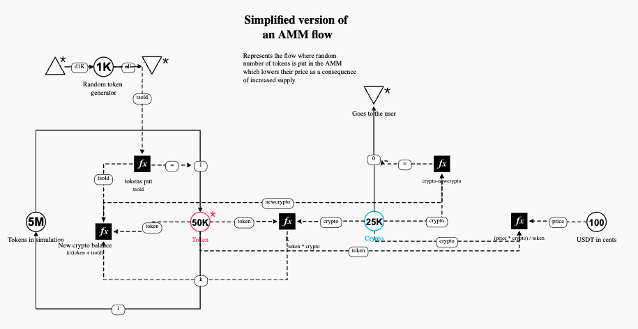
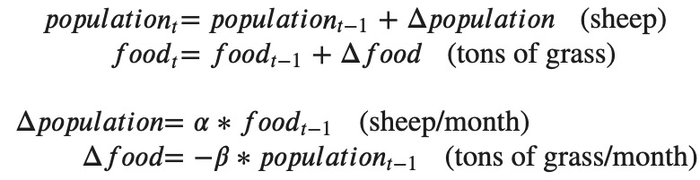
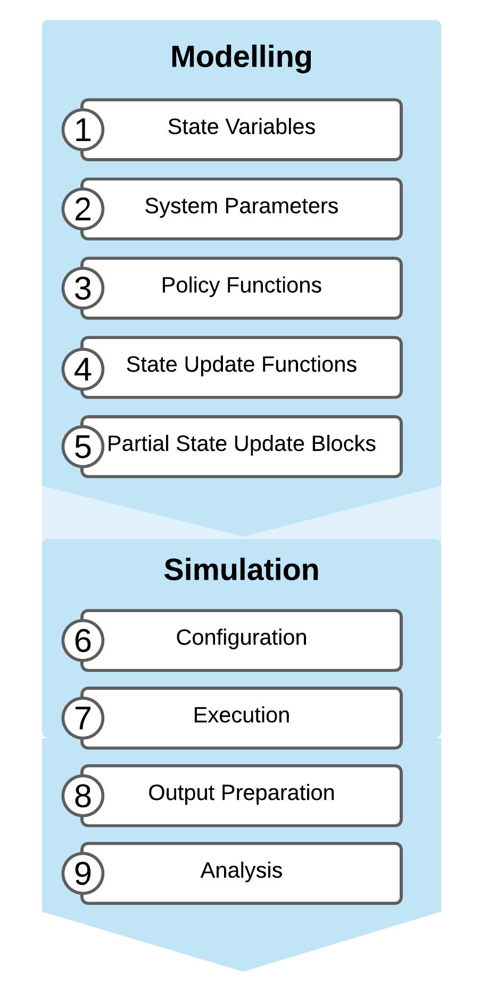
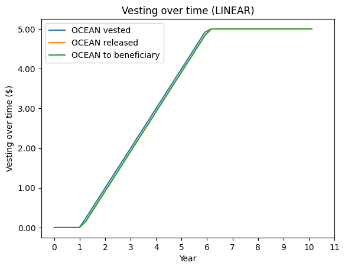

# Executive Summary

This is the first research paper in the series of research exploring Token Economics and Token Engineering tools and processes. It provides an introduction to the practice and the Process of Token Engineering. It also covers a portion of systems theory and the three most prevalent tools in the field of Token Engineering. These tools are:

1.  Machinations - tool token engineers can use in designing Crypto Economic systems in all stages, from System Mapping to Evaluation and improvements on the running system.
2.  cadCad - the package most often used in designing, testing, and validating complex systems through simulation.
3.  TokenSPICE - an EVM Agent-Based Token Simulator written in Python which simulates tokenized ecosystems via an agent-based approach, with EVM "in the loop".

# Introduction

We as humans are participating in numerous systems in our everyday life. Our families are a system, schools we participate in, markets we shop at, and countries we are residents of all have rules and incentives to get us to comply with their rules and laws. Some incentives are positive (you get paid for your work), and some are negative (steal, and if you are not lucky, you will get caught). Nevertheless, they serve as a guide to the participant's behavior.

In Web3, we have tokenized decentralized systems that anyone can participate in. Like any other system, the complex socio-economic system that is Web3 system must have rules and limitations to function correctly and according to its purpose. That is why said systems have their own economies to incentivize system participants towards a specific goal. These economies are called Token Economies, as Token is the medium by which transactions happen, and behavior is incentivized. "Tokens represent a part of the state of any cryptoeconomic systems and can be seen as their
atomic unit." - Shermin Voshmgir and Michael Zargham.

A token can cover various functions of money: medium of exchange, store of value, or unit of account. A token can represent anything in the confines of the Web3 tokenized system.
But the question here is: How to actually design these tokenized ecosystems? How to analyze said design and simulate it?

This is where the emerging Token Engineering field comes into play.

Token Engineering as a term was first mentioned in 2018. in the paper "Can Blockchains Go Rogue?" by Trent McConaghy of Ocean Protocol. In the article, he calls blockchains the "incentive machines with the power to get people to do stuff by rewarding with tokens". Trent McConaghy[^1]

Token engineering is a cross-disciplinary field that draws from systems, electrical, and robotics engineering practices. It also draws from Behavioural and Ecological Economics, AI, and Optimization. Its goal is to create reliable systems that work under varying circumstances and to create tokenomic systems that are exploit-proof. Shermin Voshmgir and Michael Zargham[^2]



*Figure 1: Crypto Economic systems as a cross-disciplinary field*

As Crypto Economic systems are complex,
Token Engineering process includes:

1.  Ideation and design of the system
2.  Modelling
3.  Simulation
4.  Testing
5.  Deployment
6.  Maintenance

This research will cover the process of token engineering and the tools used by token engineers to design, model and evaluate Crypto Economic systems. These tools are Machinations, cadCad and tokenSPICE.

# Goals & Methodology

The goal of this research is to serve as an introduction to the field of the Token Engineering, the process of Token Engineering and its tools. It will explore the process as a whole. On the tool side, we will examine Machinations, cadCad, and TokenSPICE.

The research will be done by reviewing the documentation of said tools, trying them out, and interviewing the people behind them. We will also interview an experienced Token Engineer to understand how the process is assessed in practice.

# Results & Discussion

## Steps in Token Engineering process

Below we will present some general steps in the process of Token Engineering.

### System Mapping

**Identifying what concepts and constructs are relevant to our model and goals for the system**

Before starting the process, we need to take systems thinking approach. In this stage of the design, the engineer:

-   Builds stakeholder taxonomies by identifying stakeholder groups, their possible actions, and the form of their incentives
-   Lays out the system dynamics and agent goals.

Some of the tools for system mapping are Cluster Maps and Ecosystem Canvas:

**Cluster Maps**

The system's goal is set in the middle of a cluster map while the associated nodes are drawn around it. This is a not-so-rigorous approach and is often used to get an outline of the system engineer is creating.



*Figure 2: Cluster map example*@acarogluToolsSystemsThinkers2017

**Ecosystem canvas**

When using this method, the purpose of the system is put at the center while key players are laid out in circles radiating outwards.



*Figure 3: Ecosystem canvas* Author stephenyo[^3]

### Formalising the design

After the initial phase is the phase of formalizing the design using causal loop diagrams and stock and flow diagrams, there is another tool called Machinations that Token Engineers could use in this step. We will cover Machinations later in the paper.

**Causal Loop Diagrams**

"A causal loop diagram is a"snapshot of all relationships that matter." It visualizes key variables (i.e., factors, issues, processes) and how they are interconnected. These diagrams show variables represented as texts and causal relationships between them as arrows." 'What Is a Causal Loop Diagram and What Is It Good For? \| Marketlinks'[^4]



*Figure 4: Causal Loop Diagram*

In a Causal Loop Diagram positive relationships are labeled with a plus sign while negative relationships are labeled with a minus sign. Above example is often used to explain this type of diagrams. It shows how market saturation and word of mouth impact potential adopters and adoption rate.

**Stock and flow diagrams**

Stock and flow diagrams are a more complex way of formalizing the design. You can see below a representation of the simple system using this diagram.



*Figure 5: Stock and Flow Diagram*

### Modularising the logic and model building

After formalizing the design, system modeling is done using an open-source python package, cadCad. We will cover cadCad in detail in the next section of the paper.

### Refining the model

As the name suggests, this is the part in the process where the model is refined using quantitative and qualitative backtesting.

### Evaluation and improvements on the running system

After the system is up and running cadCad model can be used as a "digital twin," which allows token engineers to:

-   evaluate proposed changes to the system
-   test the sensitivity of parameters
-   explore the success criteria and failure modes
-   evaluate behaviors and policies
-   make recommendations to governance bodies stephenyo[^5]

## Machinations

Machinations is a browser-based tool to design and balance game systems. This tool has seen use from game designers, consultants, developers, and analysts.
Token Engineers can also use this tool in designing Crypto Economic systems in stages from System Mapping to Evaluation and improvements on the running system. Machinations shines in pre-production.

Using Machinations, Token Engineer can:

-   Map systems in an interactive diagram
-   Set parameters that define resource flow
-   Plot and analyze the results in real-time using the chart option
-   Simulate outcomes for one player journey or stochastically using batch plays
-   Export outcomes in CSV
-   Export design parameters to Google Sheets

Machinations is uses these types of nodes:

-   Pools that collect Resources
-   Sources that create Resources
-   Drains that consume/destroy resources
-   Converters that transmute resources
-   Gates that redistribute resources

And two types of connections:

-   Resource connections that determine how the Resources flow
-   State connections that modify the state of diagram elements Dana[^6]

Below you will find a basic diagram created in machinations that can be used to see the flow of an AMM system:



*Figure 6: Machinations diagram example*

This design was done in less than 20 minutes and represents a basic flow of the user exchanging tokens for crypto using our AMM. The Key takeaway is that machinations, even though its main focus is on game design can be used for the stages of System Mapping and Formalising the design.

## cad Cad

                      ___________    ____
      ________ __ ___/ / ____/   |  / __ \
     / ___/ __` / __  / /   / /| | / / / /
    / /__/ /_/ / /_/ / /___/ ___ |/ /_/ /
    \___/\__,_/\__,_/\____/_/  |_/_____/
    by cadCAD                  ver. 0.4.28
    ======================================
           Complex Adaptive Dynamics       
           o       i        e
           m       d        s
           p       e        i
           u       d        g
           t                n
           e
           r

cadCad is the package most often used in designing, testing, and validating complex systems through simulation. It supports Monte Carlo methods, A/B testing, and parameter sweeping. cadCad can model systems from agent-based modeling to system dynamic modeling. It can easily be integrated with other Python modules and data science workflows. But first, let's briefly explain what these methods are:

"Monte Carlo simulations are used to model the probability of different outcomes in a process that cannot easily be predicted due to the intervention of random variables. It is a technique used to understand the impact of risk and uncertainty in prediction and forecasting models." 'What Is a Monte Carlo Simulation?'[^7]

"A/B Testing is a method to compare two (or more) variations of something and determine which one works better. In this method, users are randomly assigned to one of two variants. A statistical analysis is performed to determine which variation performs better for a defined business goal."[^8]

"In modeling, parameter sweeps are an important method for fine-tuning parameter values, exploring parameter space, and calibrating simulations to data. A parameter sweep is an iterative process in which simulations are run repeatedly using different values of the parameter(s) of choice. This process enables the modeler to determine a parameter's "best" value (or range of values), or even where in parameter space the model produces desirable (or non-desirable) behaviors." 'Parameter Sweeps and Model Iteration Idmtools Documentation'[^9]

Although it can be used to simulate any system that can be described as state variables that evolve over time according to a set of equations, cadCad has seen the most use in the Token Engineering process.

The first step in modeling using cadCad is the Visual System mapping we mentioned earlier.

Afterward, the next step is Mathematical specification using differential equations. For example, we will use the simple system of sheep from the cadCad introduction course:



Here we set the initial differential equations for our model. It is self explanatory. Population growth depends on food sources.

*Note: This is a simplified model used to for demonstration, Crypto Economy equations are much more complex*

Afterwards, the Modelling and simulation process in general works like this:



*Figure 7: cadCad processes*

We will briefly explain the steps without going into code examples as we will cover plenty of code examples in future research papers:

1.  First, the engineer defines all the state variables in the system and their initial values (they can be of any Python data type)
2.  Afterwards, the variables that impact the behavior of the model.
3.  Policy functions compute one or more signals to be passed to state update functions. They are used to describe the logic and behavior of a system component.
4.  State update functions are then designed to define how the model changes over time.
5.  Partial state update blocks are used for composing state update functions and policy functions in series or parallel.

Simulation process steps:

1.  In the configuration stage, engineer ties all the model compenents using "config_sim" and chooses how the simulation should run:
    1.  The number of times it will run
    2.  The number of timesteps the simulation will run for
    3.  The parameters of the system
2.  Execution computes the simulation output
3.  Output preparation is the process in which data is manipulated and analyzed in order to answer questions about the model.
4.  Analysis is self explanatory - engineer evaluates the model performance and if there is a need, improves the model. Usually that is the case as the first model is almost always not the optimal one.

As we can see cadCad covers the entire Token Engineering process with help from stock and flow diagrams and system mapping tools. We will cover this library and its functionalities in great detail in future research papers.

## TokenSPICE

TokenSPICE is an EVM Agent-Based Token Simulator written in Python, which simulates tokenized ecosystems via an agent-based approach, with EVM "in the loop".

Ethereum Virtual Machine (EVM) is a computation engine which acts like a decentralized computer that has millions of executable projects. It acts as the virtual machine which is the bedrock of Ethereum's entire operating structure. 'Ethereum Virtual Machine (EVM) \| CoinMarketCap'[^10]

TokenSPICE has been mainly used in later stage analysis and for verifying and tuning the system designs.

Agent-based modeling focuses on the individual active components of a system. Agents in tokenSPICE can be DAOs, unique users, and other protocols, making it a versatile tool.

It can be used in Token Engineering flows to design, tune and verify tokenized ecosystems.

If the engineer wants to model on the smart contract code directly and skip the equations set up like in cadCad, then the tokenSPICE is the tool of choice.

It uses Brownie, which treats smart contracts as classes, making it easier to run simulations. It also requires less work upfront in contrast to cadCad. Write the contracts in Solidity, then simulate with tokenSPICE.

When you run the simulator, the run function in SimEngine.py is triggered and starts the run loop in it:

``` python
def run(self):
        """
        @description
          Runs the simulation!  This is the main work routine.

        @return
           <<none>> but it continually generates an output csv output_dir
        """
        log.info("Begin.")
        log.info(str(self.state.ss) + "\n")  # pylint: disable=logging-not-lazy

        while True:  
            self.takeStep()
            if self.doStop():
                break
            self.state.tick += 1 
            chain.mine(blocks=1, timedelta=self.state.ss.time_step)
        log.info("Done")
```

Every single time it loops, every single agent inside the state takes a step:

``` python

def takeStep(self) -> None:
        """Run one tick, updates self.state"""
        log.debug("=============================================")
        log.debug("Tick=%d: begin", (self.state.tick))

        if (self.elapsedSeconds() % self.state.ss.log_interval) == 0:
            s, dataheader, datarow = self.createLogData()
            log.info("".join(s))
            self.logToCsv(dataheader, datarow)

        # main work
        self.state.takeStep()

        log.debug("=============================================")
        log.debug("Tick=%d: done", self.state.tick)
```

The rest of the file is dedicated to logging the results into CSV format, and we will not examine it further.

Similarly, the simulation engine also takes a step when the Agents take a step in the simulation.

Simulation with tokenSPICE can be done using the following command in the terminal and the results can saved in CSV or a plot created in png:

      tsp plot netlists/scheduler/netlist.py outdir_csv outdir_png

*Note: Netlists are just agents "wired-up"*

Here we ran a vesting simulation in the Ocean protocol and this is the resulting plot:



*Figure 8: Vesting simulation in tokenSPICE*

You can run all kinds of netlists in order to get a "feel" of it, in the tokenSPICE [official GitHub repo](https://github.com/tokenspice/tokenspice).

In contrast to cadCad, which can be used for any type of system, tokenSPICE is focused on EVM systems and incentives. The main difference is that cadCad is mainly used in the early-stage design of systems.

# Conclusion

Token Engineering as a field is still young, and the community around it is still tiny. However, the quality of tools available is exceptional. The tools range from general game design tools (Machinations) and general system design tools (cadCad) to specialized tools like tokenSPICE. The only missing piece of the puzzle are the Token Engineers, who will focus on mastering these tools to provide valuable insights into both designing and validating crypto-economic systems.

You can see the list of all possible tools for system modeling with tokens, and their strengths and weaknesses [here](https://github.com/TokenEngineeringCommunity/summary-of-tools/blob/main/README.md).

Considering the complex nature of systems in Web3, we have only discovered the tip of the iceberg and the picks to dig deeper and examine the economies of this vast ecosystem.

# Bibliography

<div id="refs" class="references csl-bib-body hanging-indent">

<div id="ref-danaFrameworkBasicsMachinations" class="csl-entry">

Dana, 'Framework Basics Machinations.io', *Machinations.io* \<<https://machinations.io/docs/framework-basics/>\> \[accessed 30 June 2022\]

</div>

<div id="ref-EthereumVirtualMachine" class="csl-entry">

'Ethereum Virtual Machine (EVM) \| CoinMarketCap', *CoinMarketCap Alexandria* \<<https://coinmarketcap.com/alexandria/glossary/ethereum-virtual-machine-evm>\> \[accessed 17 July 2022\]

</div>

<div id="ref-mcconaghyCanBlockchainsGo2020" class="csl-entry">

McConaghy, Trent, 'Can Blockchains Go Rogue?', *Medium*, 2020 \<<https://blog.oceanprotocol.com/can-blockchains-go-rogue-5134300ce790>\> \[accessed 29 June 2022\]

</div>

<div id="ref-ParameterSweepsModel" class="csl-entry">

'Parameter Sweeps and Model Iteration Idmtools Documentation' \<<https://institutefordiseasemodeling.github.io/idmtools/parameter-sweeps.html>\> \[accessed 1 July 2022\]

</div>

<div id="ref-stephenyoTokenEngineeringProcess2019" class="csl-entry">

stephenyo, Author, 'A Token Engineering Process', *Syoung.org*, 2019 \<<https://syounggallery.wordpress.com/2019/10/18/a-token-engineering-process/>\> \[accessed 29 June 2022\]

</div>

<div id="ref-voshmgirFoundationsCryptoeconomicSystems" class="csl-entry">

Voshmgir, Shermin, and Michael Zargham, 'Foundations of Cryptoeconomic Systems', 1.1, 18

</div>

<div id="ref-WhatCausalLoop" class="csl-entry">

'What Is a Causal Loop Diagram and What Is It Good For? \| Marketlinks' \<<https://www.marketlinks.org/resources/what-causal-loop-diagram-and-what-it-good>\> \[accessed 30 June 2022\]

</div>

<div id="ref-WhatMonteCarlo" class="csl-entry">

'What Is a Monte Carlo Simulation?', *Investopedia* \<<https://www.investopedia.com/terms/m/montecarlosimulation.asp>\> \[accessed 1 July 2022\]

</div>

</div>

[^1]: ['Can Blockchains Go Rogue?', *Medium*, 2020 \<<https://blog.oceanprotocol.com/can-blockchains-go-rogue-5134300ce790>\> \[accessed 29 June 2022\]](#ref-mcconaghyCanBlockchainsGo2020).

[^2]: ['Foundations of Cryptoeconomic Systems', 1.1, 18](#ref-voshmgirFoundationsCryptoeconomicSystems).

[^3]: ['A Token Engineering Process', *Syoung.org*, 2019 \<<https://syounggallery.wordpress.com/2019/10/18/a-token-engineering-process/>\> \[accessed 29 June 2022\]](#ref-stephenyoTokenEngineeringProcess2019).

[^4]: [\<[Https://www.marketlinks.org/resources/what-causal-loop-diagram-and-what-it-good](https://www.marketlinks.org/resources/what-causal-loop-diagram-and-what-it-good)\> \[accessed 30 June 2022\]](#ref-WhatCausalLoop).

[^5]: 

[^6]: ['Framework Basics Machinations.io', *Machinations.io* \<<https://machinations.io/docs/framework-basics/>\> \[accessed 30 June 2022\]](#ref-danaFrameworkBasicsMachinations).

[^7]: [*Investopedia* \<<https://www.investopedia.com/terms/m/montecarlosimulation.asp>\> \[accessed 1 July 2022\]](#ref-WhatMonteCarlo).

[^8]: [**devbot5sTesting2017?**](#ref-devbot5sTesting2017)

[^9]: [\<[Https://institutefordiseasemodeling.github.io/idmtools/parameter-sweeps.html](https://institutefordiseasemodeling.github.io/idmtools/parameter-sweeps.html)\> \[accessed 1 July 2022\]](#ref-ParameterSweepsModel).

[^10]: [*CoinMarketCap Alexandria* \<<https://coinmarketcap.com/alexandria/glossary/ethereum-virtual-machine-evm>\> \[accessed 17 July 2022\]](#ref-EthereumVirtualMachine).
