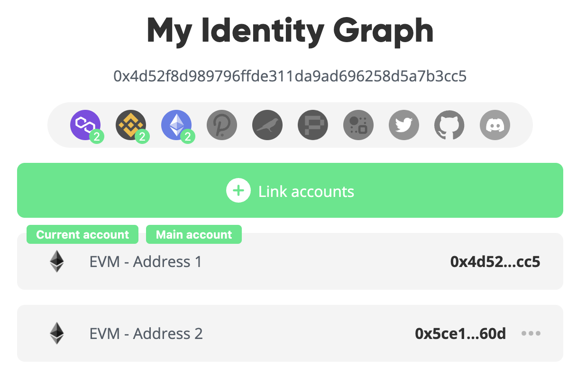
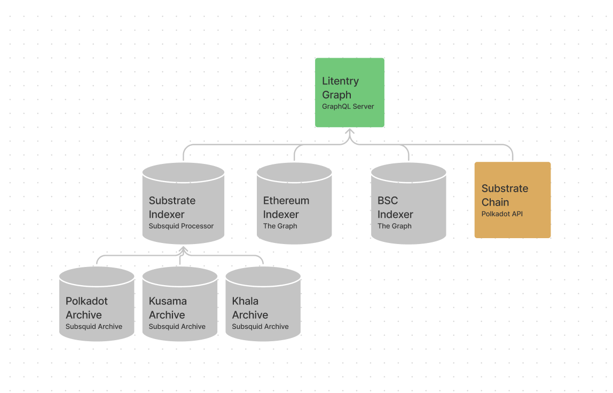
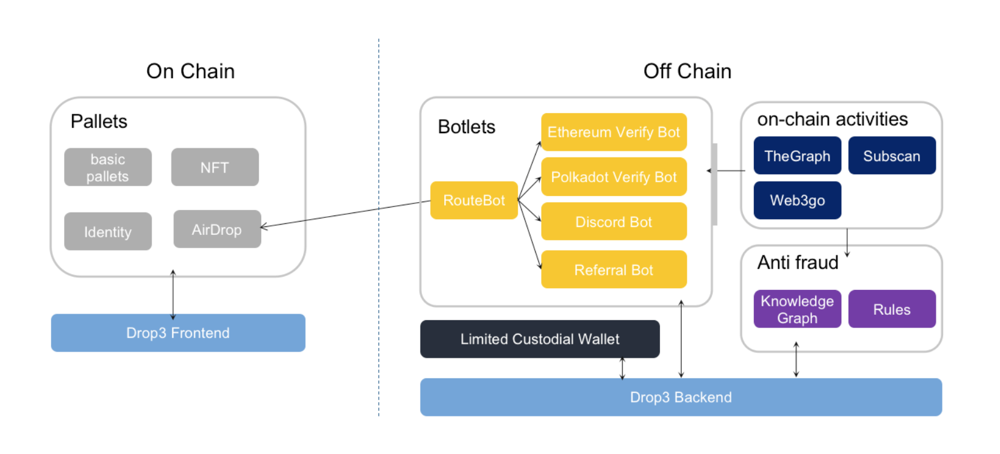
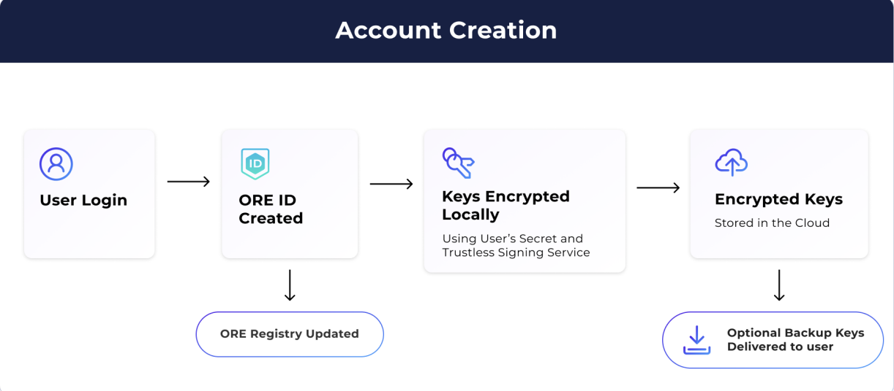
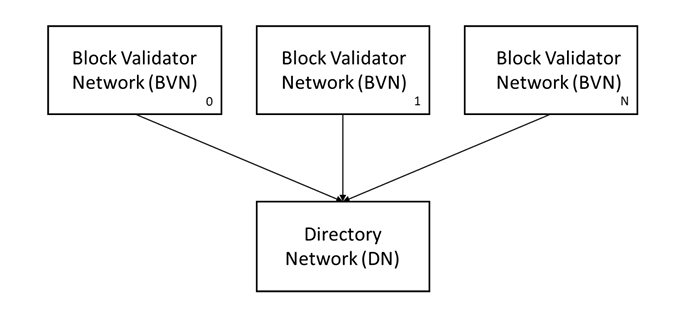

# \[ERFC - 248\] Crosschain Identity

|               |                       |
|:--------------|-----------------------|
| **Author(s)** | Aleksandar Damjanovic |
| **Date**      | 6/14/2022             |

### Table of Contents

-   [Executive Summary](#executive-summary)
-   [Introduction](#introduction)
-   [Goals & Methodology](#goals-methodology)
-   [Results & Discussion](#results-discussion)
    -   [Litentry - identity
        aggregator](#litentry---identity-aggregator)
    -   [ORE ID - identity registry](#ore-id---identity-registry)
    -   [Accumulate - mainnet launch planned for September
        2022](#accumulate---mainnet-launch-planned-for-september-2022)
-   [Conclusion](#conclusion)
-   [Bibliography](#bibliography)

# Executive Summary

When we look at the current Web2 user identity solutions, we can see
that they are mostly linked to centralized corporate organizations.
Although convenient for the end-user, this type of online identity is
not owned by the user, and the issuers (Google, Facebook, Twitter, etc.)
have complete control of them. In Web3, the focus is on
decentralization; however, the problem of cross-chain interoperability
of identities is a big one to overcome.

This paper examines the current state of cross-chain identity solutions
and the technology behind them to understand how they operate and tackle
the previously mentioned interoperability problem. Those solutions are:

1.  Litentry - a decentralized cross-chain identity aggregator which
    enables linking user identities across multiple networks. Litentry
    collects, indexes, and distributes DIDs to blockchains in a
    decentralized way.
2.  ORE - a cross-chain global identity registry where users have
    control over their own identity.
3.  Accumulate (mainnet launch planned for September 2022) - an
    identity-based, delegated proof-of-stake blockchain solution.

It also shortly covers Decentralized Identifiers (DIDs), Accumulate
Digital Identifiers (ADIs), tests and analyzes the project’s solutions
and current place in the Web3 market.

This paper does not cover Web3 identity solutions that are not
cross-chain, as that is not the main focus of this research.

# Introduction

In Web2, most users’ online identities are linked to centralized
corporate organizations like Facebook, Twitter, or Google. The problem
with this type of identity is that these organizations “own” your
identity on the platform and the associated data. That means that the
ease of use (single click logins, app interoperability, etc.) often
comes with the price mentioned above. Corporate organizations can close
and ban users’ accounts and sell their data which has been the case
before. As they have all the data from the user, they can (technically)
also generate credentials and log into any website using the user’s
identity. ‘Thousands of Leaked Facebook Documents Show Mark Zuckerberg
as “Master of Leverage” in Plan to Trade User Data’[^1]

Web3 is based on blockchain technology. Aside from use in financial
applications, blockchain can be used in creating and managing
Self-sovereign digital identities, like SSIs. SSI is a digital identity
concept in which an individual or company has complete control over
their account and personal data. ‘Self-Sovereign Identities’[^2]

The identity means nothing without claims from trusted sources
(government ID credentials, student ID credentials, library card
certificates). If many trusted parties assign claims to identity, thus
implicitly confirming it, then the identity is valid. We use our ID
number, issued by the government, anywhere, and every organization in
the country will accept our identity number as it was issued by the
trusted party confirming the identity. The validity of the identity is
not in the keys, but the claims and the keys are there to verify that we
indeed hold those claims.

Currently, when it comes to creating identity in Web3, we have various
“approaches” to it:

-   A user’s public key can be seen as a kind of identity on the
    blockchain. However, it is not very user-friendly, and it is limited
    in terms of cross-chain interoperability and in terms of
    representing a user. Users can own multiple addresses, thus having
    multiple “identities.”
-   In terms of creating an identity on the Ethereum blockchain,
    Ethereum Naming Service is the most used. ENS’s job is to map
    human-readable names like ‘3327.eth’ to machine-readable identifiers
    such as Ethereum addresses, other cryptocurrency addresses, content
    hashes, and metadata. ENS addresses can represent the user’s
    identity and be a kind of a user’s profile with its subdomains.
-   Various identity aggregators like Litentry, IDX, Accumulate, ORE
    network (this is debatable), etc.
-   SBTs and soul accounts are also proposed as a possible solution for
    an identity standard. However, they are currently a concept. They
    could evolve and become the standard someday.

# Goals & Methodology

This research will explore current solutions for creating a cross-chain
Web3 identity (aggregators, protocols). After mapping the solutions,
this research will propose the next steps in tackling this issue.

This paper will tackle this topic by reviewing various cross-chain
solutions’ documentation and whitepapers and exploring their properties,
implementation, and differences.

This paper will not be covering Web3 identity solutions that are not
cross-chain.

# Results & Discussion

Below we will discuss some of the current solutions that are trying to
tackle cross-chain identity.

## Litentry - identity aggregator

Litentry is a decentralized cross-chain identity aggregator which
enables linking user identities across multiple networks. Litentry
collects, indexes, and distributes DIDs to blockchains in a
decentralized way.

Aggregation is the process of integrating a wide range of digital
identities from multiple networks.

“Decentralized identifiers (DIDs) are a new type of identifier that
enables verifiable, decentralized digital identity. A DID refers to any
subject (e.g., a person, organization, thing, data model, abstract
entity, etc.) as determined by the controller of the DID.” DIDs, by
design, allow the controller of a DID to prove control over it without
requiring permission from any other party. ‘Decentralized Identifiers
(DIDs) V1.0’[^3]

Litentry’s main selling point is its decentralized identity and user
activity data aggregation infrastructure. It is built on Substrate
network.

Protocols could use identity aggregating service for collateralized
lending, DeFi insurance rate, and DAO voting power calculations,
preventing bots from getting airdrops and various other uses in dApps.

Main features of Litentry:

1.  Identity management - The primary focus of this platform are
    identities. Litentry provides anonymous and independent identities
    from applications and services used by the user.
2.  Identity Staking - As well as staking tokens and earning, users can
    “stake” their identity and get rewards.
3.  Distributed storage of identity data.
4.  Users do not need to create multiple accounts to use different
    platforms of services. They can use one identity to interact with
    various services.

Using Litentry, blockchain projects can “offer” special services to
users based on their identity’s quantified data.

“For example, if a new project knows that an account is a Polkadot
validator, and it spends hundreds of DOTs on another Parachain for half
a year, then the project could directly gift this specific user some
token to start to play with, or send him/her an attractive offer of the
new DeFi product, or accredit him to be a validated voter.” Litentry[^4]

It features an identity matching and identity staking mechanism, which
are at the very core of the Litentry model. But what do they represent
exactly?

Identity Matching is blind matchmaking where random anonymous identities
are picked from the on-chain pool of identities, and the substrate
off-chain worker processes candidate identity data. The network sends
the matchwinners DID as a matching opportunity back to the matching
buyer (for example, dApp that wants to do an airdrop). The buyer only
has access to the matchwinner’s DID; thus match buyer pays the LIT token
in exchange for a matching opportunity.

When it comes to identity staking, that is the process in which an
identity owner sends the snapshot of their identity document and DID to
the identities pool of blockchain and authorizes the read permissions to
the validator node. The owner gets staking and matching rewards in the
following blocks. The document is encrypted and stored on IPFS or on the
on-chain key-value store. DID is stored on-chain.

Litentry’s use cases and platforms that cover these use cases:

1.  TaskFi & Airdrops Whitelisting - Not yet implemented (Drop3
    Platform)

Litentry identity verification system enables Web3 projects to identify
target users and filter out bots. It also has a mechanism where users
need to complete the task and then get rewarded after the task is
complete.

2.  Social interaction (My Crypto Profile)

Using Litentry’s cross-chain capabilities, this platform enables users
to generate proof of ownership of various accounts and create a unique
identity graph that connects accounts and addresses from Ethereum,
Binance, Polkadot, Kusama, Phala, Twitter, and Github into a **unique**
Web3 identity. This identity can grant access to various dApps and
Airdrops. ‘My Crypto Profile \|
0x4d52f8d989796ffde311da9ad696258d5a7b3cc5’[^5]

*Picture 1: My Crypto Profile Identity Graph*

3.  Identity Data Analytics (Web3Go)

Web3 go is a multi-chain platform that uses Litentry’s DID aggregated
identity data to analyze and provide insights into the activity of a
particular cross-chain identity or identities.

4.  Polkadot Name system

Litentry currently acts as the main registrar entry for PNS (Polkadot
Name System ). Public data is indexed into the domain name with the
private name reserved in Litentry’s TEE side chain. A Trusted Execution
Environment (TEE) is an environment for executing code; it guarantees
code and data loaded inside to be protected with respect to
confidentiality and integrity. ‘Polkadot Name System’[^6]

Litentry products technical overview:

1.  Litentry Graph

Litentry Graph serves clients with aggregated identity data from
Substrate and EVM-based networks. Data is taken directly from the
blockchain using APIs such as Polkadot API or using blockchain indexers.

*Picture 2: Litentry Graph overview*

Litentry Graph - An Express GraphQL server using schema stitching to
aggregate a collection of remote schemas and subschemas.

Substrate Indexer - takes the data from the Substrate Archives and
transforms it into a schema designed for easy querying. Postgres is used
to store the data, and a GraphQL query node is used to serve the data to
the Litentry graph as a remote schema. This indexer is hosted by
Litentry.

Substrate Archive - Is a Postgres database with a real-time feed of raw
events and extrinsic data directly from the blockchain. A GraphQL query
node is used to serve the data to the Substrate Indexer.

Ethereum & BSC Indedxers - Litentry uses The Graph.

Substrate Chain - The Substrate Chain component queries data directly
from blockchain nodes via web sockets using the Polkadot API.

2.  Drop 3

*Picture 3: Drop3 Overview*

**Pallets, Ethereum Verify Bot and Web3 go Analysis are not yet
implemented**

Drop3 is still in the works. However, they have implemented some tasks
into the product like getting verified as a human, connecting polkadot
wallet etc.

3.  Governance mobile App - We will not go into details of this product
    as mobile apps are not the topic of the research.

4.  My Crypto Profile

Identity Graph:

    {
      "version": "v0.1",
      "did": "did:mcp:0xd8ebc2be207451ff9eafb3ef7fada06d64d05059",
      "main": {
        "address": "0x8ad12345c3bc8598d2f602d63e927f5995dcf5d0",
        "chain": "ethereum"
      },
      "web2List": [
        {
          "cid": "bafybeid5fo6ig6ilobawudqwgsu7so5guaedgvkdwyo6k5hnvlqiqjlhaq",
          "account": "x3",
          "socialType": "github",
          "validator": {
            "name": "Litentry Technologies GmbH",
            "validatedAt": "1645810190",
            "signature": "0x0c4c08460e651c6d6949af21c5b290bed39ffcae6cfdb5ef374760758c9387f3643992be7d5b6f5373fb78540b116750471a9fbcc68e5e5ccb5330250158bfab1c"
          }
        }
      ],
      "web3List": [
        {
          "cid": "bafybeihj43osgpx3u5zo567lod25rzfxoqrbspb27v2akdwrgwugziddf4",
          "proofs": ["bafybeidcihuc74xxgatyag2q6iiv7tjwn6vjgc4dk6jravthcryrazzkru"],
          "address": "5DXZdKSFTEx5rE25dnxamebAoSsA4fqgGT9VPFiiouxP2xM1",
          "chain": "polkadot",
          "validator": {
            "name": "Litentry Technologies GmbH",
            "validatedAt": "1645810190",
            "signature": "0x0c4c08460e651c6d6949af21c5b290bed39ffcae6cfdb5ef374760758c9387f3643992be7d5b6f5373fb78540b116750471a9fbcc68e5e5ccb5330250158bfab1c"
          }
        },
        {
          "cid": "bafybeibic6syxpgnvyp5udyrhhuosm3thbslrfm4ivaauqxtus6vbjghsm",
          "proofs": ["bafybeibbsripq672skohuiy6ruztjr5hwclkwoswj6yilt5rkezgmn4f3u"],
          "address": "5GgmqtSXGuh2d3LxRiYo691bL4iTYQNjLCAYNakj4xfmLjnm",
          "chain": "polkadot",
          "validator": {
            "name": "Litentry Technologies GmbH",
            "validatedAt": "1645810356",
            "signature": "0x0c5eb79402646ab7390355404243d73c01cde9ccabd0c26cb1803599c44de8621f69c05848c0e254bdf5849b3ff69fd43b82f3e346cdac3175d052cedf107c3c1c"
          }
        }
      ],
      "createdAt": "1646836239",
      "updatedAt": "1646836239"
    }

“Each ID graph is extracted by ID pairs. An ID pair is made of two
decentralized verifiable ownership claims. Each ID pair claims the joint
ownership of two accounts, it can be a pairing of two web3 addresses, or
a pairing of a web3 address and a web2 account. Everyone can verify and
trust the ID pair. Each ID graph is represented in its unique DID. For
ID graphs that have a common crypto address, one ID graph will be merged
into the other ID graphs and keep only one MCP DID.” - Litentry
‘Identity Graph’[^7]

Token economy:

Suppose we look at the price of LIT token, which is \$0.7227 at the time
of writing. Litentry reached an all-time high of \$14.79 on Feb 16,
2021. Currently, it’s down -95.11% since its record high.

From the market cap of just \$26,979,670 we can see that Litentry hasn’t
gained much attention or traction as a solution.

## ORE ID - identity registry

Developed by Aikon, ORE is a cross-chain global identity registry where
users have control over their own identity. This registry is stored on
the ORE blockchain. Users can use ORE ID as a single sign-on to manage
their wallets on multiple public blockchains. Single ORE ID account can
be used as a wallet on multiple chains because ORE ID accounts hold
public and private keypairs for ED 25519, SR25519, and SECP256K1 and
SECP256R1 encryption curves.

*Picture 4: ORE ID account creation process*

“Given how sensitive this data is, we use a Trustless Signing Service
that allows a user to decrypt their keys and send a signed transaction
to various blockchains using ChainJS library. Both of these modules are
open source, so any developer can audit the code.” - [ORE network’s
whitepaper](https://ore.network/wp-content/uploads/2021/09/ORE-Whitepaper-2.0.pdf)

ORE ID allows users to access various dApps with a one-click sign-up
experience. Users can use social logins of their choosing. ORE ID
creates blockchain accounts for the end-user when they sign up and
encrypts and stores the user’s private key with their chosen PIN. ORE ID
accounts are currently exportable to Scatter Wallet.

When developing an app that uses ORE ID accounts, developers need to
register the app and the app logo in order to get their APP-ID and
API-key. Documentation is well written and can be found
[here](https://github.com/TeamAikon/oreid).

ORE ID operates differently from Litentry as it creates an account that
works on multiple chains - it does not aggregate the existing addresses.

Token economy and future of ORE ID:

This project, although an interesting concept, with its market cap of
only \$ 319,175 doesn’t look like a solution for cross-chain identities
and onboarding new users. The current price is \$ 0.007984, while its
all-time-high was \$ 0.320. After testing the ORE ID, it seems that the
project has been neglected.

## Accumulate - mainnet launch planned for September 2022

Accumulate is an identity-based, delegated proof-of-stake blockchain
solution. It plans on creating a universal communication and audit layer
for individuals, entities, and blockchains to transact with each other
using their version of identifiers that adhere to W3C standards:
Accumulate Digital Identifiers (ADIs).

ADIs are human-readable addresses that users choose to represent their
presence on the blockchain. Using ADIs accumulate can serve as a
communication and audit layer between blockchains, enabling the transfer
of tokens between different chains, no matter the consensus mechanism.

ADIs are made of a collection of independent sub-chains. They are
managed by:

1.  Token accounts - Issuing tokens and tracking deposits and
    withdrawals from a token account.
2.  Data accounts - Tracking and organizing data.
3.  Staking accounts - Staking ACME tokens to participate in consensus.
4.  Scratch accounts - Accruing data that is needed to build consensus.

Accumulate Innovations:

1.  Identity - Accumulate is centered around ADIs where each ADI defines
    its own state that is independent of other ADIs. Each ADI has its
    own state and set of accounts and chains. They can be updated
    independently. They are distributed over a set of Tendermint
    networks.
2.  Synthetic Transactions - Because each ADI has its state,
    transactions that are routed to an ADI must be processed
    independently of all other ADIs. Accumulate generates another
    transaction that performs settlements within an ADI. These
    transactions are called synthetic since the protocol generates them
    in response to the transactions initiated by the user.  
3.  Scratch Accounts - Accumulate provides scratch accounts, which
    reduce the cost of using the blockchain for consensus building.
    “Scratch accounts allow processes to provide cryptographic proof of
    validation and process without overburdening the blockchain” -
    Accumulate Whitepaper ‘Whitepaper - Accumulate’[^8]

Integrations:

Accumulate protocol supports various smart contract roll-ups. This
allows Accumulate to track the state and validity of contracts on
third-party chains. Using Accumulate, organizations can process smart
contracts across various layer one protocols (Solana, Ethereum, Tezus).

Accumulate also plans on integrating with Layer-0 protocols, for
example, Cosmos and Polkadot. In that case, Accumulate can be utilized
to manage the transferred asset under the identity (ADI) of a buyer and
to continue tracking the assets across multiple chains.

Technical overview:

*Picture 5: Accumulate system overview*

In contrast to the traditional blockchain, where architecture is
centered around blocks, Accumulate is centered around accounts. Each
account is treated as an independent chain and managed as a growing
Merkle tree, and blocks are treated as a synchronization point for all
chains in the networks.

Inside the Directory Network and Block Validator Networks is the
interconnected network of chains responsible for collecting signatures,
communicating with each other, and anchoring roots to other blockchains.

These chains are:

1.  Signature chain, which collects signatures for a period of 2 weeks
2.  Main chain which records transactions in the origin account and
    accounts that are modified by the transactions
3.  Synthetic Transaction chain, which is used to store cryptographic
    proof that a synthetic transaction was actually produced by a
    particular BVN.
4.  Binary Patricia Trie, which collects hashes of the current state and
    history of accounts in BVN and DN.
5.  Root Anchor Chain - collects an anchor once per block from every
    account and system chain updated during the block.
6.  Intermediate Anchor Chain: Within the Directory Network, this chain
    collects anchors from the Root Anchor chain of every Block Validator
    Network once per block.

As our topic is identity we will focus more on the account and identity
architecture of Accumulate, which is actually at the very core of this
protocol:

Accumulate supports these accounts:

1.  Lite Token Account - Traditional address whose URL contains a public
    key hash and human-readable suffix denoting the token or a data type
    held by the account. When tokens are sent to this account, the
    account is created if it doesn’t exist. Users can create a key and
    have a trusted party send tokens to their URL.
2.  Lite Data Account - It is used for collaboration with Factom
    protocol. Lite Data Accounts are similar to token accounts, but they
    are limited to writing data.
3.  Accumulate Digital Identifier (ADI) - Primary unit of organization
    within Accumulate. ADIs can issue their tokens.
4.  Key book and Key Page - Belongs to an ADI and is used for key
    management.
5.  ADI Token and Data Accounts are explained at the beginning of the
    topic

Identity architecture:

Users can participate in the network through ADIs and Lite Accounts.
ADIs give users access to smart contracts, off-chain consensus building,
and dynamic key management. Lite Token and Data Accounts are just a
“lite” version of ADIs.

ADIs can only be created through the spending of Credits issued through
the Accumulate protocol. Users can also use their ADI to sponsor the
creation of other ADIs for themselves or others. These identities can
govern token issuance, off-chain consensus building, and multisig
signatures.

“ADI Data and Token Account URLs have the general format
`acc://<ADI>/<directory>/<account>` where the prefix acc : // specifies
the Accumulate blockchain, ADI specifies the toplevel identity in
control of the URL, directory specifies a particular type of account,
and account specifies data or tokens.” - Accumulate Whitepaper.

We will not venture deeper into the protocol architecture as it is
reasonably complex and goes well beyond this research topic. The main
takeaway is that it aims to create cross-chain transaction-compatible
accounts using ADIs. The details of a way how this will work in practice
are not covered in the whitepaper.

This project is still in development, which means the practical
implementations of the concepts presented in the whitepaper are still
under the big question mark sign.

# Conclusion

We can see from the explored “solutions” that tackling cross-chain
identity problems in Web3 is not an easy task. Many projects emerged but
fell victim to their lousy architecture and the general public’s low
interest. Different blockchains use different hash functions, making
creating a standardized cross-chain identity hard. SBTs, a newly
proposed solution by E. Glen Weyl, Puja Ohlhaver, and Vitalik Buterin
aim to solve the problem of Web3 identities by creating a new standard.
In their paper Decentralized Society: Finding Web3’s Soul, they propose
a new solution: Soul Accounts and Soul Bound Tokens. However, there is
no talk about Soul accounts being compatible with multiple chains. For
more information, see ERFC-261, which we already covered in that paper.
However, the concept of creating custom identity systems like the ones
above mentioned is an exciting topic, and we think it should be looked
into further, regardless of whether building a cross-chain identity or
not.

# Bibliography

‘Decentralized Identifiers (DIDs) V1.0’
\<<https://www.w3.org/TR/did-core/>\> \[accessed 15 June 2022\]

‘Identity Graph’
\<<https://docs.litentry.com/products/my-crypto-profile/product-features/identity-graph>\>
\[accessed 15 June 2022\]

Litentry, ‘Introducing Litentry’, *Medium*, 2020
\<<https://litentry.medium.com/introducing-litentry-d47b23d54281>\>
\[accessed 15 June 2022\]

‘My Crypto Profile \| 0x4d52f8d989796ffde311da9ad696258d5a7b3cc5’
\<<https://mycryptoprofile.io/profile/0x4d52f8d989796ffde311da9ad696258d5a7b3cc5>\>
\[accessed 15 June 2022\]

‘Polkadot Name System’ \<<https://www.pns.link/>\> \[accessed 15 June
2022\]

‘Self-Sovereign Identities’, *Bosch Global*
\<<https://www.bosch.com/stories/self-sovereign-identities/>\>
\[accessed 14 June 2022\]

‘Thousands of Leaked Facebook Documents Show Mark Zuckerberg as “Master
of Leverage” in Plan to Trade User Data’, *NBC News*
\<<https://www.nbcnews.com/tech/social-media/mark-zuckerberg-leveraged-facebook-user-data-fight-rivals-help-friends-n994706>\>
\[accessed 14 June 2022\]

‘Whitepaper - Accumulate’, 2022
\<<https://accumulatenetwork.io/whitepaper/>\> \[accessed 16 June 2022\]

[^1]: [*NBC News*
    \<<https://www.nbcnews.com/tech/social-media/mark-zuckerberg-leveraged-facebook-user-data-fight-rivals-help-friends-n994706>\>
    \[accessed 14 June 2022\]](#ref-ThousandsLeakedFacebook).

[^2]: [*Bosch Global*
    \<<https://www.bosch.com/stories/self-sovereign-identities/>\>
    \[accessed 14 June 2022\]](#ref-SelfsovereignIdentities).

[^3]: [\<[Https://www.w3.org/TR/did-core/](https://www.w3.org/TR/did-core/)\>
    \[accessed 15 June 2022\]](#ref-DecentralizedIdentifiersDIDs).

[^4]: [‘Introducing Litentry’, *Medium*, 2020
    \<<https://litentry.medium.com/introducing-litentry-d47b23d54281>\>
    \[accessed 15 June 2022\]](#ref-litentryIntroducingLitentry2020).

[^5]: [\<[Https://mycryptoprofile.io/profile/0x4d52f8d989796ffde311da9ad696258d5a7b3cc5](https://mycryptoprofile.io/profile/0x4d52f8d989796ffde311da9ad696258d5a7b3cc5)\>
    \[accessed 15 June 2022\]](#ref-MyCryptoProfile).

[^6]: [\<[Https://www.pns.link/](https://www.pns.link/)\> \[accessed 15
    June 2022\]](#ref-PolkadotNameSystem).

[^7]: [\<[Https://docs.litentry.com/products/my-crypto-profile/product-features/identity-graph](https://docs.litentry.com/products/my-crypto-profile/product-features/identity-graph)\>
    \[accessed 15 June 2022\]](#ref-IdentityGraph).

[^8]: [2022 \<<https://accumulatenetwork.io/whitepaper/>\> \[accessed 16
    June 2022\]](#ref-WhitepaperAccumulate2022).
