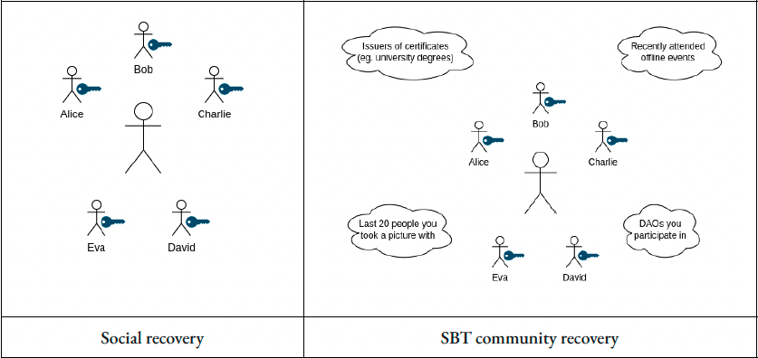
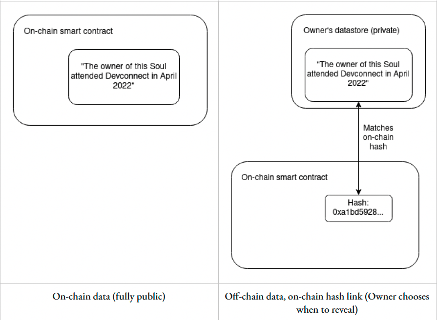
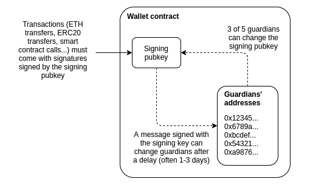

# Executive Summary

This paper explores the SBTs (Soulbound Tokens) as a concept, their potential use cases, and the difficulties of implementing this solution.
It also covers concepts of social and community recovery and briefly covers designated-verifier proofs and verifiable delay functions as they are potential enablers of this solution.

SBTs as a concept have major potential, although they face major obstacles like legacy systems, privacy and cold start issues. Nevertheless there is a positive sentiment towards this solution.

# Introduction

The online identity of users plays an essential role in Web2. It allows users to have an online reputation, a unique identifier, and access to products and services that would otherwise not be available to them.

In the Web3 ecosystem, there is a persistent problem of proving the identity and personhood of a user without going through various KYC processes. There have been multiple attempts to aggregate identities in a decentralized way, and solutions like Litentry, Open Rights Exchange and IDX have emerged as solutions to this problem. However, there is no standard for creating unique Web3 user identities. These identities, in theory, could broaden the use-cases and the complexity of the ecosystem.

In 2021 and the beginning of 2022, NFTs (Non-fungible tokens) were the "hot topic". Some of those NFTs reached a sale price of over \$90.000.000.[^1] At the core of these tokens is their transferability between addresses (parties), be it transfers or sales. Alas, we will not cover NFTs in great detail as there are more papers and research on that topic.

In this paper, we explore the newly proposed primitive: SBTs (Soulbound Tokens), which trade in transferability to satisfy other potential use cases that could not be satisfied with transferable NFTs. The "soulbound" in the name of SBTs takes inspiration from the famous game World of Warcraft, where some items, once acquired, are bound to the player and cannot be traded or transferred.

# Goals & Methodology

The goal is to understand the need for this type of tokens, the necessity of using them for various use-cases in Web3, and the utility they could provide.

This will be done by exploring the ["Decentralized Society: Finding Web3's Soul"](https://papers.ssrn.com/sol3/papers.cfm?abstract_id=4105763) paper written by E. Glen Weyl, Puja Ohlhaver, and Vitalik Buterin and how non-transferable SBTs could transform the Web3 space(lending, governance, reputation, etc.). Current sentiment towards this new primitive will also be explored (social media, blog posts, papers, etc.).

This research can be used as a short overview of the paper mentioned above and an overview of the current sentiment on SBTs.

# Results & Discussion

## Some of the current problems in Web3

If we look at the Web2 as it is now, the online identities of various users are a major part of various processes. Users can even use their identity on other platforms to easily register to others with a click or two. For example, a Google account
In the future, unique identity linked to a user (in this case a "Soul") could be a solution that would bring onboard more people to Web3, unlock new potential uses-cases, and potentially create a standardized reputation system. Currently Web3 is dependent on various Web2 structures regarding representing social identity. Examples:

1.  NFT platforms rely on centralized platforms for a proof of scarcity and initial provenance.
2.  DAOs. If DAOS want to prevent Sybil attacks, they usually rely on social media profiles for proof of personhood.
3.  Web3 participants rely on centralized custodial wallets. Wallets that offer decentralized key management are not user-friendly.
4.  Generally, it's hard to establish reputation systems and manage blacklisting as anyone can create another address and access your protocol, for example
5.  Lack of native web3 identity. This makes undercollateralized lending virtually impossible.
6.  Governance vulnerability to financial attacks.

These problems could, in theory, as the paper mentioned earlier says, be solved by introducing SBTs in Web3.

## What are souls exactly?

**Souls are accounts or wallets that hold publicly visible, non-transferable tokens. Those tokens could pottentially also be revocable by the issuer.**[^2]

The tokens that the Soul account or wallet owns should be SBTs. Soul could, in theory, hold various types of tokens, but that possibility isn't explored in the paper. SBTs could be used to represent affiliations,
credentials, memberships, etc. but more on that in the following paragraphs. The true power of these tokens lies if there was a possibility for SBTs to be issued and verified by other Soul accounts that are counterparties in the relationship. These counterparty Souls could be individuals, companies, or institutions.

Another essential property of Soul accounts or wallets is the abundance of a requirement for a soul to be linked to a legal name or a need to ensure that there is one soul account per human. Soul accounts or wallets could also be possibly transferred across humans.

Souls can also be a type of reputation signal of the user to the ecosystem. Depending on the SBTs that the soul account has, the user could have a positive or negative reputation. A positive reputation could give the user various benefits regarding products and services, and a negative one could prevent users from accessing them. This property can also pose a problem protocols could "redline" (discriminate) owners of some SBTs and prevent them from using their product.

## Possible use cases of SBTs

### SBTs and Lending

In traditional finance, reputation is a significant factor in uncollateralized lending. This system often relies on centralized credit scores of borrowers to gauge creditworthiness. However, this has flaws like not providing lending services if there is insufficient data on the borrower and discrimination.

In Web3, users must overcollateralize in the token of their choice to receive a loan. This is where the SBTs could, in theory, provide a solution.

**"Implementation and adoption of SBTs have a potential to unlock a censorship-resistant, bottom-up alternative to top-down commercial and"social" credit systems."** - E. Glen Weyl, Puja Ohlhaver, Vitalik Buterin

In the case of lending, SBTs could represent education credentials, work history, and rental contracts, which could signal "creditworthiness".

The loans themselves could be represented by the SBTs, which could be burnable by the institution that has given the loan. After the burning of the token, an institution could send another SBT to the borrower. This time it would be a proof of timely repayment SBT. This token could serve as a "signal" to other lenders that this borrower returns his/hers loans on time, which would impact the borrower's "credit score" and provide the borrower with better loan conditions. Non-transferability prevents transferring or hiding outstanding loans. A rich ecosystem of SBTs ensures that borrowers who try to escape their loans (creating a new soul) will have insufficient SBTs to stake their reputation.

#### Community lending market

**"SBTs would offer a substrate for community lending practices similar to those pioneered by Muhammad Yunus and the Grameen Bank, where members of a social network agree to support one another's liabilities. Because a Soul's constellation of SBTs represents memberships across social groups, participants could easily discover other Souls who
would be valuable co-participants in a group lending project.Whereas commercial lending is a "lend-it-and-forget-it" until repayment model, community lending might take a "lend-it-and-help-it" approach---combining working capital with human capital with greater rates of return."** - E. Glen Weyl, Puja Ohlhaver, Vitalik Buterin

#### What are the first steps?

There are a couple of "requirements" for this type of lending to be true:

-   Soul accounts/wallets would carry SBTs they are comfortable sharing publicly. This could be an excellent first step for the adoption of social/intra-community lending in Web3.
-   Social relationships and credentials would play a significant role in this type of lending.

### SBTs and NFTs

In terms of NFTs , Souls could play a major role in terms of artist's reputation. When issuing NFTs artist could issue them from their Soul.

"The more SBTs the artist's Soul carries, the easier it
would be for buyers to identify the Soul as belonging to that artist, and thereby also confirm the NFT's
legitimacy. Artists could go a step further to issue a linked SBT stored in their Soul that attests to the NFT's
membership to a "collection" and vouches for whatever scarcity limits the artist wishes to set. Souls would
thus create a verifable, on-chain way to stake and build reputation on the provenance and scarcity of an
object." - E. Glen Weyl, Puja Ohlhaver, Vitalik Buterin

The application of SBTs in this market extends beyond art. Some examples of potential use cases:

-   various services
-   rentals/property
-   authentication
-   social provenance
-   retail
-   gaming
-   and many more, SBTs unlock the use cases where NFTs cannot be applicable

### Soul Accounts in Airdrops and DAOs

Soulbound Tokens could also enable communities to be convened at the intersection of souls and to form a DAO, for example. Drops of SBTs or "Souldrops" can be given based on SBTs and other tokens within a Soul (soul account/wallet). Some examples:

-   conference attendees
-   certified programmers
-   early members
-   etc

"Souldrops could also introduce novel incentives to encourage community engagement. Dropped SBTs could be engineered to be soulbound for a period but eventually "vest" into transferable tokens over time. Or the reverse could be true. Transferable tokens held for some period could unlock the right to SBTs that confer further governance rights over a protocol. SBTs open a rich possibility space to experiment with mechanisms that maximize community engagement and other goals, like decentralization" - E. Glen Weyl, Puja Ohlhaver, Vitalik Buterin

In DAOS, SBTs could be used to mitigate Sybil attacks in various ways:

-   computing over a Soul's constellation of SBTs to differentiate between unique Souls and probable bots and denying any voting power to a Soul that appears to be a Sybil.
-   conferring more voting power to Souls with more reputable SBTs --- like work or educational credentials, licenses, or certifications.
-   issuing specialized "proof-of-personhood" SBTs could help other DAOs bootstrap Sybil resistance.
-   checking for correlations between SBTs held by Souls who support a particular vote and applying a lower vote weight to highly correlated voters.

Souls and SBTs could also be used to estimate the decentralization degree in the governance of DAOs and protocols.

### Property

So far, NFTs could not effectively be applied to property rights, considering their ease of transfer. Using SBTs, owners could set different rights and limitations for the same property (vehicles, real estate, events, etc.).

## Recovery of Soul Accounts/Wallets

Soul accounts would probably be recoverable by using Social Recovery.

### Social recovery

A social recovery system/wallet works as follows:

-   There is a single "signing key" that can be used to approve transactions
-   There is a set of at least 3 (or a much higher number) of "guardians", of which a majority can cooperate to change the signing key of the account. The signing key can add or remove guardians, though only after a delay.

A social recovery wallet can be used as a regular wallet. In case of losing a key, the user can reach out to their guardians and ask them to sign a particular transaction to change the signing pubkey registered in the wallet contract to a new one.

Guardians can be:

-   other devices
-   friends and family members
-   institutions (they can verify your identity by phone number, e-mail, etc.)[^3]

### SBT community recovery

In this proposed solution, Soul recovery is tied to the Soul's memberships across communities.

"In a community recovery model, recovering a Soul's private keys would require a member from a qualified majority of a (random subset of) Soul's communities
to consent." - E. Glen Weyl, Puja Ohlhaver, Vitalik Buterin.

This recovery implies secure, off-chain communication channels where authentication can occur.

*Picture 1: Social recovery vs SBT community recovery*

**By embedding security in sociality , a Soul can always regenerate their keys through community recovery, which deters Soul theft (or sale): because a Seller would need to prove selling the recovery relationships, any attempt to sell a Soul lacks credibility.** - E. Glen Weyl, Puja Ohlhaver, Vitalik Buterin.

This recovery solution is just a proposition and requires more experimentation.

## Implementation and adoption challenges

### Privacy

One of the biggest challenges in the adoption of SBTs is privacy. Too many public SBTs that a soul possesses can reveal too much information about a soul.

Blockchain systems are public by default, and every transaction and relationship recorded on-chain is available for everyone in the world to see. One possible solution is to have separate souls for professional and private life. These souls can easily be linked if there are no serious privacy solutions.

Another solution is to have SBTs that could store data off-chain, leaving only the hash of the data on-chain.

*Picture 2: A way to keep some of the SBTs private*

The choice of how to store data is left to the person. Possible solutions are:

-   their own devices
-   a trusted cloud service
-   IPFS or other decentralized networks

Zero-knowledge proofs are another possible solution that could help kickstart the adoption of SBTs. They also can allow people to prove arbitrary statements
without revealing any more information beyond the statement itself. They can be computed over SBTs to prove characteristics about a Soul. Privacy could be extended further by introducing multi-party computation techniques like [garbled circuits](https://www.esat.kuleuven.be/cosic/blog/introduction-to-garbled-circuit/).

Other possible solutions for privacy problems include designated-verifier proofs and verifiable delay functions.

For example: If user A wants to prove some property about its SBTs to user B, they can make a zero-knowledge proof of the statement "I hold SBTs that have the property Z." User B can then be sure as he didn't make the proof. But what about passing somebody else's proof? Users can mitigate this by using [verifiable delay functions](https://eprint.iacr.org/2018/601.pdf). Using verifiable delay functions, user A can make and present a proof that can only be made with required SBTs at the moment, but anyone else will be able to make five minutes from now.

### Bribing the owners of the SBTs

Owners of the SBTs could be bribed by various parties in order to influence their voting or to exploit their other SBTs.

In the research paper, writers mention these ways of exploits mitigations:

1.  "The ecosystem of SBTs could bootstrap of "thick" community channels , where SBTs signal
    authentic off-chain community membership with strong social bonds and repeat interactions. This would make it easier for communities to alter and revoke SBTs of impersonators and bots. Such thick channels---which we often and in churches, workplaces, schools, meet-up groups, and organizations in civil society---would provide a more sybil-resistant social substrate to police gaming (e.g., through bots, bribes, impersonation) in more "thin" social channels.
2.  Nested communities could require SBTs to force context on potential collusion vectors "just below" them . For example, if a state were holding a funding round or vote, the state might require every participating citizen to also hold an SBT of a defined county and municipality.
3.  The openness and cryptographic provability of the SBT ecosystem could itself be used to actively detect collusive patterns and penalize inauthentic behavior ---perhaps discounting the voting power of collusive Souls, or obliging Souls to accept SBTs representing negative attestations.
4.  ZK technology (eg. MACI ) could cryptographically prevent some attestations made by a Soul from being provable.
5.  Encouraging of whistleblowers
6.  Mechanisms from peer-prediction theory
7.  Correlation scores that focus on correlations where there is a large incentive to be honest if a group of Souls share a common interest." - E. Glen Weyl, Puja Ohlhaver, Vitalik Buterin. 'Decentralized Society: Finding Web3's Soul by E. Glen Weyl, Puja Ohlhaver, Vitalik Buterin :: SSRN'[^4]

### Legacy systems

Current identity systems tend to concentrate power on the issuer of identity proofs. If we look at the government IDs, for example, the user doesn't own their identity. Government can track users' movement (passports), revoke licenses (driving licenses), and put an "expiration date" on your ID card. In Web3 idendity is often handled by identity protocols like: Litentry, ORE network and IDX. When it comes to identity, SBTs and their DeSoc property could, in theory, replace the existing legacy system. However, changes in ID systems usually take a very long time.

### Cold start challenge

The research paper asks a question: **What comes first SBTs or social recovery?**

When it comes to SBTs currently revokable tokens could be created and minted to wallets. They are referred to as "Proto SBTs", allthough they are not as practical as SBTs proposed they could be a step in the right direction.

Community recovery wallets like [Argent](https://www.argent.xyz/) and [Loopring](https://loopring.io/#/) also show that social recovery wallets can work in practice.

*Picture 3: Social recovery wallets explained*

"Norms can also shepherd Souls into existence. As we rethink tokens and wallets, we can also
reframe how we think about certain classes of NFTs and tokens that are intended to signal membership. In
particular, we can introduce a norm of not transferring NFTs and POAPs issued by reputable institutions
that reflect attendance to a conference, work experience, or education credentials. Such transfers of
membership tokens---if traded for value---could diminish the reputation of a wallet and perhaps discourage
issuers from further issuing membership or POAP tokens to that wallet." - E. Glen Weyl, Puja Ohlhaver, Vitalik Buterin

## Sentiment

When the paper came out on May 11th 2022, it didn't gain mainstream attention initially. Around 20th of May the paper and the ideas in it caught the attention of media outside Web3 space with magazines like [Fortune](https://fortune.com/2022/05/26/what-are-soulbound-tokens-web3-buterin/) covering the ideas presented.

[In an interview](https://twitter.com/iamjasonlevin/status/1527316024659353601?ref_src=twsrc%5Etfw%7Ctwcamp%5Etweetembed%7Ctwterm%5E1527316024659353601%7Ctwgr%5E%7Ctwcon%5Es1_&ref_url=https%3A%2F%2Fnftnow.com%2Fguides%2Fsoulbound-tokens-sbts-meet-the-tokens-that-may-change-your-life%2F) held by Jason Levin with E. Glen Weyl , the author predicted that that SBTs will be available for early uses by the end of 2022 and that the 2024 up cycle will focus on SBTs.

Overall response to the paper was very positive all across the board and many potential use cases are discussed.

# Conclusion

As presented above, Souls and SBTs and their potential implementation have many obstacles in front of them. Problems like privacy, bribing users, and cold-start challenges are not the small ones to get a grip on. Souls and community recovery system would also require efficient and secure off-chain communication channels.

When it comes to privacy, zero-knowledge proofs are a great possible solution to this problem. Other problems presented will be hard to solve.

Regarding Web3 and its mass adoption and its principles, SBTs (Soulbound tokens) seem like the next logical step. There are various potential use-cases for them, and if the initial hurdles presented in this research and the research paper of the authors are to be overcome, it is more than likely that SBTs will start a "new chapter" in Web3 and onboard new users.

If the potential use-cases are satisfied, SBTs have the potential to change society as we know it. All beginnings are rough, right?

# Bibliography

'Decentralized Society: Finding Web3's Soul by E. Glen Weyl, Puja Ohlhaver, Vitalik Buterin :: SSRN' \<<https://papers.ssrn.com/sol3/papers.cfm?abstract_id=4105763>\> \[accessed 14 June 2022\]

'Why We Need Wide Adoption of Social Recovery Wallets' \<<https://vitalik.ca/general/2021/01/11/recovery.html>\> \[accessed 1 June 2022\]

[^1]: [**MostExpensiveNFTs?**](#ref-MostExpensiveNFTs)

[^2]: [**weylDecentralizedSocietyFinding2022?**](#ref-weylDecentralizedSocietyFinding2022)

[^3]: ['Why We Need Wide Adoption of Social Recovery Wallets' \<<https://vitalik.ca/general/2021/01/11/recovery.html>\> \[accessed 1 June 2022\]](#ref-WhyWeNeed).

[^4]: [\<[Https://papers.ssrn.com/sol3/papers.cfm?abstract_id=4105763](https://papers.ssrn.com/sol3/papers.cfm?abstract_id=4105763)\> \[accessed 14 June 2022\]](#ref-DecentralizedSocietyFinding).
