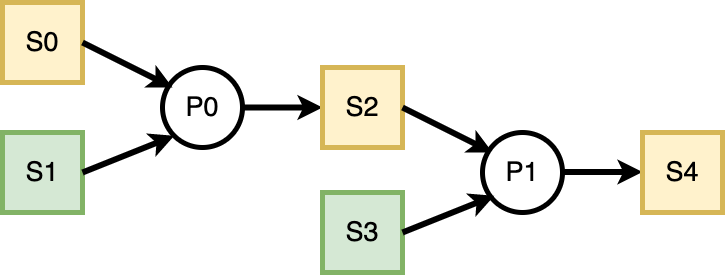

\[ERFC - 315\] Reaching Towards Realtime in Blockchain
================
Milos Bojinovic
June 19, 2022

-   <a href="#executive-summary" id="toc-executive-summary">Executive
    Summary</a>
-   <a href="#introduction" id="toc-introduction">Introduction</a>
    -   <a href="#ethereums-layer-1" id="toc-ethereums-layer-1">Ethereum’s Layer
        1</a>
    -   <a href="#off-chain-scaling-approaches"
        id="toc-off-chain-scaling-approaches">Off-chain Scaling Approaches</a>
        -   <a href="#sidechains" id="toc-sidechains">Sidechains</a>
        -   <a href="#optimistic-rollups" id="toc-optimistic-rollups">Optimistic
            Rollups</a>
    -   <a href="#bridges-and-cross-chain-applications"
        id="toc-bridges-and-cross-chain-applications">Bridges and Cross-chain
        Applications</a>
        -   <a href="#application-specific-blockchains"
            id="toc-application-specific-blockchains">Application-specific
            Blockchains</a>
    -   <a href="#concept-of-time-in-blockchains"
        id="toc-concept-of-time-in-blockchains">Concept of Time in
        Blockchains</a>
-   <a href="#goals-methodology" id="toc-goals-methodology">Goals &amp;
    Methodology</a>
-   <a href="#results-discussion" id="toc-results-discussion">Results &amp;
    Discussion</a>
    -   <a href="#on-chain-code" id="toc-on-chain-code">On-chain code</a>
        -   <a href="#parallezization-of-processes"
            id="toc-parallezization-of-processes">Parallezization of Processes</a>
        -   <a href="#persistence-across-transactions"
            id="toc-persistence-across-transactions">Persistence across
            Transactions</a>
        -   <a href="#prioritization-of-processes"
            id="toc-prioritization-of-processes">Prioritization of Processes</a>
        -   <a href="#providing-guarantees-committing-to-promises"
            id="toc-providing-guarantees-committing-to-promises">Providing
            Guarantees: Committing to Promises</a>
        -   <a href="#honoring-commitments" id="toc-honoring-commitments">Honoring
            Commitments</a>
    -   <a href="#off-chain-code" id="toc-off-chain-code">Off-chain code</a>
        -   <a href="#monitoring-the-on-chain-activity"
            id="toc-monitoring-the-on-chain-activity">Monitoring the on-chain
            activity</a>
        -   <a href="#optimization-of-action-sequences"
            id="toc-optimization-of-action-sequences">Optimization of action
            sequences</a>
-   <a href="#conclusion" id="toc-conclusion">Conclusion</a>
-   <a href="#bibliography" id="toc-bibliography">Bibliography</a>

# Executive Summary

The concept of **Real-Time** can be best explained as a set of
guarantees that are given and that need to be met within a predetermined
time period. Usually, though not necessarily, this is a short time
period. In the case the guarantees are not met before the deadline has
been reached, then the performance of the real-time system either
degrades or the system has failed completely.

For a blockchain to achieve real-time operations, it has to have low
latency and indirectly a high throughput, hopefully without sacrificing
decentralization and security.

This is a problem of scaling a blockchain, and several approaches exist,
each with its advantages and limitations. These approaches can be
grouped into **on-chain** and **off-chain** scaling solutions, with the
main difference being whether there exist a need for changing the
blockchain’s protocol in some way.

The main focus of this research is put on the off-chain scaling in the
Ethereum Ecosystem and how can a Decentralized Application (DApp)
potentially achieve something that resembles real-time operations.

The research proposes a framework consisting of an off-chain and
on-chain part where the on-chain part would be used to enforce rules
that the off-chain code needs to honor.

The ideas proposed here would need to be expanded upon and thoroughly
tested in real-world conditions to completely assess their practical
significance.

Further research should also take into consideration on-chain scaling,
namely ETH2.0, as well as an exciting concept of creating a network of
private sovereign blockchains built specifically for the DApp’s needs.

# Introduction

## Ethereum’s Layer 1

Ethereum blockchain, as defined in,[^1] can be viewed as a
“transaction-based state machine” that groups transactions into blocks
which are then sequentially executed in the order that was set by the
block’s creator - miner.

Before being included inside a block, the transactions reside in the
pending transaction pool. Miners have complete control over what
transactions get included and in what order. Each transaction advances
the chain’s state for which the miners are rewarded fees paid by the
Externally-Owned-Account(EOA)\* that initiated the transaction.

In essence, the more the EOA is willing to pay for the service of
including their transaction, the more likely it is will be included in
the next block. This creates the problem in the situation of
blockchain’s network congestion - as the transactions are being created
at a faster rate than they can be processed, fees drastically increase,
and it becomes a competition between different EOAs, which leads to a
bad user experience.

To ease the load put on the Ethereum Mainnet (Layer 1 - L1) chain and
effectively perform scaling, multiple approaches exist: Sidechains and
schemes commonly referred to as Layer 2 (L2) solutions. L2 solutions
include State Channels, Plasma, and Rollups (Optimistic and
Zero-Knowledge based).

\* Ethereum account can be defined as a private-public keypair mapped to
an address. EOA is a type of an Ethereum account where the private key
is known and “externally” controlled, in contrast to smart contract
accounts where the private key is not known, and only the address
exists.

## Off-chain Scaling Approaches

When considering approaches to Ethereum’s scaling problem, this paper
considers only Ethereum Virtual Machine (EVM) compatible sidechains and
optimistic rollups.

### Sidechains

Sidechains are completely independent parallel blockchains to the
Ethereum’s L1, with which they can communicate over two-way bridges.
They introduce their own set of parameters and operate on different
rules.

For example, [Polygon](https://polygon.technology/), a popular Ethereum
sidechain, uses Proof-of-Stake for its consensus mechanism, with block
times being around 2.3 seconds[^2] (Ethereum’s average block time is
between 12 and 14 seconds)[^3]

### Optimistic Rollups

Unlike Sidechains, Optimistic Rollups have their security rooted in the
L1 chain.

As Vitalik Buterin, the founder of Ethereum discusses in[^4] :

> “Instead of putting all activity on the blockchain directly, users
> perform the bulk of their activity off-chain in a”layer 2” protocol.
> There is a smart contract on-chain, which only has two tasks:
> processing deposits and withdrawals and verifying proofs that
> everything happening off-chain is following the rules. There are
> multiple ways to do these proofs, but they all share the property that
> verifying the proofs on-chain is much cheaper than doing the original
> computation off-chain.”

In Optimistic Rollups, after a state is proposed, there exists a period
where it can be disputed, after which it cannot be longer challenged.

While anyone can propose a state, one of the optimistic rollups -
[Arbitrum One](https://developer.offchainlabs.com/docs/inside_arbitrum)
chain has used a concept of a “sequencer”[^5]:

> The sequencer is a specially designated full node, which is given
> limited power to control the ordering of transactions. This allows the
> sequencer to guarantee the results of user transactions immediately,
> without needing to wait for anything to happen on Ethereum. So no need
> to wait five minutes or so for block confirmations–and no need to even
> wait 15 seconds for Ethereum to make a block.

The company behind Arbitrum has recently introduced another L2 concept
chain - AnyTrust Chains[^6], which is operated by a “committee” of nodes
signing the state that will later be put on-chain. If nodes go offline
or refuse to cooperate, the chain reverts to a standard protocol.

## Bridges and Cross-chain Applications

To enable cross-chain communication, there exist Bridges with the
purpose of transferring assets and passing messages. The benefit of
bridges is that users can move to a different chain if their needs
require it. For example, when either transaction cost is too high or
when there is more of a specific user activity going on the target
chain - i.e., Non-Fungible Token (NFT) trading.

Bridges operate between two extremes - trusted (there is a centralized
entity that is being *trusted*) and trustless (there is no need for the
centralized entity).[^7]

The security of bridges, however, remains troublesome. As Buterin has
pointed out in,[^8] in the case of a 51% attack of the chain from which
funds are being moved, attacker can broadcast a transaction that
deposits some funds to the target chain and then revert it, as soon the
assets are minted on the target chain. He states that:

> “… while I am optimistic about a multi-chain blockchain ecosystem
> (there really are a few separate communities with different values and
> it’s better for them to live separately than all fight over influence
> on the same thing), I am pessimistic about cross-chain applications.”

### Application-specific Blockchains

Instead of having all applications competing for the same resources, a
DApp can run its own blockchain. There can exist inter-communication
between those private and public chains through bridges.

Each chain operates with a unique set of rules and validators - making
them sovereign but less decentralized.

## Concept of Time in Blockchains

Blockchains operate in discrete time as the state is advanced only when
a block is created and validated. It is worth noting that Ethereum’s
Yellow Paper\[2\] states only that the current block’s timestamp should
be strictly greater than its predecessor’s timestamp - not what’s the
maximum difference between those two values.

This leads to blocks being produced at non-constant time intervals and
the concept of time being distorted. When periods and deadlines are
mentioned in this paper, it is meant in terms of block numbers.

# Goals & Methodology

This paper tries to give a thought framework and a set of underlying
principles that can be used to create a DApp that comes as close to
real-time operations as possible.

It considers only EVM compatible chains when doing this and reasons how
their properties can enable those operations.

# Results & Discussion

The main ideas presented in this research are the separation of DApp’s
functionality into parallel processes of different priorities while
providing guarantees that a part of the process will be executed in a
predefined period.

It breaks the DApp into its **on-chain code** (a set of smart contracts)
and **off-chain code** (operates under rules imposed by the on-chain
part).

## On-chain code

### Parallezization of Processes

Rather than separating DApp’s functionality into different contract
methods with only one method being called per transaction, it is
possible to have one method capable of executing different sequences of
method calls and accomplishing more.

In the example shown below, there exist three separate processes(P0, P1,
P2) that perform operations on the same set of data. Processes P0 and P1
are independent of each other and have no other dependencies (if EVM
allowed concurrency, they could be executed in parallel). P2 is, however
dependent on P0 and so before calling P2 we need to call P0.

``` solidity
contract Example_0 {

    ...

    function execute (uint[] operation, uint[] data_0) public onlyAdmin returns (bool) {

        for (uint i = 0; i < operation.length; ++i){

            if (operation[i] == 0){

                //P0 : calculate the sum of numbers in `data_0` and put in the `sum` storage variable

            } else if (operation[i] == 1){

                //P1 : store the entire `data_0` into the storage variable `buffer`

            } else if (operation[i] == 2){

                //P2 : if the `sum` even returns 'true'

            }
        }
        return false;
    }

    ...
}
```

This setup allows us to create “programmable” sequences of operations
and a higher degree of freedom. We can call the `execute` function with
its `operation` argument set to \[0, 2\], \[1\], \[0, 2, 1\], \[1, 0,
2\] or \[0, 1, 2\]. We could also execute a single process multiple
times by repeating a number corresponding to the process, though in the
example above, that would not make much sense.

### Persistence across Transactions

In the previous example, everything happens in the context of one single
transaction, but it doesn’t have to. There can exist another process -
P3 that would read from the `buffer` variable and perform a different
operation on its data. Now the order of operations becomes even more
important. Because P3 reads from the `buffer`, we could first call P1
that stores the `data_0` into the `buffer` and then P3 or first call P3
and after P1, which would exhibit a completely different behavior.

### Prioritization of Processes

It is obvious that there are limitations to this approach - transaction
size and the transaction cost. This is where prioritization comes in, as
not all processes are created equal - some need to be executed more
frequently in a shorter period of time while others are less important
and can have higher latency. It is up to the DApp’s off-chain code to
monitor, decide and optimize for the right moment when a process should
be executed.

### Providing Guarantees: Committing to Promises

Processes can depend upon each other; that is, they depend on the
result(state) produced by previously executed processes. As there is so
much that can fit into a single transaction, DApp doesn’t have to
execute a process and produce a result right away - it can make a claim
about that result and simultaneously commit to the promise that it will
justify the claim later.

### Honoring Commitments

Commitments made obviously need to be honored. Otherwise, there is no
point. If the deadlines are not met, DApp should be penalized, and the
users affected should be compensated.

However, there is no direct reason to halt the execution of the
processes - they can operate on claims. The issue now becomes that they
effectively act on promises - if it is found later on that the claim has
not been honored, the processes and all of their results should be
affected as well. An example of this dependency is shown in Figure 1.

<center>



Figure 1: Operating on Claims

</center>

For simplicity, states (S0, S1, S2, S3, S4) are just `uint` variables,
while P0 and P1 are addition and multiplication operations,
respectively. The yellow color indicates that a claim has been made for
that variable, while green says that the claim has been honored. We see
that claiming S0 affects S2 and S4.

It gets even more complicated when a process operates on and produces an
update to the same variable. For instance, in Figure 1, if the S2 is
fixed to always be equal to S0. The on-chain code would need to keep
track of what is affected if the specific claim will not be honored.

How to effectively implement mechanisms that would take into account all
of these concerns should be part of separate research.

## Off-chain code

Off-chain code’s responsibility can be summed up to:

-   monitor the state of the contract and all of the commitments that
    need to be honored
-   decide what to put inside the transaction by predicting when is the
    best time to execute a process

### Monitoring the on-chain activity

In the case where only the admin account can alter the contract’s state,
off-chain code can maintain a separate record offline that will
periodically be checked with the actual state read from the chain. If it
is possible for users to interact directly with the contract, then the
chain needs to be read more often - one approach would be to parse the
blocks as soon as they are validated.

### Optimization of action sequences

Deciding on how to structure a transaction is a more complex problem,
and its main part resides in the scheduling of processes. When should a
specific process be scheduled depends on what claims need to be honored
and when, as well as the state of the network. If the demand for the
network’s resources is high, the execution cost is high as well, so it
is better to issue a transaction that will use a lot of resources when
the demand becomes lower. However, there is no formal guarantee when a
transaction will be mined; there would need to exist models that would
try to predict and speculate how the demand will change over time and
how much to incentivize the miners.

#### Bursts of transactions

Another important concept is that an EOA can create multiple
transactions that can be included in the same block. The miner needs to
honor only the order in which they are issued.[^9] This can be used to
enable “bursts” of transactions in order to catch up with the claims
that are pending. If there are multiple accounts interacting with the
contract, then the order is not guaranteed so there would need to exist
some form of synchronization across transactions.

# Conclusion

This research has defined a set of principles on how an individual DApp
can be structured in order to more effectively distribute its
functionality. The ideas proposed have not been tested in practice, so
there exists a cloud of doubt about whether this approach is
generalizable and sufficient for a large number of DApps.

The research has operated on the assumption that only the DApp’s admin
account can alter the on-chain state of a contract, whether by
aggregating\*\* the users’ activity or by issuing commands that are made
possible by on-chain code. There exist a problem of what happens if the
DApp’s off-chain code goes offline, the users should not suffer for it,
and so there needs to exist a mechanism that would enable the users to
alter the contract’s state as well, which introduces more complexities
in the DApp’s design.

The main proposed direction for further research is taking an existing
real-world DApp and restructuring its code to enable “parallelization”.
Also, as everything is dependent on the off-chain’s code correct
scheduling of actions studies and simulations would need to be conducted
based on a specific chain’s properties to see how much a chain can
handle in terms of the block size, block time, transaction’s execution
cost…

Another direction would be Ethereum’s on-chain scaling solution - ETH
2.0, as well as private chains and non-EVM chains and their approaches.

\*\*By collecting signed messages from users that correspond to the
action that the user wants to make. This, however, introduces the
potential for censorship as well as manipulation when a message will be
included in a transaction (both in terms of block numbers and in terms
of ordering of messages).

# Bibliography

<div id="refs">

</div>

[^1]: [**EthereumWhitepaper?**](#ref-EthereumWhitepaper)

[^2]: [**Polygonscan.comPolygonPoSChain?**](#ref-polygonscan.comPolygonPoSChain)

[^3]: [**Blocks?**](#ref-Blocks)

[^4]: [**IncompleteGuideRollups?**](#ref-IncompleteGuideRollups)

[^5]: [**ArbitrumOffchainLabs?**](#ref-ArbitrumOffchainLabs)

[^6]: [**labsIntroducingAnyTrustChains2022?**](#ref-labsIntroducingAnyTrustChains2022)

[^7]: [**IntroductionBlockchainBridges?**](#ref-IntroductionBlockchainBridges)

[^8]: [**vbuterinFundamentalSecu2022?**](#ref-vbuterinFundamentalSecu2022)

[^9]: [**EthereumMiningEthHub?**](#ref-EthereumMiningEthHub)
