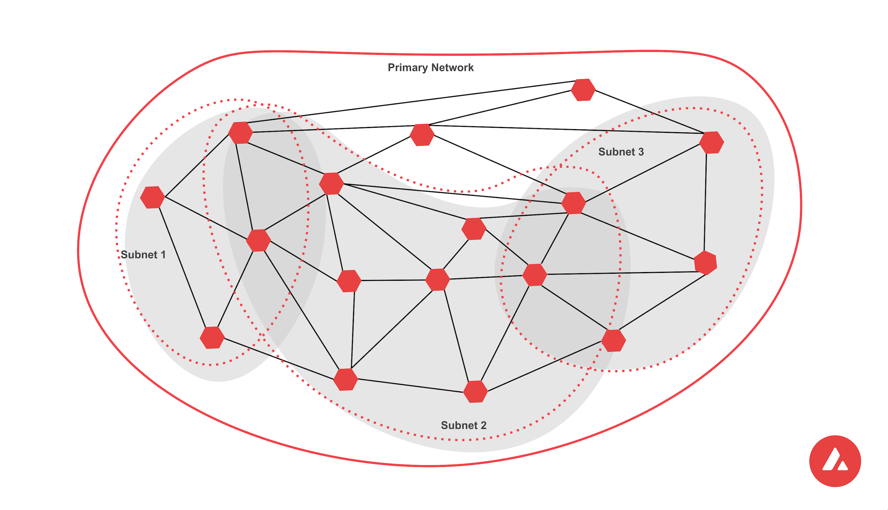

# Executive Summary

While Bitcoin and Ethereum represent the most popular networks in the Web3 space, they also face technical limitations for practical mass adoption. New networks were developed to address these limitations with novel technologies and approaches. To better understand these innovations and their advantages, this paper looks into one of these networks, Avalanche.

This paper aims to give an overview of the technical architecture of the Avalanche network, as well as present the reader with the technologies they would encounter when developing on the Avalanche network.

# Introduction

This document aims to give an introduction to the Avalanche network. By describing the consensus mechanism and the network architecture, we can better understand how to develop solutions on it.

This paper looks at the technologies one would encounter when using the Avalanche network. It briefly describes their function, how they can be used, their limitations, and possible improvements in the future.

## Components of the Avalanche network

The Avalanche network is a modular system, so before we describe how the entire network works, we will define the components that form the Avalanche network. Afterward, we can explore how those components interconnect and how each component function works in detail.

### Blockchains

When we refer to Blockchains on the Avalanche network, we refer to virtual machines. Every node on a particular network runs that network's virtual machine (or machines). They dictate valid states, as well as the rules for transitioning between those states.

These virtual machines can be customized to better suit the needs of the product that will use them. In general, one can change the initial state of the blockchain or the state transition rules. For example, one can change how transaction fees are calculated and distributed, or how the funds are distributed initially.

In a later section, we will explore the technical details and different available virtual machines on the Avalanche network.

### Validators

Different nodes communicate with each other on the Avalanche network to form the decentralized system. Nodes that run a virtual machine and receive and validate new transactions are considered validators. The validator nodes stake some amount of AVAX and receive rewards for their work.

### Subnets

A Subnet is a sovereign network that defines its own rules regarding membership and token economics. It is composed of a dynamic subset of Avalanche validators working together to achieve consensus on the state of one or more blockchains. Each blockchain is validated by exactly one Subnet, and a Subnet can have many blockchains. A validator may be a member of many Subnets.

Figure 1: Avalanche subnets overview

*Source: docs.avax.network*

Subnets are independent; they specify their own execution logic, determine their own fee regime, maintain their own state, facilitate their own networking, and provide their own security. They do not share the execution thread, storage, or networking with other Subnets.[^1]

With all components of the Avalanche network shown, we can demonstrate how they combine together using the Avalanche Primary network as an example.

**The primary network**

Every validator is a member of Avalanche's built-in public Subnet, called the Primary network. Validators can be members of as many Subnets as they choose, but they must be members of the Primary network along with them.

The Primary network is comprised of three blockchains:

1.  The Platform Chain (P-chain) is the metadata blockchain on Avalanche and coordinates validators, keeps track of active Subnets, and enables the creation of new Subnets.[^2]

2.  The Contract Chain (C-chain) is a blockchain compatible with the Ethereum Virtual Machine. It enables creating and using smart contracts similarly to how they function on the Ethereum network.

3.  The Exchange Chain (X-chain) is a blockchain for creating and trading digital assets.[^3]

Figure 2: The Avalanche primary network chains

*Source: docs.avax.network*

## Avalanche Consensus Protocol

For the network to function, the validators need to agree on the state of the blockchain they contain. The process through which they reach this agreement is called a consensus protocol. By ensuring that only valid transactions will be included in the final state of the network, consensus protocols provide security on the network.

The Avalanche Network uses a novel consensus protocol called Avalanche protocol, which functions by randomly subsampling the network multiple times.

Figure 3: Avalanche consensus mechanism

*Source: docs.avax.network*

When a validator receives a transaction, it checks that the transaction metadata is valid (e.g., the transaction signature is valid, the sender has enough funds to execute the transaction, and such). After confirming the transaction validity locally, the validator selects *n* nodes randomly if they also consider the transaction valid. If *α* of those *n* nodes consider the transaction valid, the round is considered successful. This concludes one successful round, and the process is repeated, starting from the selection of n nodes. If *β* consecutive rounds are successful, the transaction is accepted, and the state of the blockchain is updated.

In order to increase the throughput of the blockchain, the Avalanche protocol creates a Directed Acyclic Graph (DAG) that represents state changes of the blockchain. A set of transactions is considered a vertex in the DAG. How this data structure functions will be explored further in subsequent research, as it is not the focal point of this document.

**Snowman Consensus Protocol**

Snowman is a modification of the Avalanche Consensus Protocol, which creates a linear chain of vertices instead of a DAG. This modification is similar to how most decentralized blockchains work, with each vertex representing a block of transactions.

While the X-Chain uses the Avalanche Consensus Protocol, it is noteworthy that the C-chain and X-chain utilize the Snowman protocol for simplicity.

# Goals & Methodology

In this section, we will present the experience of a developer starting to develop solutions on the Avalanche network. First we'll cover the experience of developing a subnet and afterwards the experience of developing a decentralized application (dApp) on the Avalanche network.

## Subnet development

The official Avalanche documentation[^4] offers plenty of subnet creation and deployment guides of increasing complexity to introduce the reader to various aspects of the network.

The Create an EVM Subnet on a Local Network[^5] guide enables one to run a subnet locally without worrying about too many dependencies or steps during the setup. The guide explains how to locally create a subnet with five validators and an EVM-compatible blockchain called Subnet-EVM. The guide also gives additional steps on how to stop and start the Subnet or redeploy it.

The following guide[^6] instructs the user how to deploy the Subnet used in the previous guide on the Fuji testnet. With detailed instructions, one can follow the menus in the CLI wizard and have a subnet registered on the testnet. The only significant difference is that validators are not automatically created; they need to be added to the Subnet after the deployment.

The subsequent guides require running an Avalanche node, for which one would likely need to install the AvalancheGo[^7] and Subnet-CLI[^8] libraries. These dependencies raise the level of complexity when working with Avalanche but are foundational for deploying subnets on the production network and unlock the potential to customize node functionality.

After deploying a subnet on the testnet, we worked on customizing a subnet's virtual machine[^9]. By altering the genesis block, we modified the transaction fee calculation. However, the Avalanche guides also offer instructions on building a virtual machine from scratch that the Subnet will use.

Due to the scope of this research, we did not explore the topic further, but we hope to explore customizing subnets and virtual machines which use them deeper.

## dApp Development

As we previously mentioned, smart contracts are used on Avalanche C-Chain; thus, the development of dApps is done through that same type of chain. Luckily, the virtual machines used in subnet guides are primarily using Subnet-EVM.
This enables developers to use the same "dummy" subnets for dApp development.

The first step for dApp developers should be connecting to a local Subnet using Remix and Metamask, two well-known tools for smart contract development. Using these tools will introduce communicating with subnets to the developer.

For developing more advanced dApps on Avalanche, we used Hardhat for connecting to the Avalanche C-Chain on the Fuji network. After customizing the Hardhat configuration file with the appropriate RPC endpoints, smart contract deployment was identical to the deployment experience on the Ethereum network.

More research is required to validate more complex functionalities, but we expect that most frameworks and tools available for Ethereum dApp development will also work on Avalanche.

# Results & Discussion

In this section, we will technologies we've encountered in the previous section, with a brief explanation of how and why we've utilized them and our experience with using those technologies.

## Languages

1.  **GoLang**

    Both the Avalanche node implementation and coreth, the virtual machine the c-chain implements, are written in Go. For anyone looking to start developing on the Avalanche network, especially using custom subnets, Go is a language with which they should get acquainted.

2.  **Solidity**

    For developers who want to create and deploy their own dApps, Solidity is the most employed language for writing smart contracts, which are essential for almost any dApp.

    It was built for creating smart contracts on the Ethereum network. However, the Avalanche network's compatibility with the Ethereum virtual machine means that this language (and all its tools) is available to developers.

    Due to its widespread usage, available resources, and tooling, we recommend this language for any developer looking to create dApps on the Avalanche network's C-Chain.

3.  **NodeJS**

    Besides Go libraries for communicating with the Avalanche network, developers can also use AvalancheJS to access the Avalanche network using JavaScript.

    Coupled with numerous NodeJS libraries for smart contract development, for any developer wanting to create a dApp, we recommend learning NodeJS.

## Tools

1.  **Avalanche-CLI**

    The Avalanche-CLI is a tool that enables users to create and deploy subnets. With simple-to-use commands, developers can quickly run a Subnet locally and later deploy them on the Avalanche Fuji testnet.

    At the time of writing, it supports the following:

    - Creation of Subnet-EVM configs and Subnet-EVM forks
    - Local deployment of Subnet-EVM-based Subnets
    - Fuji deployment of Subnet-EVM-based Subnets

    **Our experience**

    Avalanche-CLI is a great tool for quickly having something running on one's machine. It does not require a lot of setup or complicated commands. One can interact with an Avalanche subnet with just five commands using common Ethereum tools like Remix and Metamask.

    The downside to that ease of use is its limited functionality. The authors note that Avalanche-CLI is under active development and early in its lifecycle, so expect frequent changes and certain limitations with what one can do with it.

    At the time of writing, it seems that only Subnet EVM is supported as the blockchain for the Subnet. One can edit the genesis file, enabling customizations of transaction fees, initial fund allocation, consensus, gossip, and validator communication. While this level of customization is quite a lot for someone just getting into the Avalanche network, we expect it is not enough for teams or products that want to deploy custom virtual machines highly tailored for their use case.

2.  **AvalancheGo**

    As the node implementation for the Avalanche network, AvalancheGo[^10] is a foundational library one needs for Avalanche development. Besides running a node instance (which connects to the Avalanche network), the library also enables a wide berth of RPC endpoints for:

    - Interacting with the P-Chain, C-Chain, and X-Chain
    - Examining the node's internal state, health, basic information, and statistics
    - Manage authorization tokens
    - Fetch transactions, vertices, or blocks

    **Our Experience**

    During this research, we used AvalancheGo to run our nodes on the Fuji testnet and were able to customize it to communicate with our custom subnet. We also used it together with Avalanche Network Runner and Subnet-CLI to build a custom virtual machine for our Subnet. As such, it was more used as a dependency for other Avalanche tools, and we only had limited interaction with it.

    The library functioned without many issues. However, we do have to warn the reader to pay attention to the location of the installation, as quite a few guides assume the default installation location. Installing the library at a non-default location caused unnecessary difficulty following some guides and using other Avalanche network tools.

    Since it is an integral library on the Avalanche network, we hope to dive deeper into this library in subsequent research efforts to learn its capabilities and limitations.

3.  **Subnet-CLI**

    A tool for managing Subnets on the Avalanche production network, this command line interface enables the user to create a new subnet, define its validators, and create and check the status of the blockchain for the Subnet.

    Subnet-CLI is also required to build custom node configurations using the Avalanche Network Runner tool.

    **Our experience**

    At the time of research, Subnet-CLI was the only tool available for creating a Subnet on the Fuji testnet, so it is a winner in its category by default. Subsequently, Avalanche-CLI was updated to support this functionality, and we found it more straightforward to use than Subnet-CLI.

    For now, Subnet-CLI seems to be the primary way to deploy a subnet on the Avalanche production network. However, Avalanche subnet libraries are still in rapid development. As such, we would recommend comparing the functionalities of Subnet-CLI and Avalanche-CLI to see which one has the capabilities the reader requires.

4.  **Avalanche Network Runner**

    The Avalanche Network Runner allows a user to define, create and interact with a network of Avalanche nodes. It can be used for development and testing. It aims at being a tool for developers and system integrators alike, offering functionality to run networks of AvalancheGo nodes. It also has support for custom node, Subnet, and network configurations, allowing to locally test code before deploying to the mainnet or public testnets[^11].

    Although the tool has more dependencies and slightly more complicated commands than Avalanche-CLI, Avalanche Network Runner enables customized configuration for each node individually and more detailed logging when accessing the Subnet via API.

    **Our experience**

    We utilized the Avalanche Network Runner to create a Subnet of 5 nodes locally and to add a new node after subnet deployment. The experience was straightforward; we only encountered difficulty setting up the tool's dependencies.

    The ability to use the Avalanche Network Runner as a library enables the developer to set up scripts and access a subnet programmatically. This key feature enables faster testing and development of subnets, making ANR invaluable for developers.

    As Avalanche Network Runner is intended as a tool for development and testing, we hope to utilize it more in subsequent research when we further cover developing subnets. In that research, we hope to give a more comprehensive description of this tool.

5.  **Avalanche wallet**

    The Avalanche wallet is a web application that allows users to create a new wallet or access their existing one. The app shows the wallet balance for each chain and any assets or collectibles the wallets hold.

    Users can access their wallets using a private key, mnemonic phrase, keystore file, or a hardware ledger wallet. Access using Metamask is not available at the time of writing.

    Inside the app, users can access their wallet address for each Avalanche network chain, send assets and collectibles (or create new collectibles), or send AVAX from one chain to another. Applying for staking or delegating is also available through the web wallet, as well as a view of previously executed transactions and UTXOs.

    **Our experience**

    We have used Avalanche wallet when registering a subnet on the Avalanche Fuji testnet for transferring funds between different Avalanche chains. Its missing feature to connect to Metamask does degrade the user experience, but overall the process was straightforward.

    Although this paper primarily focuses on development tools, we wanted to mention the Avalanche wallet as something a developer will come across when deploying a subnet on the Fuji testnet, as the faucet transfers AVAX to the wallet on the X-Chain, and a transfer is necessary.

6.  **Remix, Metamask, and Hardhat**

    In this section, we wanted to mention some Ethereum tools we have used in Avalanche development and how they operated. For more details on specific tools from this group, check out our Web3 Technology Radar[^12]

    **Our experience**

    We used Remix and Metamask to deploy and interact with smart contracts on a local EVM compatible Subnet, and Hardhat for deploying a sample dApp on the Avalanche Fuji testnet.

    Aside from customizing the RPC endpoint these tools use and the chain ID, these tools worked seamlessly with local and public Avalanche networks. As we mentioned, while we want to test more tools made for Ethereum on Avalanche in future research, we do not expect many issues with them functioning the same way on Avalanche as they would on Ethereum.

# Conclusion

In this research, we have described the three main components of the Avalanche network, how they interact to form subnets of validators with specific chains, and the underlying consensus mechanism for those chains. We have also given an overview of the guides and topics one would encounter when starting to work on Avalanche for the first time. Lastly, we have given a list of the technologies a developer should know when working with Avalanche and our experience with them.

We hope to have provided the reader with the foundational understanding of the Avalanche Network, its components, and introductory projects, which will enable them to decide whether Avalanche is a good choice for their use case and how they can get started if it is.

We hope to explore the Avalanche ecosystem further in subsequent research, specifically creating more customized virtual machines and testing, deploying, and monitoring subnets on the Avalanche production network. This research would also include measuring a subnet's performance and programmatical use of the development tools to test network behavior before deployment.

The Avalanche network's X-Chain is another subject we would like to research further. Its directed acyclic graph, the data structure of the chain, and high throughput are interesting subjects we would like to explore more comprehensively.

# Bibliography

Ava Labs, 'Avalanche Docs', *Avalanche Docs* \<<https://docs.avax.network/>\> \[accessed 2 August 2022\]

---------, 'Avalanche Network Runner', *Avalanche Network Runner* \<<https://docs.avax.network/subnets/network-runner>\> \[accessed 7 August 2022\]

---------, 'Avalanche Platform', *Avalanche Platform* \<<https://docs.avax.network/overview/getting-started/avalanche-platform>\> \[accessed 2 August 2022\]

---------, 'AvalancheGo', *AvalancheGo Github Repository* \<<https://github.com/ava-labs/avalanchego>\> \[accessed 7 August 2022\]

---------, 'AvalancheGo APIs Overview', *AvalancheGo APIs Overview* \<<https://docs.avax.network/subnets/customize-a-subnet>\> \[accessed 3 August 2022\]

---------, 'Create an EVM Subnet on a Local Network', *Create an EVM Subnet on a Local Network* \<<https://docs.avax.network/subnets/create-a-local-subnet>\> \[accessed 2 August 2022\]

---------, 'Create an EVM Subnet on Fuji Testnet', *Create an EVM Subnet on Fuji Testnet* \<<https://docs.avax.network/subnets/create-a-fuji-subnet>\> \[accessed 3 August 2022\]

---------, 'Customize Your EVM-Powered Subnet', *Customize Your EVM-Powered Subnet* \<<https://docs.avax.network/subnets/customize-a-subnet>\> \[accessed 3 August 2022\]

---------, 'Subnet-CLI', *Subnet-CLI \| Avalanche Docs* \<<https://docs.avax.network/subnets/subnet-cli>\> \[accessed 7 August 2022\]

---------, 'Subnets Overview', *Subnets Overview* \<<https://docs.avax.network/subnets>\> \[accessed 2 August 2022\]

MVP Workshop, 'Web3 Technology Radar', *Web3 Technology Radar* \<<https://web3radar.3327.io/tech-radar>\> \[accessed 7 August 2022\]

[^1]: [Ava Labs, 'Subnets Overview', *Subnets Overview* \<<https://docs.avax.network/subnets>\> \[accessed 2 August 2022\]](#ref-avalabsSubnetsOverview).

[^2]: [Ava Labs, 'Avalanche Platform', *Avalanche Platform* \<<https://docs.avax.network/overview/getting-started/avalanche-platform>\> \[accessed 2 August 2022\]](#ref-avalabsAvalanchePlatform).

[^3]: [Ava Labs, 'Avalanche Platform'](#ref-avalabsAvalanchePlatform).

[^4]: [Ava Labs, 'Avalanche Docs', *Avalanche Docs* \<<https://docs.avax.network/>\> \[accessed 2 August 2022\]](#ref-avalabsAvalancheDocs).

[^5]: [Ava Labs, 'Create an EVM Subnet on a Local Network', *Create an EVM Subnet on a Local Network* \<<https://docs.avax.network/subnets/create-a-local-subnet>\> \[accessed 2 August 2022\]](#ref-avalabsCreateEVMSubnet).

[^6]: [Ava Labs, 'Create an EVM Subnet on Fuji Testnet', *Create an EVM Subnet on Fuji Testnet* \<<https://docs.avax.network/subnets/create-a-fuji-subnet>\> \[accessed 3 August 2022\]](#ref-avalabsCreateEVMSubneta).

[^7]: [Ava Labs, 'AvalancheGo', *AvalancheGo Github Repository* \<<https://github.com/ava-labs/avalanchego>\> \[accessed 7 August 2022\]](#ref-avalabsAvalancheGo).

[^8]: [Ava Labs, 'Subnet-CLI', *Subnet-CLI \| Avalanche Docs* \<<https://docs.avax.network/subnets/subnet-cli>\> \[accessed 7 August 2022\]](#ref-avalabsSubnetCLI).

[^9]: [Ava Labs, 'Customize Your EVM-Powered Subnet', *Customize Your EVM-Powered Subnet* \<<https://docs.avax.network/subnets/customize-a-subnet>\> \[accessed 3 August 2022\]](#ref-avalabsCustomizeYourEVMPowered).

[^10]: [Ava Labs, 'AvalancheGo APIs Overview', *AvalancheGo APIs Overview* \<<https://docs.avax.network/subnets/customize-a-subnet>\> \[accessed 3 August 2022\]](#ref-avalabsAvalancheGoAPIsOverview).

[^11]: [Ava Labs, 'Avalanche Network Runner', *Avalanche Network Runner* \<<https://docs.avax.network/subnets/network-runner>\> \[accessed 7 August 2022\]](#ref-avalabsAvalancheNetworkRunner).

[^12]: [MVP Workshop, 'Web3 Technology Radar', *Web3 Technology Radar* \<<https://web3radar.3327.io/tech-radar>\> \[accessed 7 August 2022\]](#ref-mvpworkshopWeb3TechnologyRadar).
