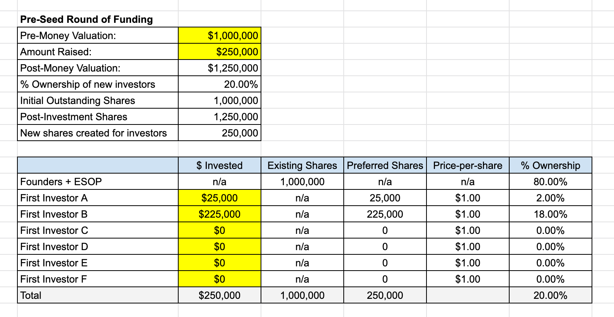
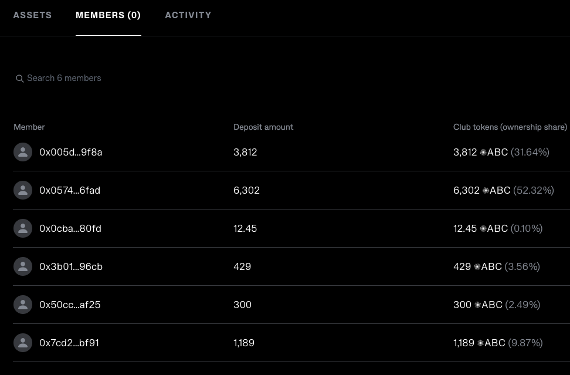

# Executive Summary

This research covers the current solutions based on Capitalization
Tables in Web3 to fully understand the idea of creating a Capitalization
Table Platform that would store the data and changes on-chain. The
proposed solution is building a similar solution to Syndicates but
without the governance power of token holders. Is this proposed solution
just an inefficient DAO? Probably. It is up to the readers to decide.

# Introduction

This research paper explores the viability of creating a transparent
Capitalization Table solution that would store the equity capitalization
for a Web3 native/non Web3 native company and its changes on-chain. The
motivation for this idea originated from the hypothesis that there is a
general lack of transparency of web3 companies funding rounds, equity
ownership, and debt positions. If we look at the CoinMarketCap and
similar tracking websites, we can see the price history of the token,
the largest token holders, and in some cases, the initial token
distribution, etc. However, the precise representation of the entity
(Capitalization Table, for example) behind the coin is absent. There are
also various questionable solutions that provide cap tables behind a
paywall. The above reasons are why this research is conducted.

# Goals & Methodology

The goal of this research is to explore:

-   the current solutions in Web3 that aim to provide transparency in
    the space
-   the current solutions in Web3 that are based around Capitalization
    Tables (if there are any)
-   is there a way Capitalization Tables of Web3/Web2 companies can be
    stored on-chain
-   is there a possibility/need for building a Capitalization Table
    platform

We will accomplish this by exploring what Capitalization Tables are, how
they are utilized in Web2, whether there are any limitations/needs for
implementing them in Web3, and the current solutions based on entity
transparency and Capitalization Tables in Web3.

# Results & Discussion

We will first explain what the Capitalization Table represents, whether
any solutions in Web3 already tackle this, and we will go over the
possibility and limitations of creating the Capitalization Table service
or a tool.

### What is the Capitalization Table?

In all companies, the Capital Structure de-facto represents the
company's quality and investment quality if the investor were to invest
in it. Capital structure is a mix of a company's capital - its debt and
equity:

-   Equity is a company's common and preferred stock plus retained
    earnings. To not venture deep into what the common and preferred
    stocks are right now, we can look at equity as stocks + retained
    earnings.
-   Debt, if we simplify it, usually represents short-term borrowing and
    long-term debt

Investors analyze capital structure by using ratios like:

-   debt ratio
-   debt-to-equity ratio
-   long-term debt to capitalization ratio 'Analyzing a Company's
    Capital Structure'[^1]

We will not explain these ratios in this paper as it is not the research
topic, but we listed them to show what the investors are taking into
account when researching which company to invest in. These are the
basics of fundamental analysis and provide some context for the
following paragraphs.

A Capitalization Table is a table or a spreadsheet that shows the equity
capitalization of the company 'Capitalization Table: A Familiar Document
in the Startup World'[^2].

They are mostly used by startups and businesses in early stage however
they can be used by already established businesses.

In the Capitalization Table, each type of equity ownership capital, the
investors and the share price at which the funds were invested/current
price is listed.They can also list various convertible securities,
warrants and options. They are usually used privately by companies to
provide information on investors and market value. Investors can use
them to decide if they should invest in a company.

Capitalization Tables can vary in design and the information provided
but all of them are centered around above mentioned factors. Here is the
example of the table's structure:

*Image 1 : Capitalization Table example - They can be of various types
and detail*

When making important financial decisions in the company, Capitalization
Table is considered. That means the table has to represent the actual
state and be updated continously. They do not need to be public but once
the company goes public the list of insiders and institutional
stakeholder goes public. This is where the idea of storing and tracking
this data on-chain becomes interesting.

In the above table you can see that the investors equity stake is
calculated by multiplying the share price by the number of shares owned.
We will not go into great detail as this Capitalization Table design is
pretty self-explanatory.

So in it's essence Capitalization Table shows who owns how many shares,
the current market value and the proportions of the ownership, have in
mind that these are updated constantly.

### Are there any current solutions in Web3 that use Capitalization Tables?

Below we will do a short overview of Web3 solutions that aim to provide
a similar service or use some type of Capitalization Table. There are
various Web2 Cap Table management solutions that support tracking both
traditional equity and tokens like Pulley but we will not explore them
as the tables are not stored on-chain.

#### Syndicate

Syndicate 'Syndicate'[^3] is a decentralized investing protocol. It is
used to create Investing DAOs. Its Web3 Investment Clubs product has a
similar structure as a Capitalization Table. The user creates a wallet
through the Syndicate dApp and chooses the name and the club token
ticker. Club's token represents the asset ownership percentage of the
investment club (wallet) and the investor's "equity" in the club. This
token is a non-transferrable ERC-20 token used for both the snapshot and
on-chain governance voting. The club's members can track where the
investments of their tokens are going and vote for different investment
opportunities. So in its essence, Syndicate is used to create investing
DAOs.

However, this Capitalization table can only be used for investment
clubs, and there is no "Company Capitalization Table" product in the
making. Because of that, we won't examine Syndicate further.

*Image 2: How the ownership is represented via Syndicate dApp*

#### Liquify

Liquify is a solution that helps users automate their token
vesting.@LiquiFiTokenVesting It enables Companies to save time from
manually distributing tokens, Investors to track and claim their tokens.
However, the user's address needs to be whitelisted to access its
services currently. There is not much information about this solution
online, but there are claims that they are building the "Carta of Web3".
Carta is a solution for Capitalization Table management and automation
with a \$7.4 billion valuation. If that is true, then this solution
challenges our idea. 'LiquiFi Is Building the "Carta of Web3" for
Companies Issuing Tokens on the Blockchain'[^4]

#### Blockstate

Blockstate, a Swiss security token platform for non-bankable assets,
claimed to have the solution for on-chain Capitalization Table
management back in 2019. however, there is not much information on the
website, and they deleted all their social media profiles. We won't
venture deep into this solution as it seems that the project has failed.

#### Magna - still in the works

Magna is a solution that aims to solve the Capitalization Table
management problem and become a leading TokenOps platform. 'Magna -
Token Cap Table Management Platform'[^5] It plans to provide:

-   Stakeholder views - the dashboard and notifications for unlocks and
    token positions
-   Exchange analytics - insights on selling and transferring of tokens
-   Wallet intelligence - there is no information on what this
    represents exactly
-   Possibility of liquid staking - voting and staking with tokens while
    they are still unlocking
-   One-time and recurring payments - for vendors or contractors
-   Support for complex unlocking schedules

This project is still in the works, so there is no more information.
They are currently listed on the Y Combinator's website. There is no
information on funds raised. This solution would be a direct competitor
to our idea. 'Magna: Carta for Web3: Token Vesting and DeFi Investment
Management.'[^6]

#### Legal nodes

Legal Nodes seems to offer the service of Capitalization Table
management via Legal Structuring service. However, this is not an open
solution/platform and instead a part of their legal services. 'Legal
Structuring Support for Startups \| Legal Nodes'[^7]

#### Proposal of the possible solution

##### Web3 Native entity

Suppose we were to create a similar product to Syndicate's - a
wallet/smart contract creation dApp where the creator must provide LLC -
Limited Liability Company papers before creation. The smart contract
would then be able to mint the company's utility/security token in
exchange for tokens invested in various rounds. The invested tokens
would then possibly be locked and unlocked after an agreed time,
depending on the owner's settings. We could then fetch the data as it's
transparent and present the capitalization table based on investments
for investors to see. The bonding curve would determine the price, or
the company owners would set the price themselves via the smart-contract
(ICO).

Another great insight would be comparing the price at which the funds
were invested and the current price on the market. That would show the
overall growth of the LLC.

The prices would be fetched from Oracles and updated daily, thus
providing a fully transparent and intuitive experience for the potential
future investors in the company.

The company's debt positions would also be visible and presented via the
dApp, and the invested tokens would go into various costs like payments
for workers and other operational costs.

This raises a question: **Aren't DAOs already functioning similarly or
at least in a more efficient way?** Yes and no. DAOs issue their token
representing the users voting power in the DAO's governance. The voting
process is often slow. This proposed solution would not give the owners
of the token governance rights. The tokens distributed would be
utility/security tokens. And the governance token would be distributed
how the company that owns the wallet/smart contract sees fit.

If we are talking about security tokens they bring regulation with them.
As I am not a Legal expert, I cannot comment on that, and it would
require separate research.

#### Web2 companies

The proposed solution of putting the Capitalization Tables of "Web2"
companies on-chain would best fit for private blockchains or the chains
where the data can be hidden. However, the hypothesis is that this would
open up a legal "can of worms". More research on the Capitalization
Tables regulation is required.

# Conclusion

There have been various tries at implementing Capitalization Tables in
Web3 or similar products. Currently, there are options where
Capitalization Table management is offered as a service for clients like
the one Legal Nodes offers. There is a platform in the works (Magna)
that aims to solve exactly what our idea is about - a standardized
Capitalization Table Platform. This shows that the execution speed is as
important as a good idea. However, a growing number of companies are
interested in blockchain, so making an alternative to Magna, Liquify, or
Syndicate would be in the spirit of decentralization.

# Bibliography

'Analyzing a Company's Capital Structure', *Investopedia*
\<<https://www.investopedia.com/articles/basics/06/capitalstructure.asp>\>
\[accessed 29 July 2022\]

'Capitalization Table: A Familiar Document in the Startup World',
*Investopedia*
\<<https://www.investopedia.com/terms/c/capitalization-table.asp>\>
\[accessed 29 July 2022\]

'Legal Structuring Support for Startups \| Legal Nodes'
\<<https://legalnodes.com/product/startup-legal-structuring>\>
\[accessed 30 July 2022\]

'LiquiFi Is Building the "Carta of Web3" for Companies Issuing Tokens on
the Blockchain', *TechCrunch*
\<<https://social.techcrunch.com/2022/04/21/liquifi-is-building-carta-web3-for-crypto-companies-tokens-blockchain/>\>
\[accessed 30 July 2022\]

'Magna - Token Cap Table Management Platform'
\<<https://www.magna.so/>\> \[accessed 30 July 2022\]

'Magna: Carta for Web3: Token Vesting and DeFi Investment Management.',
*Y Combinator* \<<https://www.ycombinator.com/companies/magna>\>
\[accessed 30 July 2022\]

'Syndicate' \<<https://syndicate.io/>\> \[accessed 29 July 2022\]

[^1]: [*Investopedia*
    \<<https://www.investopedia.com/articles/basics/06/capitalstructure.asp>\>
    \[accessed 29 July 2022\]](#ref-AnalyzingCompanyCapital).

[^2]: [*Investopedia*
    \<<https://www.investopedia.com/terms/c/capitalization-table.asp>\>
    \[accessed 29 July 2022\]](#ref-CapitalizationTableFamiliar).

[^3]: [\<[Https://syndicate.io/](https://syndicate.io/)\> \[accessed 29
    July 2022\]](#ref-Syndicate).

[^4]: [*TechCrunch*
    \<<https://social.techcrunch.com/2022/04/21/liquifi-is-building-carta-web3-for-crypto-companies-tokens-blockchain/>\>
    \[accessed 30 July 2022\]](#ref-LiquiFiBuildingCarta).

[^5]: [\<[Https://www.magna.so/](https://www.magna.so/)\> \[accessed 30
    July 2022\]](#ref-MagnaTokenCap).

[^6]: [*Y Combinator* \<<https://www.ycombinator.com/companies/magna>\>
    \[accessed 30 July 2022\]](#ref-MagnaCartaWeb3).

[^7]: [\<[Https://legalnodes.com/product/startup-legal-structuring](https://legalnodes.com/product/startup-legal-structuring)\>
    \[accessed 30 July 2022\]](#ref-LegalStructuringSupport).
