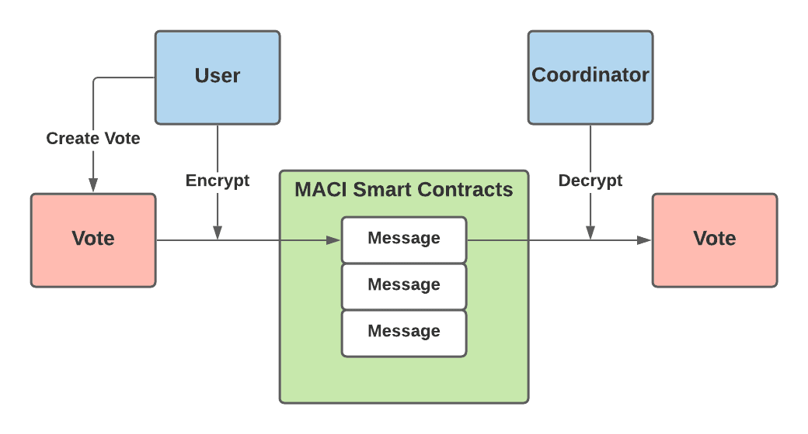
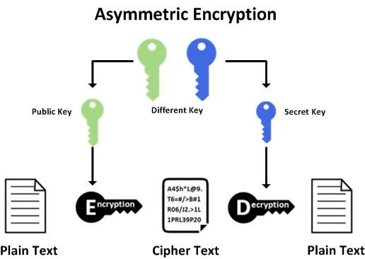
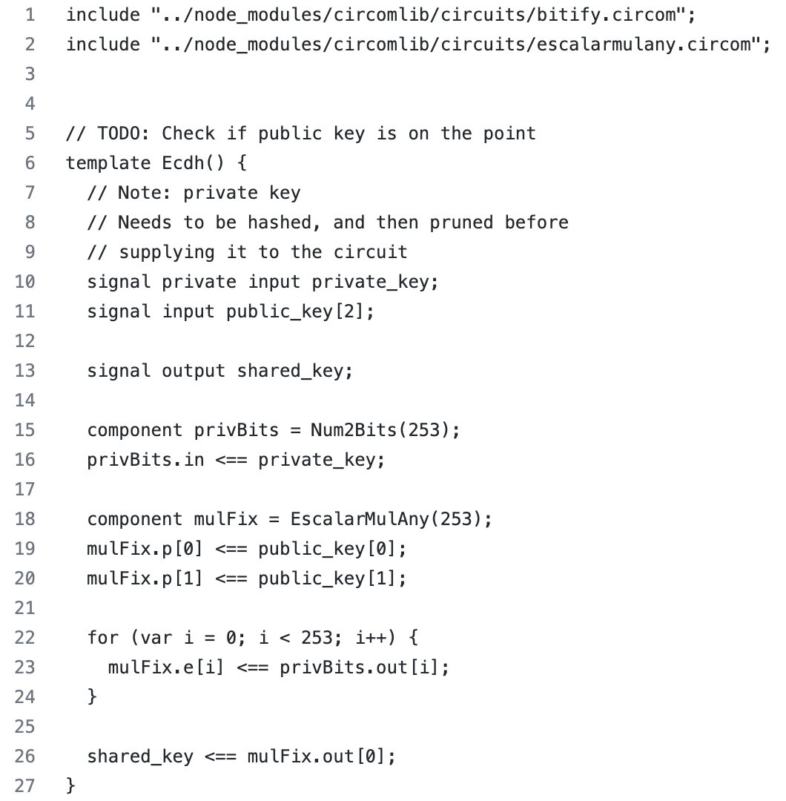
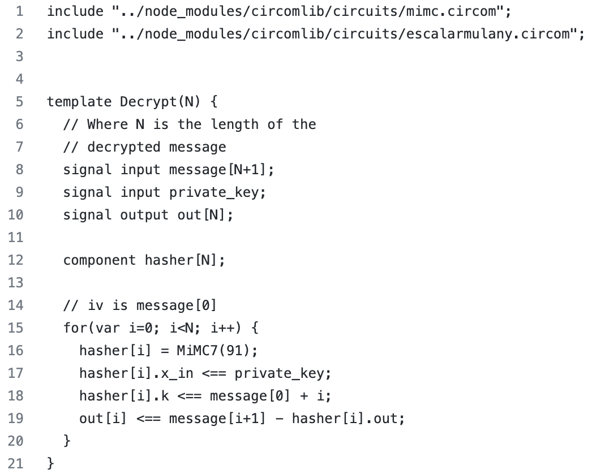
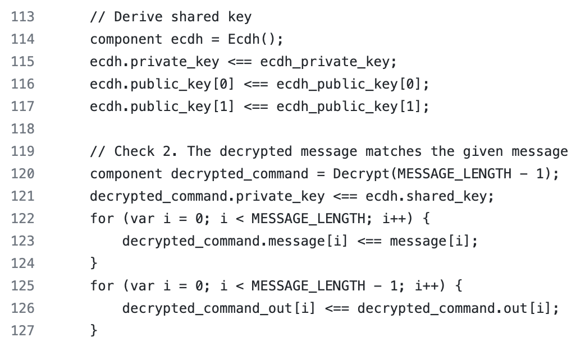
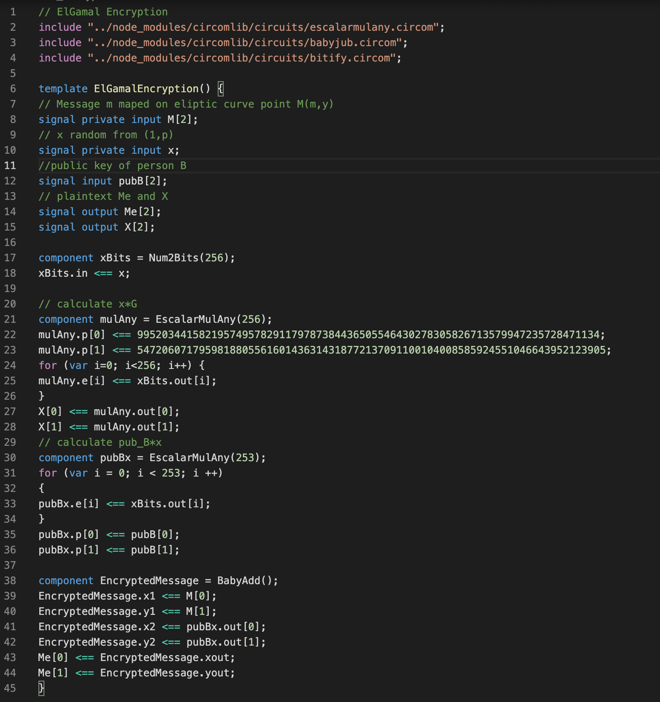

 

# Executive Summary

MACI - Minimal Anti-Collusion Infrastructure is a collection of smart contracts, ZK circuits and ts packages that we can use to build programs on top. We have already dealt with this topic, we summarized what has been done in MACI so far. More information about MACI can be found in our previous research (MACI \[1\]) and blog (Can MACI really destroy the collusion? \[2\]).

This research is a continuation of the previous one, but with the aim of improving MACI. Namely, the problem that we saw as "burning" in MACI is that the coordinator can see how which voter voted. There is no problem if the coordinator is honest, but what if he is not?!

This research solves exactly that problem, i.e. prevents the coordinator from connecting the vote it processes with the voter itself. In this way, the anonymity of voting is completely preserved.

# Introduction

In order to remove the "burning" problem and fully ensure the privacy of voting, we need to mention the most important components that currently perform encryption-decryption in MACI, as well as the way in which it is achieved.

Voters vote using MACI smart contracts. Before sending their vote to the blockchain, they first encrypt their vote (actually, they encrypt the signature and the command (which contains a couple of components, one of which is the option they voted for)) using a shared key. They use an Elliptic-curve Diffie--Hellman shared key. Voters send this encrypted message to the MACI smart contract and it will be stored on-chain. Using shared keys, the coordinator decrypts each vote. It should be noted that each voter will have a different shared key, and that only the voter and the coordinator know that key.

As it is always easier to understand the matter if there is a visualization, the image below shows the way encryption-decryption works in MACI.

After decryption, the coordinator needs to prove that voting was valid and reveal the results of voting. This should be done in the way that everyone is sure in the voting results, without releasing the vote of every individual. In order that the coordinator fulfill both of the above conditions, he will make ZK proofs. In this way, the anonymity of voting is almost completely preserved, up to the coordinator.

Our recommendations for interesting articles about MACI:

-   MACI research \[1\];
-   Can MACI really destroy the collusion? \[2\];
-   Release Announcement: MACI 1.0 \[3\];
-   A Technical Introduction to MACI 1.0 \[4\].

# Goals & Methodology

As we already stated in the lines above, the intention of this research is to examine the possibilities and try to find a solution that would nullify the possibility of collusion in MACI. Namely, everything is hidden on-chain at the moment, but we want that coordinator not to know which user took what action.

Our proposal is to use ElGamal encryption and re-randomization. The main motivation for this is the article authored by Kobi Gurkan (MACI anonymization - using rerandomizable encryption \[8\]).

This potential improvement would have enormous implications for rooting out collusion. It is extremely important for the ecosystem to be able to use a decentralized voting system that is completely resistant to collusion. In the first place, it is important to protect the privacy of a certain voter in every sense (on-chain and off-chain). On the other hand, as MACI can be seen to be in use by the clr.fund, where users can vote which projects will receive funding, and for this reason the importance of this potential improvement can be additionally seen.

Therefore, in the future MACI would represent the most perfect system for voting in a decentralized system - a system completely resistant to collusion.

To be able to present the idea clearly, we need to explain how encryption works. In the following lines, we will first explain how ECDH encryption works, and how ElGamal encryption works.

## Asymmetric encryption

The creators of asymmetric cryptography are Whitefield Diffie and Martin Hellman, who in 1976. described the idea of cryptography based on two keys: private (secret) and public key.

The difference between symmetric and asymmetric algorithms is that symmetric algorithms use the same key for encryption and decryption, while asymmetric algorithms use different keys for encryption and decryption. Information encrypted with a public key can only be decrypted with a private key, that can only the person who owns the private asymmetric key.

### ECDH encryption

ECDH is very similar to the DHKE (Diffie--Hellman Key Exchange) algorithm, but it uses ECC point multiplication (consecutive addition). Our recommendation for literature related to elliptic curves in cryptography is Pairings for beginners \[9\].

ECDH allows two parties, each having an elliptic curve public--private key pair, to establish a shared key. Let $G$ be a generator point on the elliptic curve over a finite field $F_p$ (where $p$ is a prime number). Let $pr_A$ and $pr_B$ be the private keys of two different people $A$ and $B$. Then $pub_A = pr_A * G$ and $pub_B = pr_B * G$ are their public keys. ECDH is based on the property of elliptic curve points:

$(pr_A * G) * pr_B = pub_A * pr_B = shared key = pub_B * pr_A = (pr_B * G) * pr_A$.

In this way, both of them know the shared key, and they get it using their private key and the other person's public key. In this way, each person's private key remains secret.

The security of the algorithm lies in the difficulty of calculating the discrete logarithm.

### Encryption in MACI

Now, we want to show in practice how ECDH works in MACI. First, we start with encryption. The image below shows an encryption template written in Circom (Circom \[10\]). In order to generate a shared key, the voter will enter as inputs: his private key and the public key of the coordinator (which is available for everyone). As you can see the output of this template will be a shared key.

In order to process all the votes after the voting is over and to prove (to make ZK proof) that voting was regular (and announce the outcome of the voting), the coordinator needs to decrypt each vote. To achieve this, the coordinator uses the Decrypt(N) template which can be seen below. Namely, as inputs he enters a message and a shared key (marked as private_key in the code). As an output, he can read the message, i.e. he can see who voted (because the public key will be visible to him) as well as the option for which the voter with that public key voted.

In order for the coordinator to update the State tree, he must read each vote (in that template). The picture below shows what it looks like. In lines 114-117, the coordinator, using his private key and public key of the voter as inputs (using the Ecdh template), derives the shared key. Then in lines 119-127 coordinator decrypts the message (from the voter) using the Decrypt template. Its input data is the shared key that he obtained in lines 114-117 and the encrypted message. The decrypt_comand_out variable contains the decrypted message that the coordinator can read.

### EC ElGamal encryption

In 1985, Taher Elgamal created an asymmetric cryptographic algorithm based on the Diffie-Hellman key exchange. Similar to the ECDH algorithm, the security of ElGamal is based on the difficult or almost impossible computation of the discrete logarithm of a large prime number.

Let $G$ be a generator point on the elliptic curve over a finite field $F_p$ (where $p$ is a prime number). Let $pr_A$ and $pr_B$ be the private keys of two different people $A$ and $B$. Then $pub_A = a * G$ and $pub_B = b * G$ are their public keys. Let person $A$ be the person who will encrypt the data. For this purpose, person $A$ should do the following:

1)  choose an arbitrary $x$ from the interval $(1,p)$;

2)  calculate $x * G =: X$;

3)  assigns a point on the elliptic curve $M(m,y)$ to the message $m$, where person $A$ choose $y$ so that the point $M$ is a point on the elliptic curve;

4)  calculate $Me := M + pub_B * x$;

5)  send $Me$ and $X$ to person $B$.

Person $B$ needs to decrypt the data. For this purpose, person $B$ should do the following:

1)  calculate $pub_B * x == pr_B * G * x == pr_B * X$;

2)  decrypts the message $M(m,y) == Me - pub_B * x$;

Note that when encrypting a message, person $A$ needs to know the public key of person $B$, while person $B$ can decrypt the message without knowing the public key of person $A$ (which is not possible with decryption that relies on a shared key, i.e. ECDH).

## Re-randomization

We usually use re-randomization when we want to convey the same message, but two cipher texts cannot be connected to each other. That function randomizes an existing cipher text such that it's still decryptable under the original public key it was encrypted for.

Suppose we are working with the same elliptic curve. Assume that the notation we used above holds. We want the input parameters to be $X$ and $Me$ and the output parameters to be $X_1$ and $Me_1$ to hide the same message.

For this purpose, person $A$ should do the following:

1)  choose an arbitrary $z$ from the interval $(1,p)$;

2)  calculate $X1 :=z * G + X$;

3)  calculate $Me_1 := Me + pub_B * z$;

4)  output $Me_1$ and $X_1$.

## Nullifier

In the following, we will use nullifier, so for the convenience of the reader, we will define it.

The nullifier is a unique ID that is in connection with the commitment and the ZKP proves the connection, but nobody knows which nullifier is assigned to which commitment.

# Results & Discussion

In order to achieve complete voter anonymity, we created required building blocks. Codes for ElGamal encryption, decryption and re-randomization are written in circom language. Below is the code for encryption, but all codes are available on github \[12\].

Code for encryption:

The decryption and rerandomization codes existed in a different form and can be viewed in \[11\].

In order to take advantage of this, the current MACI protocol needs to be modified. Here we will only give an idea of what needs to be done to achieve the desired goal.

## Protocol

In order to achieve the desired result, it is necessary to change the protocol. The current protocol, as we said before, allows the voter to vote and to change the public key (voter can send two types of message). For example, If the voter is blackmailed, he can create a command with the content of the option he wants to vote for and with a new public key. He can sign it with his previous public key, encrypts it (using ECDH encryption) and submits it to the MACI smart contracts. However, the same voter can then vote for the option the blackmailer wants, without that vote being valid (which the blackmailer will not know). How does it achieve this? The voter creates a command with the content of the option the blackmailer wants and the previous public key. He signs it with his previous public key, encrypts it (using ECDH encryption) and submits it to the MACI smart contracts. When the voting is over, the coordinator decrypts the first message, validates the signature, records this vote (because it is valid) and updates the voter's public key. Then the coordinator decrypts the second message, sees that the signature does not match the new public key and therefore this message is invalid. But the voter can decrypt this message too, as proof of his vote for option blackmailer wants.

We want to preserve these two nice features: first, that the voter can prove to the blackmailer that he voted for that option for which he was blackmailed (without that vote being valid), and second, that all votes are encrypted and stored on-chain. But we also want to add a feature, so that the coordinator does not know which option the voter voted for. In the current protocol, when a voter's public key is changed, the coordinator knows that the change has occurred and from there coordinator knows how the voter voted (although the public key change helped the voter to deceive the blackmailer).

As we do not want that coordinator to know who is the "owner" of the new public key, we need to disable the coordinator from seeing the link between the old and new public key of the voter. In order to achieve this, it is necessary for the voter to prove (he needs to make ZK proof) that owns the private key for the old public key and to be able to create a new public key based on that. For this purpose, we will need to create a set that will contain all deactivated public keys and his encrypted states. But here we have to be careful, we have to make sure that based on the previous public key, the voter can create exactly one new public key. For this reason we will need nullifiers and the set where we store them. Conclusion, we will need two new sets that we haven't had so far. Let's mark the first of them with $D$ and the second with $N$. Set $D$ is public, while set $N$ is private. Also, we must expand the set of states, more precisely, in that set there should be a field that says whether the voter's public key is active or inactive.

Also, we will need two new message types. The first type of message should be to deactivate the old public key. After deactivation, the coordinator adds the old public key with its encrypted state (using ElGamal encryption) to set $D$.

Second type of message is that the voter creates a new public key proving that he is the owner of the old one. To achieve this, the voter needs to make a ZK proof that the element (old public key of voter, ($X$, $Me$)) belongs to the set $D$, where ($X$, $Me$) is the ElGamal encrypted message, as well he need to prove that he knows the private key for the old public key. Also the output of the circuit should be ($X_1$, $Me_1$) which are obtained by rerandomization ($X$, $Me$) and nullifier which is the hash of the private key. The content of the message itself should be: ($X1$, $Me_1$), nullifier, the ZK proof and the new public key. Of course the message is encrypted. The coordinator decrypts the message, if the proof is valid, the nullifier doesn't already exist in the set $N$, places the nullifier in the set $N$, adds a new public key and updates its state. Note that in this way the coordinator does not know the old public key of the voter whose vote he is processing. In this way, complete anonymity of voting was achieved.

### Example

We now want to illustrate the entire protocol with an example. We want a person $A$ to be a voter. Person $A$ wants to prove to the blackmailer that she voted for option 1, even though she will vote for option 2. Also, person $A$ wants the coordinator not to know which option she voted for. Person $A$ can do it for example like this.

1)  Person $A$ accesses the vote with public key 1. Votes for option 2, changes the public key to public key 2, signs the command with public key 1, and encrypts using ElGamal encryption.

2)  Person $A$ then votes for option 1 and signs the vote with public key 1 and encrypts using ElGamal encryption.

3)  Person $A$ deactivates his public key.

4)  Person $A$ activates a new public key based on the old public key using ZK proof and rerandomization.

Let's see what happens when the coordinator processes the messages.

1)  The first message will be valid and will update the state related to the public key of person 1 (a vote for option 2 will be entered and the new public key of person $A$ will become public key 2).

2)  The second message will not be valid and there will be no state change (because person $A$'s public key has become public key 2, not 1, as signed in the message).

3)  It will change the state of public key 2 of person 1 to inactive. When the key state is inactive, that vote is not counted in the total. Therefore, the vote for option 2 is not counted at this time. Also, the coordinator updates the set $D$ and writes to it the public key 2 and the encrypted states (using ElGamal encryption)- vote for option 2.

4)  New key - public key 3 (of person $A$, but the coordinator does not know that it is the public key of person $A$) writes to the set of public keys and registers a new state (vote for option 2 is now written and this key is considered active).

Note that person $A$ used all 4 message types in the proposed protocol. In this way, person $A$ voted for the desired option 2. Also, by decrypting the second message, person $A$ can "prove" to the blackmailer that he voted for option 1. And let's note that the coordinator does not know how the person $A$ voted.

# Conclusion

The research showed that it is possible to achieve complete anonymity of voting, i.e. it was shown that it is possible to avoid that coordinator knows options that each individual voter voted for.
Also, for this purpose, codes were made in circom language for ElGamal encryption, decryption and re-randomization. The next step could be the implementation of the presented solution.

# Bibliography

\[1\] MACI, https://github.com/0x3327/3327-operations/blob/babb99c2eec36b95a84c04bde6bd9bb01851e534/\_research/ERFC-291.md

\[2\] Can MACI really destroy the collusion?, https://3327.io/can-maci-really-destroy-the-collusion/

\[3\] Release Announcement: MACI 1.0, https://medium.com/privacy-scaling-explorations/release-announcement-maci-1-0-c032bddd2157

\[4\] A Technical Introduction to MACI 1.0, https://medium.com/privacy-scaling-explorations/a-technical-introduction-to-maci-1-0-db95c3a9439a

\[5\] ECDH Key Exchange, https://cryptobook.nakov.com/asymmetric-key-ciphers/ecdh-key-exchange

\[6\] Cryptography, http://poincare.matf.bg.ac.rs/\~ezivkovm/nastava/kripto.pdf

\[7\] Cryptography - Notes, http://poincare.matf.bg.ac.rs/\~aleksandar/files/kripto/2020/Skripta.pdf

\[8\] MACI anonymization - using rerandomizable encryption, https://ethresear.ch/t/maci-anonymization-using-rerandomizable-encryption/7054/1

\[9\] Pairings for beginners, https://static1.squarespace.com/static/5fdbb09f31d71c1227082339/t/5ff394720493bd28278889c6/1609798774687/PairingsForBeginners.pdf

\[10\] Circom 2 Documentation, https://docs.circom.io/

\[11\] ElGamal encryption, decryption, and rerandomization, with circom support, https://ethresear.ch/t/elgamal-encryption-decryption-and-rerandomization-with-circom-support/8074

\[12\] ElGamal codes for encryption, decryption and re-randomization, https://github.com/MarijaMikic/ElGamal
