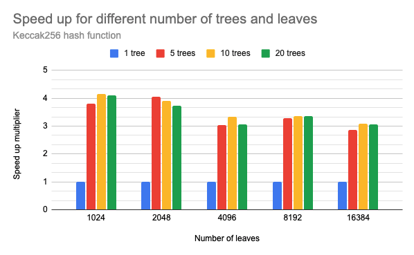
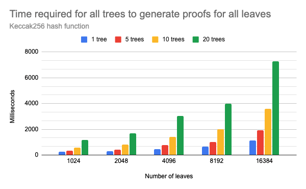
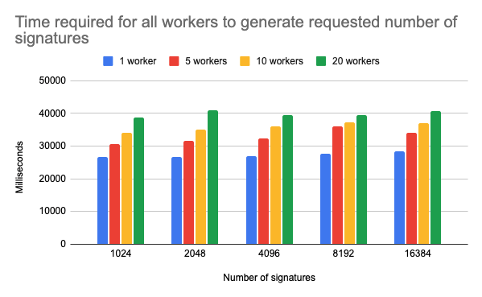

# Executive Summary

Utilizing Blockchain comes with big limitations when it comes to storing
a larger number of documents on the chain. Another problem arises when a
large number of documents must be stored on the chain with minimal
delay - real-time. In those cases, the time and financial costs may
become overwhelming. This research aims to find the solution for this
issue by combining off-chain issuing techniques and on-chain commitments
to maximize throughput while minimizing costs from the number of
transactions required to store the commitments. The solution is
formulated as a hybrid (on-chain/off-chain) protocol called Minty.

# Introduction

While higher utilization of Blockchain in formerly pure Web 2.0
use-cases is a trend, some obstacles prevent a smooth transition to Web
3.0. Most of those issues are known scalability issues, combined with
high transaction costs. Two scalability issues closely related to the
costs of using Blockchain in business are the number of transactions
that could be processed in a second (TPS) and the size limit of the
transaction. The TPS metric can easily trick the user into thinking that
1,000s of transactions per second would mean that he or she can submit
1,000 transactions and expect them to be included in a block after a
one-second delay. Unfortunately, that assumption would be wrong, and we
can prove that with a simple counter-example. Let us assume that TPS is
10,000 transactions, ten times more than the user needs. Although
Blockchain protocols could indeed process 10,000 transactions per
second, there could be at least 9,001 other transactions from different
users waiting to be accepted. In this case, it is impossible to have
10,001 or more transactions in one block, so at least one transaction
will have to wait for the next block - breaking the one-second
expectation. The last nail for this assumption is the requirement to
have all transaction nonces ordered correctly. If one sends 1,000
correctly ordered transactions to the miners, there are no guarantees
that the miners will sort them correctly, leaving transactions out of
order for the next block. As the Blockchain becomes more utilized, the
issue will become more severe. To make the situation worse, some
transactions may offer better gas prices than others, prioritizing them
and delaying other transactions even further.

Another issue is submitting 1,000 transactions on an EVM blockchain,
which requires at least 21,000 gas per transaction. Those amounts may
quickly add up costs and disincentivize further use of Blockchain (at
least use of mainnet).

The main question is how realistic it is to have a use case where it is
required to execute 1,000s of transactions in a short time. The answer
is not clear as the question is not correctly formed. If use cases, for
some reason, specifically require 1,000s of separate transactions to be
executed, then there is no better solution than waiting for faster
blockchains. A better question might be how realistic it is to have a
use case where it is required to write 1,000s of data blocks on
Blockchain often. The answer might be - not a lot, but the numbers will
quickly rise as soon as the more efficient solution for performing the
task appears. In that case, it becomes reasonable to investigate the
possibilities of having much fewer transactions than the number of data
blocks and explore off-chain solutions, such as ZK proofs and
signatures, to reduce the costs of writing on Blockchain.

# Goals & Methodology

This research will focus on a generic example problem, minting 1,000s of
generic documents in short intervals, which can be easily specialized
for any use case requiring minting high volumes of data in a short time.
The following sections will also present a concrete example of a
real-world use case.

Before we get into details, we shall first define some basic
assumptions. The worst-case scenario is putting the data of each
document on Blockchain in separate transactions. The more reasonable
scenario is writing documents in batches of
 per transaction. Let us
assume that a document consists of
 bytes32 elements. The
minimum gas required to run a transaction is 21,000 gas and 2,000 more
to store one `bytes32` element. Another restriction is the upper limit
of the gas amount per block, which is 30,000,000 on Ethereum. Assuming a
very farfetched case where:

-   TPS is 1,000 (currently much lower)
-   One user gets to have all transactions in all blocks until the
    document storing is complete (possible only on private chains)
-   Every document consists of only five `bytes32` elements (a
    reasonable amount of data)
-   One transaction contains 30 documents (reasonable limitation)

The number of transactions in a block would be \~93, which enables
storing only 2790 documents per second. On the other hand, having a low
gas price of 10 gwei, for 30,000,000 gas, the cost would be 0.3 native
coins. On Ethereum, with the price of \$1500, the cost would be 0.3 \*
\$1500 = \$500. Executing the same transaction on Polygon L2, the price
would be only 0.7 \* \$1 = \$0.7. This is the price for having 2790
documents stored on-chain under pretty unreal circumstances. To store
all 100,000 documents, the total cost would be \~12 coins (\$18000 on
Ethereum and \$12 on Polygon), which would take around 36 seconds. To
summarize, the lowest theoretical boundary for storing 100,000 \* 5
`bytes32` elements, under given circumstances, is 36 seconds and \$12.
In practice, the time delay would be much higher as executing \~3,333
transactions from one user in 36 seconds would only be possible on a
private chain.

What if the requirement is to store data of 100,000 documents in 10
seconds with a high probability? How could it be achieved? The only way
to reduce the number of transactions executed on Blockchain is to reduce
the amount of data that has to be written. There is, of course, a
possibility to increase the number of documents in a batch, but we are
already hitting the boundary with that in the previous example. When
there is a requirement to store exactly 100,000 documents, there are two
options: - Compress the data to have more of the smaller documents in
batches; the example would be storing hashes of data. - Store no data
but generate signed documents off-chain - Store single commitments for
multiple data; the example would be storing a root hash of a Merkle tree
built from documents.

In each case, we assume the user will receive proof that the document
belongs to a commitment and can materialize (mint) its data on the chain
by providing the proof.

The first solution might be tempting for smaller amounts of data.
However, it reduces the number of transactions for a constant factor (5
in the previous example), which would not be very helpful when data
quantity increases.

The second solution is very similar to OWT and represents an ideal
solution from a theoretical perspective. However, the issue arises from
the time required to generate a large number of signatures, which is
much higher than a Merkle tree construction time. The comparison is
provided in the results section.

The third option is more suitable for handling large quantities of data,
as it scales much better. On the other hand, the construction of the
Merkle tree grows exponentially with the number of documents, so the
time required to generate bigger trees adds another limit to the number
of documents processed in a given time after a certain threshold.
Nevertheless, the Merkle tree solution has better potential, as one can
generate multiple Merkle trees in parallel (on multicore processors or
multiple servers), which can scale document processing to another level.
This fact leads us to an outstanding balance between the number of
transactions, the number of processed documents, and the time required
to prepare and write the data - the parallel computation of multiple
Merkle tree roots and writing multiple roots in one transaction. In this
scenario, there are better guarantees that a single storage transaction
will be executed in 10 seconds while storing
 Merkle roots of
-document trees. Can we
go even further? For a few milliseconds more, another tree could be
formed from the roots of the trees generated in parallel - leading to
one tree with  subtrees
and
")
extra levels. This upgrade results in storing only one root hash for the
entire set with 
subtrees generated in parallel for a few times speedup. There is also
one more concern regarding parallelization. It is not the case that
having 10,000 parallel processes will always result in 10,000 times
speedup. The overhead communication between processes adds a slowdown.
The results from the following section show the example of speedup
achieved when creating Merkle trees in parallel workers.

# Results & Discussion

The assumption of efficiently generating Merkle roots in a parallel way,
as data commitments, was put to the test. A simple but representative
use case assumed storing trading cards on Blockchain (similar to NFTs
but more straightforward). The card consists of an ID, image number
(associated with image URL) and owner address. The goal was to enable
storing commitments of 100,000 cards in 10 seconds. The flow consisted
of generating  Merkle
trees with  leaves
sequentially until all cards had been committed. The resulting roots
were used to generate a "cap" Merkle tree, and inclusion proofs for the
cards were generated from the subtrees and extended with respective
"cap" proofs. In the end, each card had a root commitment stored on
Blockchain and inclusion proof generated for the end user to claim or
transfer the card. Multiple tests estimated the speed of generating
Merkle trees and all of the proofs under different conditions. The
variables were the number of leaves and workers that generated trees.
One worker generated one tree. The results showed that parallel tree
generation achieved, on average, 3.5x - 4x speedup on a 2.6 GHz 6-Core
Intel Core i7 CPU. Leaves of the trees were `keccak256` hashes of card
data: - `uint256 id` - `uint256 imageId` - `address owner`

The following charts represent the time and speedup results when using
parallel tree generation.

 

   <i>Speedup in number of
processed leaves per second when generating multiple trees in parallel
compared to a single tree with the same number of leaves. The results
assume not just tree generation but also proof generation for all leaves
of all trees</i>

 

   <i>Chart of the time
required to generate all proofs when using different number of workers
in parallel</i>

As expected, the time delays increase exponentially with the number of
leaves. The speedup of \~4x correlates with the number of CPU cores left
available for the workers minus the overhead from communication costs
when moving larger data (proofs) between parallel workers and the parent
process. We can notice that even with only 20 parallel processes, the
communication overhead is clearly observable. Also, 20 parallel workers
could generate

proofs in \~7.5 seconds, much greater than the targeted 100,000
documents per second. However, this computation does not count in the
time required for generating document hashes and sending commitment
storage transactions on Blockchain.

Nevertheless, the results gave us some insights into the parameter
values. Additionally, the time required to generate document signatures
in parallel was also evaluated, as the off-chain signature issuing
approach was a direct competitor of the Merkle tree approach. The
results show that the parallel Merkle tree generation approach wins this
comparison up to a large number of documents, as the time complexity for
generating multiple signatures grows linearly with the number of
documents but with much higher base costs. It is important to note that
the signature generation results do not discard the possibility of using
the signature approach but show that the Merkle trees are a more
efficient approach.

 

   <i>Chart of the time
required to generate all signatures when using different number of
workers in parallel</i>

 

The full test consisted of generating document hashes for 1,000,000
documents, generating commitments for 100,000 documents per batch using
up to 20 parallel workers with a maximum of 16,384 leaves. Finally, the
resulting commitment was sent to Blockchain (Ganache) asynchronously
after each batch. The time required for the entire process to complete
and store all 1,000,000 document commitments as root hashes of batches
was \~55s, or \~180,000 processed documents per 10s. The costs of
storing commitments on L2 chain like Polygon would be around \$27 per
day (having the gas price of 100 gwei), for storing commitments of 1.44
billion documents.

The parameters can and should, be tuned according to the use case.
Suppose the number of documents that should be processed per second is
insignificant, and higher delays are allowed. In that case, 1,000,000 or
more documents could easily be represented as one commitment stored on
Blockchain. This approach allows for semi-real-time document processing
with minimal delay.

## Document materialization on Blockchain

The smart contract consists of functions for storing commitments and
functions used to mint the cards from commitment proofs. The owner of
the commitment proof mints the card by providing card data to the smart
contract along with inclusion proof and the ID of the corresponding
commitment. The smart contract verifies the proof and mints a new card
with the given data. The card owner can only do the minting as the
message sender's address is used for the owner's address. The owner can
also mint the card to a different address, where the same process
applies, with the only difference being the card minted with a different
owner's address. The one-time overhead costs for the users to mint
and/or transfer their documents on the chain are minimal, especially
when L2 solutions, like Polygon, are used.

The entire protocol for generating a massive number of documents using
off-chain proofs and commitments was assigned the name <b>Minty</b>.

# Conclusion

The results show that the approach of using parallel off-chain proof
generation and storing commitments on the chain enables semi-real-time
minting of a massive number of documents with high saves in costs when
compared to direct on-chain minting. The example use-case can be further
expanded to cover NFTs or any other types of documents which could be
minted on the chain. Future research should cover specific applications
of the presented protocol and estimate its value in various use cases.
