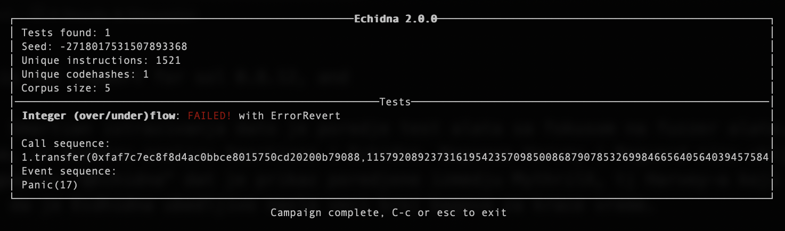

# Executive Summary

We are witness of the accelerated development of smart contracts, and more and more valuable assets are contained in them. For this reason, it is very important to write secure smart contracts. However, since people write smart contracts, and people make mistakes, it is desirable to have a tool that will be able to point out potential problems in the code. Fuzz testing is a technique that with early entry stresses our program to reveal errors. We will get to know with fuzing tools through this research.

# Introduction

Smart contracts often contain valuable assets, whether in the form of tokens or Ether. Smart contract's source code is publicly available, every execution happens on a public network. If smart contracts have vulnerabilities that can lead to catastrophic damages, that is potentially measured in millions of dollars. For example, at 2017 attack on Parity Wallet cost \~30 million dollars[^1] , at the 2016 DAO Hack cost \~150 million dollars[^2] , at 2020 Harvest Finance was attacked using flash loans and stole \~30 million dollars[^3] . To prevent disasters like this, it is important to find any vulnerabilities in smart contracts before deployments. Some of the common vulnerabilities are integer overflow/underflow, race conditions, and also we could have logic mistakes that are hard to detect. Security is essential while developing smart contracts. There are some known hacker attacks and good practices to follow.[^4]

Hence, in the development of smart contracts, testing is one of the most important techniques that require special time aside. Mostly we write unit tests, but unit tests are specific to one use case, and often some edge cases are not covered. There is a big research interest in developing testing tools, especially ones that are able to automatically detect as many problems in the code as possible, one such technique is fuzz testing.

# Goals & Methodology

There are many automatic bug-finding tools, and the purpose of this research is to introduce you to smart contracts fuzz testing. Fuzzing is a well-known technique in the security community it generates random, or invalid data as inputs to reveal bugs in the program, in one word it stress the program and causes unexpected behavior or crashes.

Considering the research interest in this area, a number of tools have been developed. Some popular open source tools are ContractFuzzer, ContraMaster, ILF, sFuzz, Smartian, and Echidna. Comparison of these tools is not easy task, the main reason is that each tool covers some specific set of bug classes.

Echidna is a property-based tool, develop with the aim to check if the contract violates some user-defined invariants, while other tool tries to find crashes. Company *Trails of Bits* extended fuzz technique to the EVM by developing the Echidna tool. Echidna can test both Solidity and Vyper smart contracts, it is written in Haskell, and main design goals are:

-   Easy to use and configure
-   Good contract coverage
-   Fast and quickly results

ContraMaster have been developed to detect irregular transactions due to various types of adversarial exploits, detects 3 classes of bug: Reentrancy, Exception Disorder, Gasless Send and Integer overflow/underflow.

ContractFuzzer detects 7 classes of bug: Reentrancy, Exception Disorder, Gasless Send, Timestamp Dependency, Block Number Dependency, DelegateCall and Freezing Ether Contract.

sFuzz detects all classes of bug as Contract Fuzzer plus Integer overflow/underflow. It has an extendable architecture which allows to easily support new bug classes as well. Also, sFuzz is effective in achieving high code coverage

Smartian detects 13 classes of bug: Assertion Failure, Arbitrary Write Block state Dependency, Control Hijack, Ether Leak, Integer Bug, Mishandled Exception, Multiple Send, Reentrancy, Suicidal Contract, Transaction Origin Use, Freezing Ether, Requirement Violation.

The way of generating inputs is different, ContractFuzzer and Echidna generate test cases based on a set of predefined parameter values, and fail to cover deeper paths that expose some vulnerabilities. sFuzz has guided input generation based on a genetic algorithm to iteratively improve its branch coverage. ILF generates input based on AI, using neural networks.

All in all, only Smartian, ILF, and Echidna at the end show the path how we could reproduce the bug. As Smartian covers more bug classes than ILF, shown in bellow Figure[^5] , the focus in this research will be on Smartian and Echidna.


# Results & Discussion

All examples are run on MacOS Big Sur, version 11.6, processor 2,6 GHz 6-Core Intel Core i7 and 16GB of memory. As there is no upper bound on how long Echidna can run, but the goal is to find a bug in up to 5 minutes.[^6] Configuration for Smartian test timeout is set up to 5 minutes.

Let's first show and discuss few motivating smart contract examples:

``` javascript
contract MotivationExample {
    function f(int256 a, int256 b, int256 c) public pure returns (int256) {
        int256 d = b + c;
        if (d < 1) {
            if (b < 3) {
                return 1;
            }
            if (a == 42) {
                assert(false);
                return 2;
            }
            return 3;
        } else {
            if (c < 42) {
                return 4;
            }
            return 5;
        }
    }
}
```

Very fast both Smartian and Echidna find assertion failure in above smart contract, results with counterexample and information how to reproduce transaction are show in next Figures(Figure1 and Figure2):


Figure1 : Smartian replayable test case


Figure2 : Echidna replayable test case

The next two examples have some more complex math:

``` javascript
contract MotivationExample {
    bool private value_found;

    function f(uint256 a, uint256 b, uint256 c, uint256 d) public {
        require(a == 42);
        require(b == 129);
        require(c == d+333);
        value_found = true;
        assert(value_found == false);
    }
}
```

Above one, the inputs must meet three requirements, and to the equality. Smartian and Echidna test it, and at bellow Figures(Figure3 and Figure4) are results:


Figure3 : Smartian replayable test case


Figure4 : Echidna failed to find assertion

Smartian quickly found assertion failure and counterexample, while Echidna failed to find one. Take a look at hardest motivation example and result from fuzzers:

``` javascript
contract MotivationExample {
    uint256 private stateA;
    uint256 private stateB;
    uint256 CONST = 32;

    function f(uint256 x) public {
      stateA = x;
    }

    function g(uint256 y) public{
      if (stateA % CONST == 1) {
        stateB = y - 10;
      }
    }

    function h() public view {
      if (stateB == 62) { 
        bug(); 
      }
    }

    function bug() private pure {
      assert(false);
    }
}
```


Figure5 : Smartian replayable test case


Figure6 : Echidna failed to find assertion

Again, Smartian quickly finds assertion failure, while Echidna fails. The reason for failure is due to the way it generates inputs. Echidna is not smart to go in-depth when making input seeds and figure out the values in the deeper branches.

Indeed, there is a way for Echidna to find assertion failure in the above examples, solution is in the configuration file.

Echidna has a YAML configuration file, with configurable parameters, that can be turned on or off during the test. If `config.yaml` is not listed, the [default YAML](https://github.com/crytic/echidna/blob/master/tests/solidity/basic/default.yaml) configuration file is called.[^7]
Some of configuration parameters enable to blacklist function, compute maximum gas usage, the maximum number of transactions sequences to generate, number of test sequences to run, prefix for boolean functions that are properties to be checked, contract deployer address. Also it is possible to define set of addresses transactions originate from along with default balance for addresses. In case we have a complex contract, and we need to initialize the blockchain with some data -\> tool Etheno helps here[^8] , after Etheno finishes the initialization JSON file is created, that is set as initialization inside configuration file. Additionally, if our contract uses some framework, for example, Hardhat or Truffle, Echidna then use crytic compile, and build directory of the framework is sent through crytic arguments inside Echidna configuration file.

Back to the above example, to find assertion failure, it is enough inside configuration file to set corpus directory. After first run, inside the corpus directory we could see the generated input for contract properties, now is enough to modify the input to use suitable parameters that will cause assertion failure.

Although Smartian beat Echidna in the above examples, the logical question, that arises, is what are the advantages of Echidna and why would we use Echidna rather than Smartian?

Echidna's advantage are invariants, Invariants are Solidity functions that can represent any incorrect state that contract can have, each invariant must be:

-   Public method that has no argument
-   Return true if it is successful

or:

-   Public method that can have an argument
-   Use assert in function


Figure7 : Architecture of Echdina

Architecture[^9] is divided into preprocessing and fuzzing campaigns. In the preprocessing step, the static analyzer tool Slither[^10] is used with the purpose to find useful constants and functions for effective testing. In the fuzzing campaign step, using contract ABI(Application binary interface) the random transactions are generated, and also any previous transactions from the corpus are included. In case the vulnerability is detected, a counterexample is automatically minimized to the smallest and simplest sequence of transactions that cause failure.

Running Echidna:

`$ echidna-test contract.sol --constract TEST --config config.yaml`,

or if Truffle or Hardhat is used:

`$ echidna-test . contract.sol --constract TEST --config config.yaml`

Echidna can be run from the docker, the official image of the current 2.0.0 version is trailofbits/echidna. Inside docker, default version of solidity compiler is 0.5.7, so if we want to test contracts in another version we need to install solc-select. If the preferred method is to not worry about how to install additional tools, there is a docker image trailofbits/eth-security-toolbox, but currently there ecidna version is 1.7.2.

# Conclusion

Although Smartian is better at generating input, what should be noted is that Smartian still doesn't have support for solc 0.8.x or greater. All examples from the section [Results & Discussion](#results--discussion) have been tested with solc 0.4.25. For an experiment, if you take [IB.sol](../assets/ERFC-42/research_examples/smartian_banchmark/IB/0.4.25/IB.sol) from Smartian benchmark examples,[^11] and adapt it to work with solidity version 0.8.9, Smartian will fail to find Integer Bug, but Echidna will find it. If you take a look at comparison of fuzz tools in [Goals & Methodology](#goals--methodology) that in the previous version Echidna was not able to found these bugs, as the integer overflow/underflow is one of the features in Echidna 2.0.0 for solc 0.8.x or greater. In [Appendix](#appendices) at Figure11 and Figure12 is shown Smartian output, and in Figure13 is shown Echidna output.

In general, Echidna and Smartian together cover bug classes: Assertion Failure and Integer Bug. Some comparison examples between Echidna 2.0.0, Smartian solc 0.4.25 and Smartian solc 0.8.9 are in [research_examples](../assets/ERFC-42/research_examples/).

Echidna Assertion allows us to manage what property should test along with the input range value of testing property arguments, in contrary using explicit property we are not sure which function will be checked and which arguments should be used to call test property, explicit property check all method that is not private or internal.

When asked which tool of the two to use, the simple answer is both. Both tools are promising. They cover different classes of problems and the use of both tools for testing smart contracts reduces the chance that our contract has potential flaws. Echidna is under active development, so it is reasonable that it is buggy. But, they work hard to reply & fix each issue.

The Echidna coverage report is a little bit confused, one is shown at Figure8. Some suggestion is to add some styled report([example](https://twitter.com/dapptools/status/1435973810545729536)) and the legend table of symbol meaning:

| Line marker | Meaning                                                                            |
|:-----------:|:-----------------------------------------------------------------------------------|
|    '\*'     | If an execution ended with a STOP                                                  |
|      r      | If an execution ended with a REVERT                                                |
|      o      | If an execution ended with an out-of-gas error                                     |
|      e      | If an execution ended with any other error (zero division, assertion failure, etc) |


Figure8 : Echidna coverage

UI for both tools should be improved, it would be nice to display emitted events. And, Smartian output could color counterexample and found bugs. The current UI is shown in the bellow Figures.

Figure9 : Smartian output


Figure10 : Echidna output

It would be nice to have integration with Remix IDE, which will help with debugging.

# Appendices


Figure11 : Smartian found Integer Bug with 0.4.25


Figure12 : Smartian not found Integer Bug with 0.8.9



Figure13 : Echidna found Integer Bug with 0.8.9

# Bibliography

<div id="refs" class="references csl-bib-body hanging-indent">

<div id="ref-BuildingsecurecontractsWorkflowMd" class="csl-entry">

'Building-Secure-Contracts/Workflow.md at Master $\cdot$ Crytic/Building-Secure-Contracts', *GitHub* \<<https://github.com/crytic/building-secure-contracts>\> \[accessed 14 February 2022\]

</div>

<div id="ref-choiSMARTIANEnhancingSmart2021" class="csl-entry">

Choi, Jaeseung, Doyeon Kim, Soomin Kim, Gustavo Grieco, Alex Groce, and Sang Kil Cha, 'SMARTIAN: Enhancing Smart Contract Fuzzing with Static and Dynamic Data-Flow Analyses', in *2021 36th IEEE/ACM International Conference on Automated Software Engineering (ASE)* (Melbourne, Australia: IEEE, 2021), pp. 227--39 \<https://doi.org/[10.1109/ASE51524.2021.9678888](https://doi.org/10.1109/ASE51524.2021.9678888)\>

</div>

<div id="ref-CryticEchidnaEthereum" class="csl-entry">

'Crytic/Echidna: Ethereum Smart Contract Fuzzer' \<<https://github.com/crytic/echidna>\> \[accessed 28 February 2022\]

</div>

<div id="ref-Etheno2022" class="csl-entry">

'Etheno' (Crytic, 2022) \<<https://github.com/crytic/etheno>\> \[accessed 28 February 2022\]

</div>

<div id="ref-foxleyHarvestFinance24M2020" class="csl-entry">

Foxley, William, 'Harvest Finance: \$24m Attack Triggers \$570m 'Bank Run' in Latest DeFi Exploit', 2020 \<<https://www.coindesk.com/tech/2020/10/26/harvest-finance-24m-attack-triggers-570m-bank-run-in-latest-defi-exploit/>\> \[accessed 11 February 2022\]

</div>

<div id="ref-griecoEchidnaEffectiveUsable2020" class="csl-entry">

Grieco, Gustavo, Will Song, Artur Cygan, Josselin Feist, and Alex Groce, 'Echidna: Effective, Usable, and Fast Fuzzing for Smart Contracts', in *ISSTA 2020*, 2020

</div>

<div id="ref-siegelUnderstandingDAOAttack2016" class="csl-entry">

Siegel, David, 'Understanding The DAO Attack', 2016 \<<https://www.coindesk.com/learn/2016/06/25/understanding-the-dao-attack/>\> \[accessed 11 February 2022\]

</div>

<div id="ref-SlitherSoliditySource2022" class="csl-entry">

'Slither, the Solidity Source Analyzer' (Crytic, 2022) \<<https://github.com/crytic/slither>\> \[accessed 11 February 2022\]

</div>

<div id="ref-Smartian2022" class="csl-entry">

'Smartian' (SoftSec Lab, 2022) \<<https://github.com/SoftSec-KAIST/Smartian>\> \[accessed 28 February 2022\]

</div>

<div id="ref-ParityWalletHack2017" class="csl-entry">

'The Parity Wallet Hack Explained', *OpenZeppelin Blog*, 2017 \<<https://blog.openzeppelin.com/on-the-parity-wallet-multisig-hack-405a8c12e8f7/>\> \[accessed 11 February 2022\]

</div>

</div>

[^1]: ['The Parity Wallet Hack Explained', *OpenZeppelin Blog*, 2017 \<<https://blog.openzeppelin.com/on-the-parity-wallet-multisig-hack-405a8c12e8f7/>\> \[accessed 11 February 2022\]](#ref-ParityWalletHack2017).

[^2]: [David Siegel, 'Understanding The DAO Attack', 2016 \<<https://www.coindesk.com/learn/2016/06/25/understanding-the-dao-attack/>\> \[accessed 11 February 2022\]](#ref-siegelUnderstandingDAOAttack2016).

[^3]: [William Foxley, 'Harvest Finance: \$24m Attack Triggers \$570m 'Bank Run' in Latest DeFi Exploit', 2020 \<<https://www.coindesk.com/tech/2020/10/26/harvest-finance-24m-attack-triggers-570m-bank-run-in-latest-defi-exploit/>\> \[accessed 11 February 2022\]](#ref-foxleyHarvestFinance24M2020).

[^4]: ['Building-Secure-Contracts/Workflow.md at Master $\cdot$ Crytic/Building-Secure-Contracts', *GitHub* \<<https://github.com/crytic/building-secure-contracts>\> \[accessed 14 February 2022\]](#ref-BuildingsecurecontractsWorkflowMd).

[^5]: [Jaeseung Choi and others, 'SMARTIAN: Enhancing Smart Contract Fuzzing with Static and Dynamic Data-Flow Analyses', in *2021 36th IEEE/ACM International Conference on Automated Software Engineering (ASE)* (Melbourne, Australia: IEEE, 2021), pp. 227--39 \<https://doi.org/[10.1109/ASE51524.2021.9678888](https://doi.org/10.1109/ASE51524.2021.9678888)\>](#ref-choiSMARTIANEnhancingSmart2021).

[^6]: [Gustavo Grieco and others, 'Echidna: Effective, Usable, and Fast Fuzzing for Smart Contracts', in *ISSTA 2020*, 2020](#ref-griecoEchidnaEffectiveUsable2020).

[^7]: ['Crytic/Echidna: Ethereum Smart Contract Fuzzer' \<<https://github.com/crytic/echidna>\> \[accessed 28 February 2022\]](#ref-CryticEchidnaEthereum).

[^8]: ['Etheno' (Crytic, 2022) \<<https://github.com/crytic/etheno>\> \[accessed 28 February 2022\]](#ref-Etheno2022).

[^9]: [Grieco and others](#ref-griecoEchidnaEffectiveUsable2020).

[^10]: ['Slither, the Solidity Source Analyzer' (Crytic, 2022) \<<https://github.com/crytic/slither>\> \[accessed 11 February 2022\]](#ref-SlitherSoliditySource2022).

[^11]: ['Smartian' (SoftSec Lab, 2022) \<<https://github.com/SoftSec-KAIST/Smartian>\> \[accessed 28 February 2022\]](#ref-Smartian2022).
