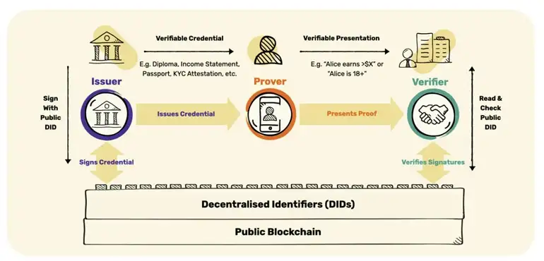
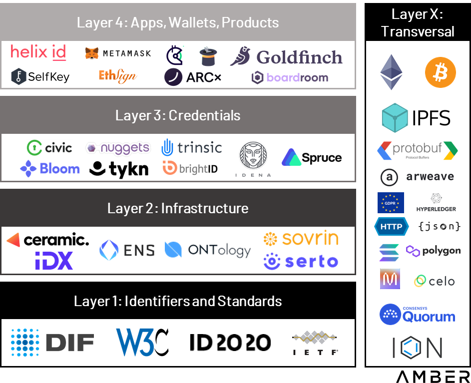

# Executive Summary

User-centric development proved to be imperative for any successful digital product. Decades of data marketing behind us showed how important is to track, collect insights and examine patterns in user behaviors. Those insights consider the must-have "know-how" of every successful product. According to the PWC digital product Study [\[1\]](https://www.pwc.de/de/digitale-transformation/pwc-studie-digital-product-development-2025.pdf), data analytics and artificial intelligence (AI) are the new backbones of digital product development. However, unlocking new technology fields like the blockchain industry becomes a problematic question. User-centricity is the subject of many debates as well as the fact of how to achieve it. In a world that lies on high privacy and decentralization, data is strict and is kept to itself. Therefore one of the burning questions is how to find a way to use it and not misuse it and build more user-centered products.

This paper examines the concept of decentralized identity, as the important integrator of our activities and achievements on-chain and how it can be used for better product development. The first part of the research will be an introduction to basic concepts, then we'll dive deep into the current state of different decentralized identity solutions, and at the end propose what would be an appreciated approach in the future when it comes to web3 product building [\[2\]](https://blog.dock.io/verifiable-credentials-changing-user-authentication/?_ga=2.167673726.1510007691.1671541874-186932671.1668070693&_gl=1*14fgd84*_ga*MTg2OTMyNjcxLjE2NjgwNzA2OTM.*_ga_K3WZ1GPZ2C*MTY3MTU0MTg3NS4xNS4xLjE2NzE1NDQ1NDQuMC4wLjA.).

# Introduction

### Web 3 Identity (SSI)

For almost a decade now, the flow of visiting any standard website looks the same: The first thing are the obnoxious cookie pop-ups urging to allow innumerable third parties to track the visit, so they can sell this information. Then, the pressure to establish yet another password and divulge the email address or phone number. This information flow to the centralized servers that are making all the person who provided this information very vulnerable to phishing attempts and raises the possibility that your personal information is compromised. According to the data from 2021, 1,291 data breaches happened that affected around 281.5 million people [\[2\]](https://blog.dock.io/verifiable-credentials-changing-user-authentication/?_ga=2.167673726.1510007691.1671541874-186932671.1668070693&_gl=1*14fgd84*_ga*MTg2OTMyNjcxLjE2NjgwNzA2OTM.*_ga_K3WZ1GPZ2C*MTY3MTU0MTg3NS4xNS4xLjE2NzE1NDQ1NDQuMC4wLjA.).

As a result in Web2, users do not own their user's data and by it, their online identities. Not to mention malversations and the creation of many users' identities. As such, they are prone to the risks associated with centralization, including hacking, censorship, manipulation, or even loss of data [\[3\]](https://moralis.io/web3-identity-the-full-guide-to-authentication-identity-and-web3/).
The idea behind the decentralized identity is to store and share your identity on the blockchain. The identity itself is not stored on the blockchain network, instead, DID uses a verification method that lets you verify a claim without actually sharing the identity [\[4\]](https://stanly-johnson.medium.com/signin-with-decentralised-identity-e030590c140c).
Organization-centric approach toward the digital identity we have today helps built data silos we do not own, that are being used without our consent. Rather than this approach, digital identity should be based around the individual ([5](https://jonnyfry175.medium.com/decentralised-identity-does-it-need-a-blockchain-64759dd378c3)), and that is how we came to the concept of **self-sovereign identity**.

Traditional identity management systems have long relied on those centralized intermediaries who issue, hold, and control your identifiers and attestations. This means you cannot control your identity-related information or decide who has access to personally identifiable information (PII) and how much access these parties have ([6](https://ethereum.org/en/decentralized-identity/)).

The real question here is how can we build such a system for handling our most important documents, like driver's licenses or passports. The ideal system would let a service verify our identity without giving it any access and lets the user remain in complete control of their data. This system became possible with Web3 and the concept of **self-sovereign identity** or **decentralized identity** ([4](https://stanly-johnson.medium.com/signin-with-decentralised-identity-e030590c140c)).

The idea behind **the decentralized identity** is to store and share your identity on the blockchain. The identity itself is not stored on the blockchain network, instead, DID uses a verification method that lets you verify a claim without actually sharing the identity ([4](https://stanly-johnson.medium.com/signin-with-decentralised-identity-e030590c140c)).

Advantages of decentralised identity [\[6\]](https://ethereum.org/en/decentralized-identity/):

-   Decentralized identity increases individual control of identifying information. Decentralized identifiers and attestations can be verified without relying on centralized authorities and third-party services.
-   Decentralized identity solutions facilitates a trustless, seamless, and privacy-protecting method for verifying and managing user identity.
-   Decentralized identity harnesses blockchain technology, which creates trust between different parties and provides cryptographic guarantees to prove the validity of attestations.
-   Decentralized identity makes identity data portable. Users store attestations and identifiers in mobile wallet and can share with any party of their choice. Decentralized identifiers and attestations are not locked into the database of the issuing organization.
-   Decentralized identity should work well with emerging zero-knowledge technologies that will enable individuals to prove they own or have done something without revealing what that thing is. This could become a powerful way to combine trust and privacy for applications such as voting.
-   Decentralized identity enables anti-Sybil mechanisms to identify when one individual human is pretending to be multiple humans to game or spam some system.

### Creating your decentralised identity

Experts distinguish three main components known as the three pillars of SSI: **blockchain, verifiable credentials (VCs)**, and **decentralized identifiers (DIDs)** \[[7](https://mirror.xyz/0x52CEb287BEb81D61eDf413A8B3007b611E8917EA/gBxgOJPaI9pu9GJ2nv4q0bM68jVIuXspAqQ1uDteVHg)\].

**Decentralized identifiers (DIDs)** are globally unique identifiers that can be stored on a blockchain and play an essential role in creating users' Web3 identity \[[8](https://www.dock.io/post/web3-identity#dock%E2%80%99s-web3-id)\]. For example, centralized digital identifiers like emails, usernames, and phone numbers can be revoked at any time by big organizations. A DID refers to any subject like a person, organization, data model, abstract entity, et cetera, as determined by the controller of the DID. They are created by the user, owned by the user, and independent of any organization. It's an ID that you generate for yourself. For example, one person can create several identifiers: one for online gaming, one for educational purposes, one with work credentials for business, etc.

**Verifiable credentials** are claims about achievements or attributes that include cryptographic proof of who issued them. For example, it's your on-chain passport, ID card, or diploma \[[9](https://medium.com/9yards/web3-has-an-identity-problem-building-decentralized-identity-7d8219a992db)\]. A Digital wallet is used to own and manage credentials. When the wallet owner presents these credentials, websites and apps can check that they are valid (with the university, etc.) and grant access accordingly.

Your wallet holds **all of your DIDs** and **verifiable credentials**. When some dApp needs it, you get the notification and choose if you want to share information with them.

There are several parties involved in the process of creating a decentralized identity: the **issuer** that issues verifiable credentials to a person, the **prover** that needs that credential and stores it in the wallet, and the **verifier** that can request insight into the credential. Verifier then checks if the issuer issued the credential. So once issued, the prover cares for the credential in its wallet and presents it to the verifier on demand.

[Figure 1, Source: Tykn](https://medium.com/9yards/web3-has-an-identity-problem-building-decentralized-identity-7d8219a992db)

Zero-knowledge proofs and encryption are critical technologies because distributed ledgers are designed to be readable by anyone. To support decentralized identity, distributed ledgers will instead store decryption keys to validate information while the data itself will be encrypted and stored locally on a user's device. With DIDs, you don't even have to share your age, the service will simply query your did with a condition like is age \> 18 ? and if that statement is true, the DID returns a success message, the service still does not know about your age, it simply knows if you're old enough to use their service ([4](https://stanly-johnson.medium.com/signin-with-decentralised-identity-e030590c140c)).

# Goals & Methodology

This research paper will overview the existing Decentralised Identity dApps and their current use cases. Additionally, this data will be examined from the perspective of Web3 product development. Therefore, the main goals of this research are:

-   Map out decentralized identity dApps currently in use (exclude beta versions etc.)
-   Recognize the use cases and the problems they aim to solve.
-   Explore the potential of using these dApps in Web3 product development.

### Methodology

-   Exploration of the ecosystem by diving deeper into blog posts and articles about DID dApps to map out the relevant solutions.
-   Trying out and using existing solutions.
-   Comparing and contrasting the current state of DIDs and what they can achieve in future Web3 product development.

This research wants to validate if the current DID dApps solutions can be used for comprehensive user research in Web3 product development. Based on its findings, we can conclude that it's time to go deeper into the Web3 product development ideas that can integrate different DID solutions to collect specific data from users without compromising their privacy.

# Results & Discussion

### The decentralized identity ecosystem

A decentralised identity ecosystem is comprehensive and complex. There are many solutions covering it from different angles: going from the deep infrastructural level of collecting and processing the data to user-level DIDs and even Web3 social networks. The initial list of the explored solutions was made based on Alchemy's selection of Decentralised Identity Tools[\[10\]](https://www.alchemy.com/best/decentralized-identity-tools), desktop research, and several blog posts found on DID ecosystem mapping. Based on a different level of infrastructure and the project's focus, suggestions proposed by the Amber group have been used ([11](https://medium.com/amber-group/decentralized-identity-passport-to-web3-d3373479268a)) to narrow down the initial list of dApps to analyze. These categorizations cover the DID ecosystem from infrastructural to reputational DID use cases. Below is their categorization, just to represent the complexity of leveling the existing solutions ([11](https://medium.com/amber-group/decentralized-identity-passport-to-web3-d3373479268a)):

-   Layer 1: Identifiers & Standards

    -   Standards, identifiers, and namespaces create the public trust layer, ensuring standardization, portability, and interoperability. They also allow networks to register and govern DID methods, providing developers and users with the rules and context of the network's ID system.

-   Layer 2: Infrastructure

    -   Infrastructure and agent frameworks allow applications to interact directly with each other and verifiable data registries. These solutions include communication, storage, and key management.

-   Layer 3: Credentials

    -   Credentials have to be managed, updated, and exchanged. This layer aims to address how DIDs can negotiate proof of control and authentication, as well as securely passing data between identity owners.

-   Layer 4: Apps, Wallets, Products

    -   This layer is likely most familiar to readers and intends to provide real-world use cases and value to consumers.

-   Layer X: Transversal

    -   These projects largely transcend any individual layer and have consequences at multiple levels.

    

    

    [Figure 2, Source: Amber](https://medium.com/9yards/web3-has-an-identity-problem-building-decentralized-identity-7d8219a992db)

    

As the subject of this research is decentralized identity and its application in Web3 product development, the focus of this paper will be on Layer 4. The focus will be on solutions that cover user level, more specifically on the dApps that represent DIDs and can help prove your rights and claim your data with VCs.

### Decentralized identity dApps in use

The list of dApps analyzed can be found [here](https://docs.google.com/spreadsheets/d/1_BrB-JxoA9vVS0xkcsgT6zU-9HTio1L_OBSPxoKOYL8/edit?usp=sharing). This list only includes the options that are most pertinent to this paper; it does not include all the options available on the market. Fourteen solutions were analyzed in total. The first step of the analysis was understanding the dApp on a conceptual level based on the information from the website, and then each solution was installed and explored from the user perspective. The main elements analyzed were:

-   **General information** - type of solution, description, blockchain
-   **Product focus** - features, main value / USP, customer segment
-   **Level of adoption** - number of users, stage of development
-   **Privacy** - data collection necessary, verification mechanism, and how is done

### Analysis summary

-   The market for DID solutions as a whole is growing rapidly, and this trend will likely continue in the future.

-   The three categories of DID dApps are **ID wallets, Web3 Passports,** and **ID dApps**. Most of them have a product in their portfolio for their own DID protocol solution, upon which their dApps are based.

-   All the solutions are developed on **different blockchains**, most of them still sticking to **Ethereum**, however, there are a lot of dApps supporting multichain options such as **ONT ID, Human Bound, HashKey**, and **WIW**. Chains covered with analyzed solutions are **Ethereum, Arbitrum, Optimism, Polygon, Avalanche,** and **Solana**, and some of them built their own blockchains e.g. **PlatON, Klaytn, Quorum**, and **Dock**.

-   **ID dApps** (Fractal ID, Bright ID, Polygon ID, Disco.xyz, Human Bound, WIW) are the most numerous and most developed in terms of DID functionalities. Most of them work best if installed with their wallets, but can work with other wallets as well. The majority of them run on multiple chains. Basic features for those apps are identity verification, authorization of different dApps, receiving claims, creating claims, and holding them in your ID. Most of them have the entire portfolio of other dApps for other players of DID ecosystem for issuing claims, verifying claims, etc. Main USPs these solutions focus on are having control over your data you can monetize and transferable reputation (Web 2 - Web3).

-   **Web3 Passports** (Civic Pass, GitCoin Passport, HashKey) as identity record solutions. They are there to prove claims about you and enable access to some communities, products, etc. Even though they have the same purpose, each differs a bit - Gitcoin serves as a Web3 pass that is simply connected with Web2 and Web3 apps and can claim things on your behalf. HashKey offers the possibility of centralized storage and privacy and you can mint your passport, as well as Civic Pass, does. Therefore, even though most of these solutions are b2c focused, some of them segment businesses and future VC issuers. The main value those solutions focus on is to personalize your Web3 appearance. Web3 Passports are strictly b2c focused.

-   **ID wallets** (SelfKey, Vendible Labs, Dock Wallet, ONT ID) are the least developed DID solution. Most of them have DID as an optionality and their main product focus remains with wallet features. DID features they support are mostly multiple wallet management therefore possible to create and manage several DIDs, with some of them offering solutions such as issuing VC, verifying VC, scan QR codes to receive VC. However, in many of these solutions, some of these functionalities are promised and developed, but couldn't work at the time of testing. Also, one of the interesting solutions was SelfKey with the feature to go on the marketplace to apply for and buy a secondary passport or residence for a specific country that offers this possibility under certain conditions. Those solutions are mostly both, b2b and b2c focused.

-   Another solution analyzed that is not covered in the previous three categories is [Proof of Humanity](https://proofofhumanity.eth.limo/index.html). This is a verified human network building social identity network on Web3 proving you are human. It works by simply uploading [a video](https://www.youtube.com/watch?v=WH83_Fad7E4) and photo and your wallet address and waiting for others to vouch for you and vote if you are human or not. Once approved you have the claim you can use with any dApp that needs proof of humanity. However, the process takes too long (more than 7 days to be verified).

-   **Verification** and **privacy** matter a lot in those dApps as they promise data safety first of all. The majority of dApps do not save data users provide them to prove identity or other. Usually, it's only saved on the user's device or simply process data over a third party or their protocols but does not store it. The most common case was that upon the installation of a dApp or registration DID was automatically created. Sometimes it happened enough that some of the applications didn't verify their users at all (identity, humanity, personhood, etc.). Three main things required upon registration were: name, wallet, and email. In some specific cases, to verify more details things required were location, ID or passport, other documents, company, and industry. However, to prove your identity in the Web3 world the biggest challenge is to prove you are a unique human being without revealing who you are. Proofs that are possible to make are:

    -   **Proof of Identity** - this was mostly done through passport/ID upload and selfie video.

    -   **Proof of Address / Location** - the location on your device, addressed docs to that location, and your name no older than 6 months (bank statement, confirmation from your company that you live there, etc.), in some cases it was done only through IP check, VPN Check.

    -   **Proof of Humanity** - photo, wallet address, video in which the user is claiming that you are not previously registered in that registry.

    -   **Proof of Human** - selfie video and captcha.

    -   **Proof of uniqueness** (BrightID) - verification through stages. First, you join the zoom call for the verification party and you are verified as a human by the meeting's host. After that, you achieve the first level of verification and that is how you start building your social graph. It's important to connect with other people you know that are using the same app and to integrate this solution with other dApps you are using. Then the user is required to set the social recovery to get completely verified.

    -   **Proof of personhood** - Proving ownership over various accounts and data provides proof of personhood. Also in some cases, this is done through Multi-factor Authentication (MFA) - wallet ID, mobile number, ID doc, and liveness check.

-   The level of adoption of DID solutions is still low. For almost one-third of the solutions analyzed, **beta testing** (or closed beta) was active for a few years now. So a couple of them couldn't be tried out at all. Besides them, most of the solutions are in the **early development phase** with limited features or features that do not still work properly. Only 5 of 14 solutions were marked as "**Active**" two of them with 1 million active users. However, the average number of users goes **under one hundred thousand users**.

### Current state of DID dApps: challanges

Analyzing fourteen DID dApps showed that even more of them exist and that this is one of the rising segments of the Web3 industry. However, half of them were very early in their development, and the rest had functionalities that couldn't be used at this moment. This was mostly because there are **no real use cases active** in which those solutions can be used. There is a lack of other players such as **issuers** and **verifiers** - parties that would require you to claim something regarding your identity and accept for this to be done through some of the DID solutions.

To get some traction first players to join should probably be Web3 companies, DAOs, and DeFi institutions. It is expected that DeFi helps DID solutions to emerge as it may have many beneficial effects on the financial rating of a person, credit potential, etc. without revealing their sensitive data.

Also, one big sphere of Web3 that is beneficial for DIDs to work is cryptographical technology, in most of the current cases ZK.

Even though Soul Bound Tokens (SBTs) appeared recently as a concept of NFTs that can not be transferred to another's wallet, only one solution was identified using this technology as a core of its Web3 ID.

Based on the comprehensive analysis done, common challenges analyzed solutions face are:

-   Data privacy they are claiming - mostly depends on the protocols they are using.
-   Data verification - passport or ID verification in cases of forgery or when issued in the local language can not be easily checked.
-   They are not that much easy to navigate and intuitive to find even the core functionalities.
-   Most of the Wallet ID solutions does not require ID verification or proof of humanity/personhood.
-   Inefficient mechanisms of proving you are a real person - for some verifications, there is a wait of seven or more days.

If put together, the four main benefits of decentralized identity management include control, security, privacy, and ease of use. However, the main concerns are a low level of adoption, a lack of regulation, and interoperability.

### Empowering user-centric design in web3

One of the biggest challenges Web3 is facing now is its timing. Are we at the end of the Inventor era and entering the mass adoption period? How and when this should happen? Led with this, for a few years now, many infrastructural projects that were crucial to enable mass technical and technological ways to mass adoption, finalized. We developed many strong, secure, and fast chains that can answer many of the challenges such as - high gas fees, slow transactions, privacy through ZK, higher decentralization, and scalability. Many of them are still open, but significant achievements have been made.

However, another big challenge to mass adoption is poor UI/UX design. The roots of this problem lie in the even earlier phase of development - product design. Many factors influenced that users are not the focus when building Web3 products. Most of the reasons come from the nature of the blockchain and its innovativeness. Three factors that influenced the development of products that are far away from the Web3 users we know today are ([12](https://3327.io/user-decentric-design-in-web3/)):

-   Building solution-centric products inspired by expanding the tech limits lead to inventions. Current Web3 products are often advanced technological solutions, many of which do not have many users at all, leaving a lot of Web3 products with no problem they are solving and by it, no current use case.
-   Building smart contracts or tech-oriented products with zero focus on the users and their experience.
-   The user dilemma is directly related to the adoption problem. Being early in the market led to the fact that for many years only devs were the actual users of Web3.

Even though some of these things changed over the past years, or are changing at the moment, this decade-long narrative built a specific framework around Web3 product development, that is not user-centric enough.

However, striving to the mass adoption of blockchain and its product, bring along way better products for the end users. One of the challenges on this way is tracking data analytics. Web3 adds complexity to tracking accurate customer behavior --- making things like attribution and personalization much, much harder for product and marketing teams \[[13](https://www.third.academy/article/the-challenge-with-web3-analytics)\]. The same article brings to the surface the two core challenges of this problem:

-   Identity fragmentation - addressing the lack or multiplication of identities caused by no KYCs, decentralized wallets with no identity-related owners, and multiple wallets that can represent multiple identities.
-   Interface fragmentation - relating to the Web2 - Web3 gap when tracking data and user actions (Web2 front-end and Web3 back-end).

Even though Web3 postulates made it technically demanding to create a world of absolute transparency of actions and privacy of users, those are the exact problems we aim to address. Identity fragmentation is exactly where the potential of DID can be of high significance.

Mapping the product development process it is clear that lack of data is mostly influencing tracking users' behaviors and building more personalized and specific products. Given the current state of DIDs and their early development, and the technical challenges of data analytics, it seems like this type of involvement in the product building will have to wait until more users join DID ecosystem (addressing more parties entering as the issuers and verifiers that accept this type of identity and its claims). Also, this type of analytics, that is tracking users' behaviors based on interactions with different products is useful in setting general information about specific segments of the user population.

However, other product development phases can benefit from DIDs. As is well known, user-centricity needs to be built in, much earlier in the development process. The discovery and research phase of product development are important parts of the Web3 products lifecycle and user-centricity. These two phases of product development are still done the same as in Web2 - through market research.

Imagining the future in which we will be able to have DIDs that hold information about us in form of VC or claims that are ZKP encrypted, it will be much easier to organize product research with potential users. The most complicated part of the research in Web3 is to get to the right people you want to involve in research, where to find them, and know if they are the people they tell you they are - what they are claiming is true. Having these in mind, there are several benefits DID would bring to this process.

-   Preferences/mass user data - passive research through data sharing that people hold on to their DIDs. Using the data stored in verified claims on DIDs. Simply by accepting the request from X company to share its data, valuable statistics on the target audience can be found.
-   Reliable eligibility test - simply by verifying or accepting the verified claim contained in the presented DID, a potential interviewee can be recruited for user research.
-   Better incentivization of users - any user can earn tokens by sharing their data and keeping their privacy. Also, in the process of user interviewing having in advance users' DID helps award users with tokens easily.
-   Automatisation of the research process - fast eligibility test and automated incentivization process.
-   Reaching out to users - this is the most challenging part of the user research process - reach out to the people and get them involved in the research. Even now, in early development, some of the dApps explored have a messaging feature, so they can communicate with others that are using the same dApp. With automatic eligibility tests and messaging features directly to someone's DID with the request to participate in the research, DIDs can help in getting the right people on board.

Having all this in mind, it is important to start developing solutions that can accelerate the development of DIDs for product development.

# Conclusion

From everything we explored in this research paper, we can conclude that data analytics and tracking in Web3 while keeping privacy is challenging. However, it is also something that will be resolved in a matter of time.

In its early development, DIDs at this point can not be used in the process of product development until higher adoption is achieved.

However, the potential DID bring with them is highly beneficial and can crucially change the way products are being built, and even product decisions are made in Web3.

Even though the current situation is not ready for DIDs, this time gap should be used, to develop the infrastructure needed to start using it for product development as early as possible.

Some of the directions for future research on this topic could be:

-   Explore technical solutions to tracking data and segmenting claims DIDs hold for product analytic purposes.
-   Tracking user interactions with different products through DIDs and when those are used for behavioral data.
-   DID aggregator / bridge - in form of dApp or even protocol that can bridge different proofs stored in one DID to any other or any verifier.
-   Messaging aggregator for all DIDs - that is not centralized and can replace email from Web2 world for anyone who has DID dApp installed.
-   Collecting claims and making general statistics from public data. As all issued claims are publicly available as proofs, the direction of creating summary analytics can be an interesting one to discuss.

In conclusion, Web3 is experiencing a crisis in user-centric product development. Enabling and supporting DIDs as crucial analytical silos for product development could be major research directions to eventually help overcome it.

# Bibliography

\[1\] [Digital Product Development, PWC](https://www.pwc.de/de/digitale-transformation/pwc-studie-digital-product-development-2025.pdf)

\[2\] [How Verifiable Credentials Will Change User Authentication, Dock.io](https://blog.dock.io/verifiable-credentials-changing-user-authentication/?_ga=2.167673726.1510007691.1671541874-186932671.1668070693&_gl=1*14fgd84*_ga*MTg2OTMyNjcxLjE2NjgwNzA2OTM.*_ga_K3WZ1GPZ2C*MTY3MTU0MTg3NS4xNS4xLjE2NzE1NDQ1NDQuMC4wLjA.)

\[3\] [Web3 Identity -- The Full Guide to Authentication, Identity, and Web3, Moralis.io](https://moralis.io/web3-identity-the-full-guide-to-authentication-identity-and-web3/)

\[4\] [SignIn With Decentralised Identity](https://stanly-johnson.medium.com/signin-with-decentralised-identity-e030590c140c)

\[5\] [Decentralised identity: does it need a blockchain, Johny Fry](https://jonnyfry175.medium.com/decentralised-identity-does-it-need-a-blockchain-64759dd378c3)

\[6\] [Decentralized Identity, ethereum.org](https://ethereum.org/en/decentralized-identity/)

\[7\] [What is decentralized identity in blockchain?, Domen](https://mirror.xyz/0x52CEb287BEb81D61eDf413A8B3007b611E8917EA/gBxgOJPaI9pu9GJ2nv4q0bM68jVIuXspAqQ1uDteVHg)

\[8\] [Web3 Identity, Dock.id](https://www.dock.io/post/web3-identity#dock%E2%80%99s-web3-id)

\[9\] [Web3 has an Identity Problem: Building Decentralized Identity, Jelena Hoffart](https://medium.com/9yards/web3-has-an-identity-problem-building-decentralized-identity-7d8219a992db)

\[10\] [Decentralized Identity Tools, Alchemy](https://www.alchemy.com/best/decentralized-identity-tools)

\[11\] [Decentralized Identity passport to Web3, Amber Group](https://medium.com/amber-group/decentralized-identity-passport-to-web3-d3373479268a)

\[12\] [User (De)Centric Design In Web3](https://3327.io/user-decentric-design-in-web3/)

\[13\] [The Challange of Web3 Analytics, Third Academy](https://www.third.academy/article/the-challenge-with-web3-analytics)
