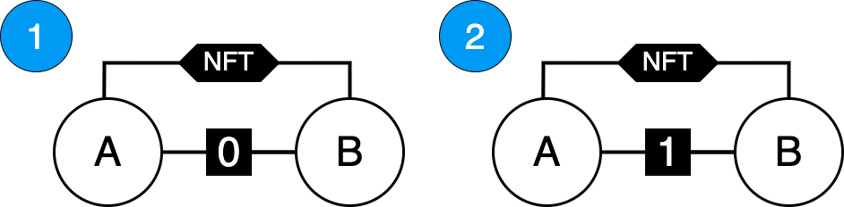
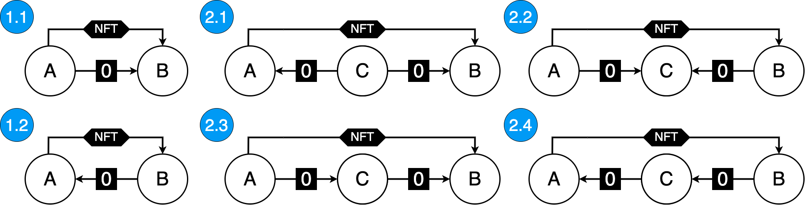
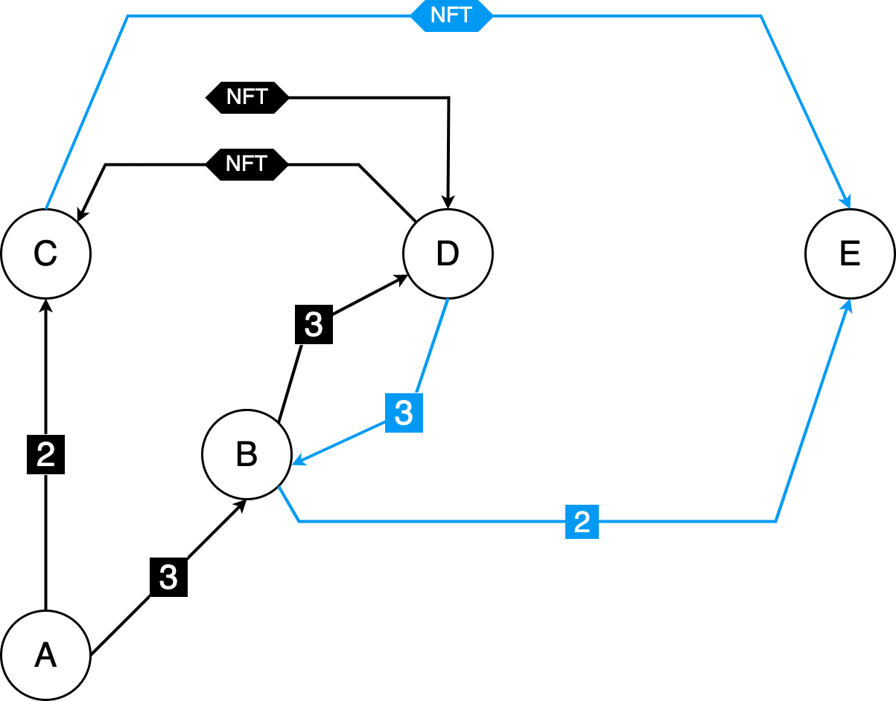

# Executive Summary

With the monthly trading volume of the **Non-Fungible Token (NFT)** marketplace [OpenSea](https://opensea.io) reaching 5 billion dollars in January 2022[^1] it is clear that NFTs are gaining popularity and with that grows the importance of having a transparent trading activity.

**Wash trading** is a form of market manipulation where a single entity or a group of colluding entities buy and sell the same asset with the goal of feeding the marketplace misleading information[^2].
There are at least two possible benefits to wash trading, the first being that a single asset can be wash traded multiple times, continually increasing the price, thus making the asset appear more sought after than it actually is. This chain of wash trades is broken when an unsuspecting victim buys the asset.
The second potential benefit is that the trading can be incentivized by the platform, with rewards being tied to the volume traded. Trading rewards can, at least for a limited time period, be higher than the fees, which makes this process worthwhile.

In the case of NFTs, wash trading is additionally enabled by the associated user anonymity. One single entity can control a large number of addresses without a way of reliably determining who is behind them.
Those addresses, however, need to be somehow funded to make them usable, which leads to a money trail that can be followed to detect connections between them and to flag suspicious NFT trades.

# Introduction

Currently, only [Nansen](https://nansen.ai), a blockchain analytics platform that requires a paid subscription, offers a feature called "Wash Trading Filter" where users can see the metrics (volume, average price, etc.) for an NFT collection with and without the filter but cannot browse through the individual NFTs. Another drawback is that Nansen doesn't disclose how the filter works, and so the question of why some trades were flagged remains.

Data on the blockchain is public, but it is hard to extract specific pieces of information from it.
Detecting if a particular NFT was wash traded would require collecting every single trade that was made on all of the marketplaces and
checking if the addresses involved in it are connected in some way. This data would need to be safely stored and effectively parsed to enable
answering if any arbitrarily chosen NFT has been wash traded. The detection algorithm should also provide adequate reasoning
on why a specific trade has been flagged. Developing and publicly disclosing the inner workings of such an algorithm would add more transparency
to NFT trading, but it would inevitably lead to the creation of more intricate patterns that would not get caught if the algorithm is not regularly updated.

# Goals & Methodology

**The goals** of this research are to :

-   define what transaction patterns classify as a wash trade
-   develop ways of extracting the necessary information needed for the detection:
    -   trades on two of the largest NFT marketplaces (OpenSea and [LooksRare](https://looksrare.org/))
    -   Ether transfers for each of the accounts involved in the trade
-   serve as a starting point for the creation of detection algorithms

**Methodology** for accomplishing those goals consists of

-   taking into account only Ethereum's on-chain transactions when discussing ways a wash trade can be made
-   using [Etherscan](https://docs.etherscan.io/) and [Alchemy](https://docs.alchemy.com/alchemy/) APIs to enable the data collection process
-   using Python programming language for the implementation part

# Results & Discussion

### Wash Trading Patterns

The explanation for the diagrams used in this paper is the following:

-   White circles with a letter inside them are addresses that are considered
-   Address can be connected with multiple lines
-   The line that has the **NFT** written on it signals that those two addresses were involved in an NFT trade
-   The line containing a number **n** on it signals that exists an Ether transfer trail between those addresses through **n** intermediaries
    -   if **n** = 0 that is a direct transfer
    -   if **n** = 1 there is a transfer trail involving one intermediary address
-   Lines with an arrow care about the direction of a transfer and point to the new owner's address
-   Lines without an arrow do not care about the direction

Shown on *Figure 1* there are two "meta-patterns" that this paper considers.

<center>



*Figure 1 - Considered Meta-patterns*

</center>

Meta-patterns can be expanded into specific patterns that care about the direction of those transfers (*Figure 2*). While some patterns may be more suspicious than others, all of them can be used for the purpose of wash trading. For example *pattern 2.2* can mean that after making a wash trade and selling the NFT to someone else, addresses **A** and **B** send all of their funds to address **C**.

<center>



*Figure 2 - Expanded patterns*

</center>

The reason that all of these patterns do not take the time order of transfers into account is that it doesn't matter - they need to detect only the connections between addresses.

## Collecting and Parsing of Data

This research takes into account only trades of NFTs that follow the ERC721 standard. The same principles can be applied to the trades involving the ERC1155 standard, with the only difference being the collection and parsing of trades.

When an NFT trade is executed, the ERC721 compliant contracts emit a **Transfer event** that contains three fields: previous owner, new owner, and the token id. Using the combination of Etherscan and Alchemy APIs, it is possible to get all the events that were emitted by the transaction and to extract the needed event based on its topic along with all of its fields.

Not every Transfer event corresponds to a trade, so there needs to be an extra processing step that will eliminate all transfers that were not made through a marketplace. To do this, one needs to go through all of the marketplace's contract's transactions and select only those that have the right **methodID**.

After the seller's (previous owner's) and buyer's (new owner's) addresses are known, the last step is collecting and parsing of all of their transactions searching for Ether transfers and all the addresses they have interacted with - in this paper referred to as "associates".

## Wash Trading Detectors

Having a set of all of the buyer's and seller's associates enables the creation of **Wash Trading Detectors (WTD)**.
This paper proposes and implements two basic algorithms:

-   **WTD0** that detects a direct transfer by checking if the seller's address belongs to the set of buyer's associates
-   **WTD1\*** that detects a set of common associates that are Externally Owned Accounts (EOAs)

\*WTD1 is incomplete because the detected common associate can be a Centralized Exchange's (CEX) address which would give a false positive. The only way to make the WTD1 fully functional is to manually keep a list of all the addresses that should be ignored.

## Implementation

Using the proposed ways of getting the data and reasoning on it, it is possible to extract suspicious wash trading patterns, flag those trades, and perform an analysis of the results. The code shown bellow is capable of getting the count of detected wash trades performed through a marketplace in a given block range :

``` python
import utils

def run(contract, methodIds, start_block, end_block):
    '''Detects potential Wash trades for a marketplace's contract'''

    transactions = utils.get_all_transactions(
        contract,
        start_block,
        end_block
    )

    wtd0_count, wtd1_count, total = 0, 0, 0

    for  tx in transactions:

        if tx['input'][:10] in methodIds:

            status, logs = utils.get_logs(tx['hash'])

            if status != 1: # Reverted transaction
                continue

            nft_contract, token_id, A, B = utils.parse_logs(logs)

            if A == None or B == None: # not a standard ERC721
                continue

            associates_A = utils.get_associates(A)
            associates_B = utils.get_associates(B)

            wtd0_count += int(
                utils.wtd0(A, B, associates_A, associates_B)
            )
            wtd1_count += int(
                len(utils.wtd1(A, B, associates_A, associates_B)) > 0
            )

            total += 1

    return (wtd0_count, wtd1_count, total)
```

The `run` function consists of getting all transaction data for a marketplace's contract starting from the `start_block` up to the `end_block` and considering only those that are in the provided list of `methodIds`. These transactions are then parsed, and values are extracted that will be passed to the `utils.wtd0` and `utils.wtd1` functions which will perform detection.

For the full implementation of all of the used helper methods from `utils` module see [Appendix A](#appendix-a).

### Example

For example, let us take the [OpenSea's Wyvern V1 contract](https://etherscan.io/address/0x7Be8076f4EA4A4AD08075C2508e481d6C946D12b) and pass three different block ranges. The `['0xab834bab']` argument corresponds to the `methodID` of the contract's method that gets called when there is a trade.

``` python
WYVERN_V1 = '0x7Be8076f4EA4A4AD08075C2508e481d6C946D12b'

ranges = [
    [6652089, 6652239],
    [7486211, 7486311],
    [7704798, 7704898],
]

for start_block, end_block in ranges:

    print(run(WYVERN_V1, ['0xab834bab'], start_block, end_block))
```

From the total of **23** trades that were made during the provided ranges :

-   WTD0 flags **8** trades
-   WTD1 flags **11\*\*** trades

\*\*WTD1 returns a list of associate addresses; these lists were manually checked through Etherscan to see if they belong to a CEX. The list of ignored addresses is available in [Appendix B](#appendix-b).

### Implications

The sample size of **23** is too small to discuss how the reported numbers relate to all of the NFT trades since the marketplace's contract deployment. The code itself can, however, serve as a starting point for the development of a service capable of extracting the data from all of the NFT marketplaces since their creation. In that data lies the key to answering not only what trades are a wash trade but also who performed them, how many times was an address linked to a wash trade, whether one NFT has been wash traded multiple times, etc. Such a service would need to effectively manage its resources such as the collection of data and the computation needed in the detection - in the example above, set of associates is always computed from scratch (there is no storing of the result and checking if those values have already been computed). The full specification for the development of this service is out of the scope of this paper and should be a topic of a separate research.

#### Complex Patterns

Due to current non-negligible transaction fees on Ethereum and the fact that not many people are deeply looking into each trade, it is unlikely that there are complex patterns present in NFT wash trading. As the fees get lower and as the adoption grows, it's almost certain that they will emerge. On the *Figure 3* is shown one pattern that could be used in the process of wash trading.

<center>



*Figure 3 - Complex pattern*

</center>

There are two NFT wash trades present (marked by the black and blue colored arrows). The sequence of transfers is the following:

1.  **A** finances **B** and **C** through 3 and 2 intermediaries, respectively
2.  **B** finances **D** through 3 intermediaries
3.  **D** buys an NFT from some non-associated address
4.  **D** sells the NFT to **C**
5.  **D** sends the funds to **B** through the same 3 intermediaries that were used before
6.  **B** finances **E** through 2 intermediaries
7.  **E** buys the NFT from **C**

After the last step, **E** can sell the NFT to an unsuspecting victim.
It is important to note that addresses used do not have to be discarded after each wash trade - i.e. **B** can be used just for routing of the funds.
Furthermore, a malevolent entity can inflate the prices of not just a single NFT but for a complete collection, making it look like the collection is very popular, which attracts victims.

# Conclusion

This research shows that it is possible to flag a specific trade as being a wash trade. The proposed algorithms can serve as a starting point in this process. To flag a specific NFT as being wash traded there would need to exist a list of all the trades of that NFT. This could be done via a service that would enable the users to browse the history of trades of any NFT on every marketplace and see all of the connections between the
addresses that once owned it. If the service is built and popularized while keeping its inner workings public, the malevolent parties would try to evade detection which would lead to the need to constantly improve the algorithm.

# Appendices

## Appendix A

Implementation of the `utils` module.

``` python
import time, json, requests
from web3 import Web3

config = {
    "alchemy-url" : "",
    "etherscan-api-key": "",
}

web3 = Web3(Web3.HTTPProvider(config['alchemy-url']))

def get_all_transactions(address, start_block = 0, end_block = 19999999):
    '''Gets all transactions using Etherscan API for the provided address'''
    transactions = []

    while True:
        time.sleep(5)
        result = requests.get(
            'https://api.etherscan.io/api?module=account&action=txlist' +
            f'&address={address}' +
            f'&startblock={start_block}' +
            f'&endblock={end_block}' +
            f'&offset={1_000}' +
            f'&sort={"asc"}' +
            f'apikey={config["etherscan-api-key"]}'
        ).json()['result']

        transactions += result

        if len(result) < 1_000:
            break

        start_block = int(result[-1]["blockNumber"]) + 1


    return transactions

def is_EOA(address):
    '''Returns true if the address belongs to an Externally Owned Account'''

    try:
        _address = Web3.toChecksumAddress(address)
        return web3.eth.getCode(_address) == b""
    except:
        return False

def get_associates(address):
    '''Returns a set of all account with which the provided addresses interacted with'''

    transactions = get_all_transactions(address)

    associates = set()
    for tx in transactions:
        if tx['from'] != address:
            associates.update([tx['from']])
        if tx['to'] != address:
            associates.update([tx['to']])

    return associates

def get_logs(tx_hash):
    '''Gets the logs from the transaction receipt of the tx_hash'''

    tx_receipt = web3.eth.get_transaction_receipt(tx_hash)

    return tx_receipt['status'], tx_receipt['logs']

def parse_logs(logs):
    '''Returns the NFT contract's address, token id and addresses involved in the trade'''

    TRANSFER_TOPIC = "0xddf252ad1be2c89b69c2b068fc378daa952ba7f163c4a11628f55a4df523b3ef"
    WRAPPED_ETH = "0xC02aaA39b223FE8D0A0e5C4F27eAD9083C756Cc2"

    nft_contracts, token_ids, _from, _to = [], [], None, None

    for ev in logs:

        if TRANSFER_TOPIC == ev["topics"][0].hex() and ev["address"] != WRAPPED_ETH:

            nft_contracts.append(ev["address"])

            bytecode = "".join([x.hex() for x in ev["topics"]]) + "".join(ev["data"])
            _from = "0x" + bytecode[66 : 66 * 2][-40:]
            _to = "0x" + bytecode[66 * 2 : 66 * 3][-40:]
            token_ids.append(int(bytecode[66 * 3 : 66 * 4][2:66], base=16))

    return nft_contracts, token_ids, _from, _to


def wtd0(A, B, associates_A, associates_B):
    '''WTD0 implementation'''

    return (A in associates_B) or (B in associates_A)

def wtd1(A, B, associates_A, associates_B):
    '''WTD1 implementation'''

    EOA_associates = []

    common_associates = associates_A.intersection(associates_B)
    for ca in common_associates:
        if is_EOA(ca):
            EOA_associates.append(ca)

    return EOA_associates
```

## Appendix B

Following is the list of all the addresses that were ignored by WTD1 due to the fact that they belong to CEXs

<center>

|                  Address                   |    CEX    |
|:------------------------------------------:|:---------:|
| 0x564286362092d8e7936f0549571a803b203aaced | Binance3  |
| 0x59a5208b32e627891c389ebafc644145224006e8 |  HitBTC2  |
| 0x56eddb7aa87536c09ccc2793473599fd21a8b17f | Binance17 |
| 0xeb2629a2734e272bcc07bda959863f316f4bd4cf | Coinbase6 |
| 0xd551234ae421e3bcba99a0da6d736074f22192ff | Binance2  |
| 0xb5d85cbf7cb3ee0d56b3bb207d5fc4b82f43f511 | Coinbase5 |
| 0x0681d8db095565fe8a346fa0277bffde9c0edbbf | Binance4  |
| 0x3f5ce5fbfe3e9af3971dd833d26ba9b5c936f0be |  Binance  |

</center>

# Bibliography

<div id="refs" class="references csl-bib-body hanging-indent">

<div id="ref-haywardOpenSeaHitsRecord2022" class="csl-entry">

Hayward, Decrypt / Andrew, 'OpenSea Hits Record \$5b in Monthly Sales as Ethereum NFT Market Swells', *Decrypt*, 2022 \<<https://decrypt.co/91748/opensea-record-5b-ethereum-nft-market-swells>\> \[accessed 13 March 2022\]

</div>

<div id="ref-WashTradingDefinition" class="csl-entry">

'Wash Trading Definition', *Investopedia* \<<https://www.investopedia.com/terms/w/washtrading.asp>\> \[accessed 21 March 2022\]

</div>

</div>

[^1]: [Decrypt / Andrew Hayward, 'OpenSea Hits Record \$5b in Monthly Sales as Ethereum NFT Market Swells', *Decrypt*, 2022 \<<https://decrypt.co/91748/opensea-record-5b-ethereum-nft-market-swells>\> \[accessed 13 March 2022\]](#ref-haywardOpenSeaHitsRecord2022).

[^2]: ['Wash Trading Definition', *Investopedia* \<<https://www.investopedia.com/terms/w/washtrading.asp>\> \[accessed 21 March 2022\]](#ref-WashTradingDefinition).
